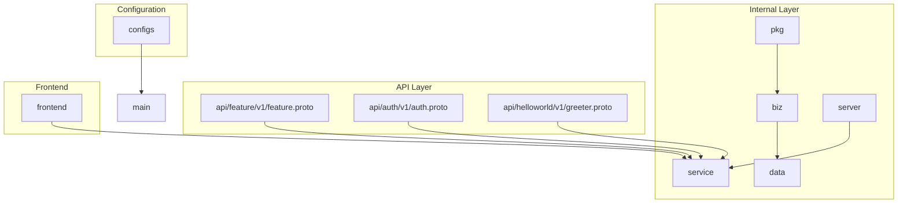
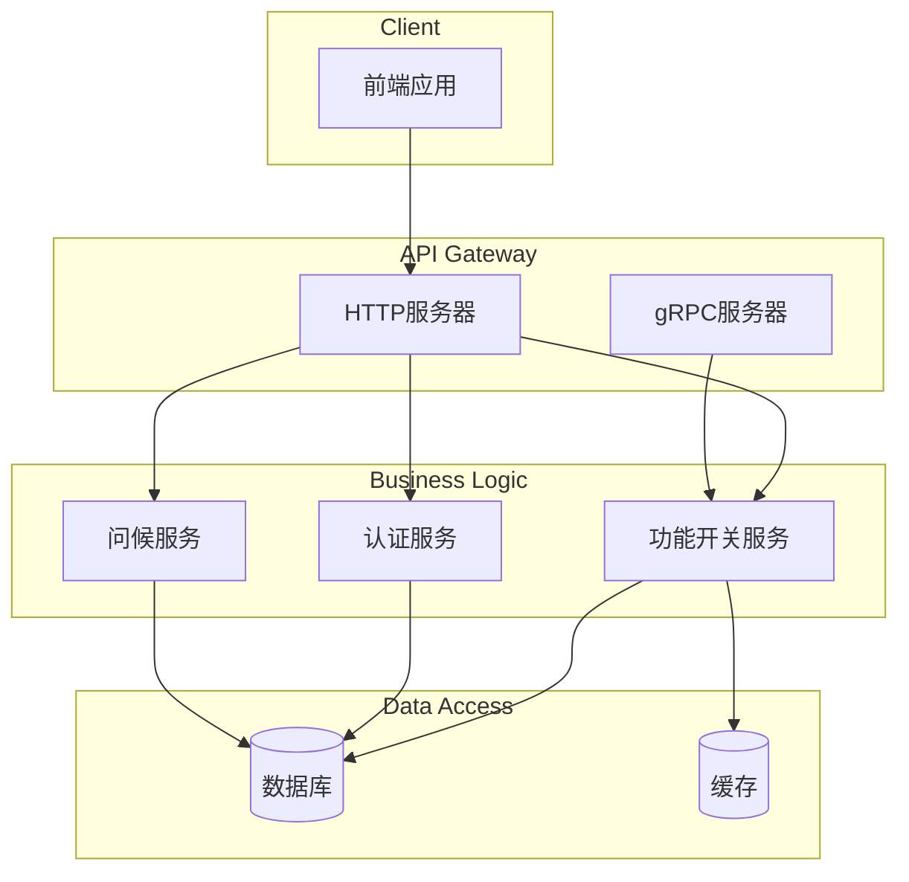
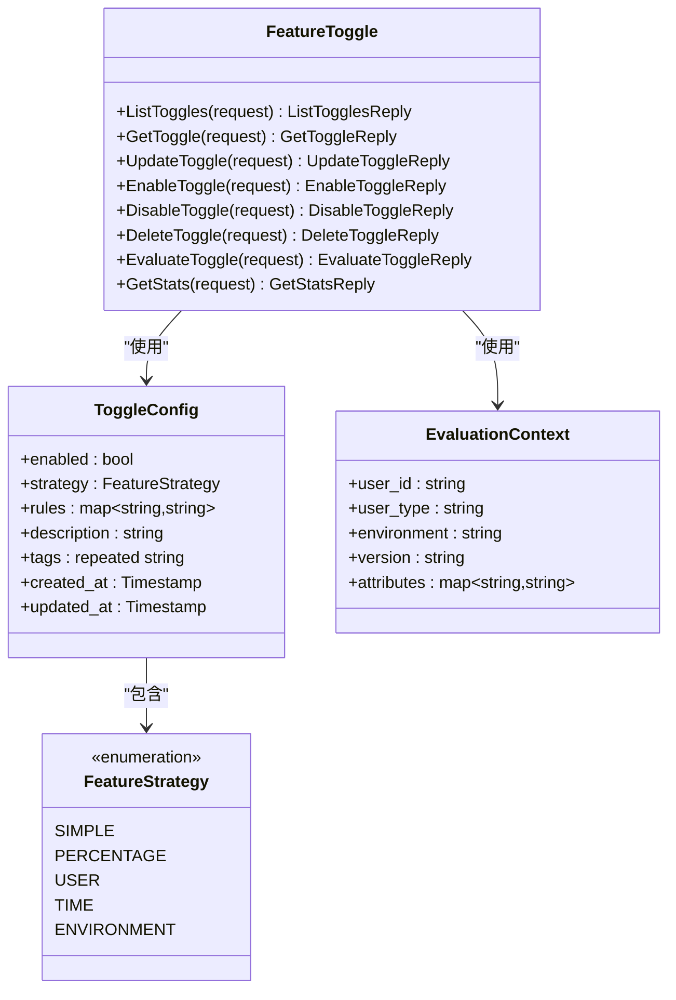
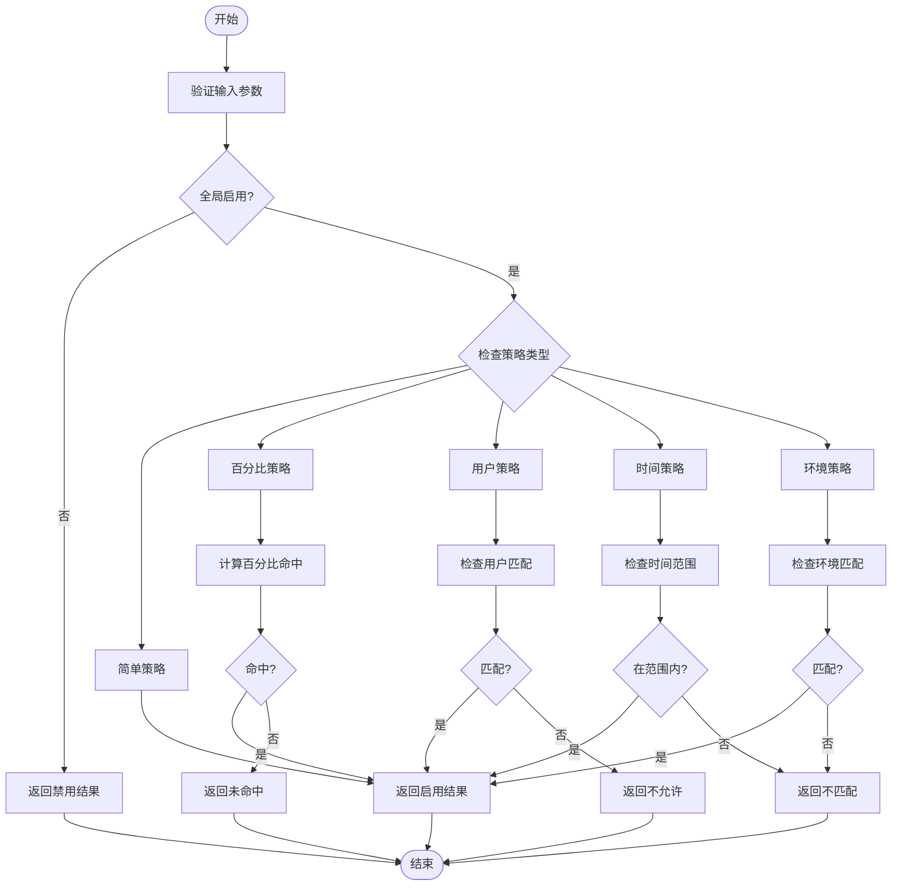
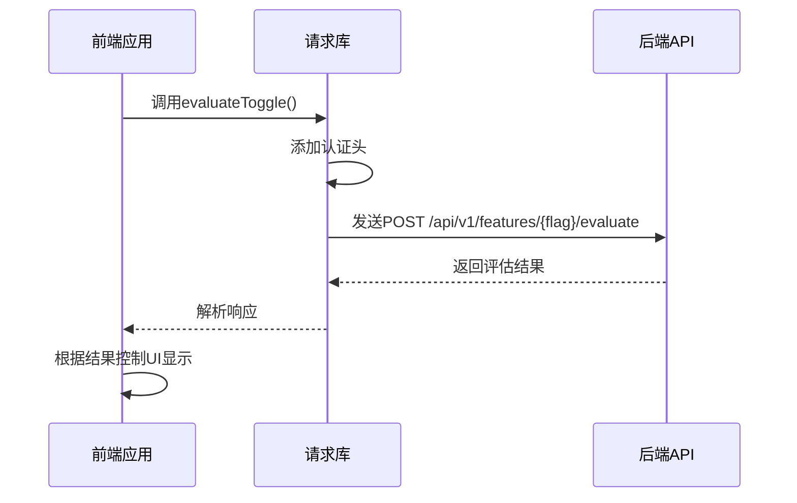
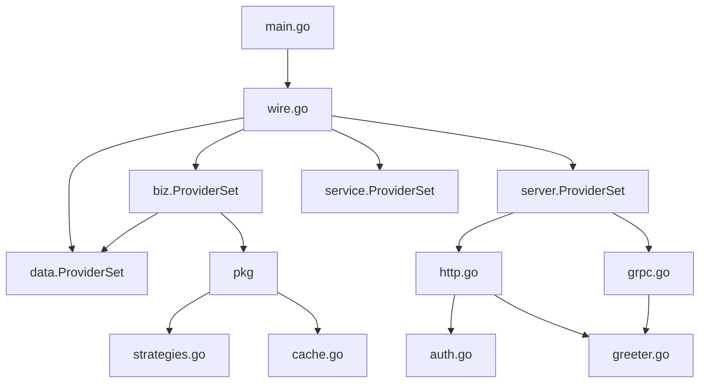
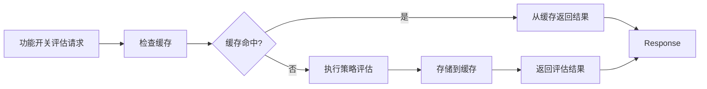

# 功能开关系统

<cite>
**本文档引用的文件**
- [feature.proto](file://api/feature/v1/feature.proto)
- [auth.go](file://internal/biz/auth.go)
- [greeter.go](file://internal/biz/greeter.go)
- [strategies.go](file://internal/pkg/auth/strategies.go)
- [cache.go](file://internal/pkg/cache/cache.go)
- [request.ts](file://frontend/src/api/request.ts)
- [HelloWorld.vue](file://frontend/src/components/HelloWorld.vue)
- [main.go](file://cmd/kratos-boilerplate/main.go)
- [wire.go](file://cmd/kratos-boilerplate/wire.go)
</cite>

## 目录
1. [简介](#简介)
2. [项目结构](#项目结构)
3. [核心组件](#核心组件)
4. [架构概述](#架构概述)
5. [详细组件分析](#详细组件分析)
6. [依赖分析](#依赖分析)
7. [性能考虑](#性能考虑)
8. [故障排除指南](#故障排除指南)
9. [结论](#结论)

## 简介
本项目实现了一个功能开关（Feature Toggle）系统，通过Protobuf定义的gRPC接口支持动态启用/禁用功能模块。系统包含多种评估策略，如百分比灰度、用户白名单、时间窗口和环境判断等，并与业务层代码集成以控制功能权限。前端可通过API查询当前用户是否具备某项功能权限，并与Greeter服务集成体现开关对业务行为的影响。

## 项目结构
项目采用分层架构设计，主要分为API定义、内部业务逻辑、数据访问和外部服务集成等部分。

**图示来源**
- [feature.proto](file://api/feature/v1/feature.proto)
- [auth.go](file://internal/biz/auth.go)
- [greeter.go](file://internal/biz/greeter.go)

**节源**
- [feature.proto](file://api/feature/v1/feature.proto)
- [auth.go](file://internal/biz/auth.go)
- [greeter.go](file://internal/biz/greeter.go)

## 核心组件
功能开关系统的核心组件包括基于Protobuf的gRPC接口定义、多种评估策略的实现以及与业务逻辑的集成。

**节源**
- [feature.proto](file://api/feature/v1/feature.proto)
- [strategies.go](file://internal/pkg/auth/strategies.go)

## 架构概述
系统采用微服务架构，通过gRPC进行内部通信，HTTP提供外部API接口。

**图示来源**
- [main.go](file://cmd/kratos-boilerplate/main.go)
- [wire.go](file://cmd/kratos-boilerplate/wire.go)
- [http.go](file://internal/server/http.go)
- [grpc.go](file://internal/server/grpc.go)

## 详细组件分析
### 功能开关服务分析
功能开关服务通过Protobuf定义了完整的生命周期管理接口，包括创建、查询、更新、删除和策略评估等功能。

#### gRPC接口定义

**图示来源**
- [feature.proto](file://api/feature/v1/feature.proto)

#### 策略评估流程

**图示来源**
- [feature.proto](file://api/feature/v1/feature.proto)
- [auth.go](file://internal/biz/auth.go)

**节源**
- [feature.proto](file://api/feature/v1/feature.proto)
- [auth.go](file://internal/biz/auth.go)

### 前端集成分析
前端通过API调用与功能开关系统交互，实现动态功能控制。

#### API请求流程

**图示来源**
- [request.ts](file://frontend/src/api/request.ts)
- [HelloWorld.vue](file://frontend/src/components/HelloWorld.vue)

**节源**
- [request.ts](file://frontend/src/api/request.ts)
- [HelloWorld.vue](file://frontend/src/components/HelloWorld.vue)

## 依赖分析
系统各组件之间的依赖关系如下：

**图示来源**
- [main.go](file://cmd/kratos-boilerplate/main.go)
- [wire.go](file://cmd/kratos-boilerplate/wire.go)
- [http.go](file://internal/server/http.go)
- [grpc.go](file://internal/server/grpc.go)

**节源**
- [main.go](file://cmd/kratos-boilerplate/main.go)
- [wire.go](file://cmd/kratos-boilerplate/wire.go)

## 性能考虑
为确保高频判断场景下的高效执行，系统采用了缓存优化方案。

**图示来源**
- [cache.go](file://internal/pkg/cache/cache.go)

## 故障排除指南
当遇到功能开关未生效的问题时，可按照以下步骤进行排查：

1. **检查配置**：确认功能开关的配置是否正确，特别是`enabled`字段和策略设置。
2. **验证上下文**：确保评估上下文中的用户ID、环境等信息与策略要求匹配。
3. **查看日志**：检查系统日志中是否有相关的错误或警告信息。
4. **测试API**：直接调用`/api/v1/features/{flag}/evaluate`接口测试评估结果。
5. **清除缓存**：如果怀疑缓存问题，尝试清除相关缓存后重新测试。

**节源**
- [feature.proto](file://api/feature/v1/feature.proto)
- [cache.go](file://internal/pkg/cache/cache.go)

## 结论
本功能开关系统通过清晰的分层架构和标准化的接口定义，实现了灵活的功能控制机制。系统支持多种评估策略，能够满足不同场景下的需求。通过与业务逻辑的紧密集成，可以有效地控制功能的可见性和可用性。建议在实际使用中结合监控和日志系统，以便更好地跟踪功能开关的状态和效果。