基于对密钥管理系统的深入分析，现在我将创建完整的文档内容。

<docs>
# 密钥管理系统（KMS）

<cite>
**本文档引用的文件**
- [manager.go](file://internal/pkg/kms/manager.go)
- [datakey.go](file://internal/pkg/kms/datakey.go)
- [rootkey.go](file://internal/pkg/kms/rootkey.go)
- [interfaces.go](file://internal/pkg/kms/interfaces.go)
- [crypto_service.go](file://internal/pkg/kms/crypto_service.go)
- [kms.go](file://internal/biz/kms.go)
- [kms.go](file://internal/data/kms.go)
- [000002_create_data_keys_table.up.sql](file://internal/data/migrations/000002_create_data_keys_table.up.sql)
- [manager_test.go](file://internal/pkg/kms/manager_test.go)
</cite>

## 目录
1. [简介](#简介)
2. [系统架构概览](#系统架构概览)
3. [核心组件分析](#核心组件分析)
4. [密钥层级关系](#密钥层级关系)
5. [数据密钥生命周期管理](#数据密钥生命周期管理)
6. [加解密服务实现](#加解密服务实现)
7. [数据库设计与存储](#数据库设计与存储)
8. [业务层使用示例](#业务层使用示例)
9. [安全性最佳实践](#安全性最佳实践)
10. [故障排除指南](#故障排除指南)
11. [总结](#总结)

## 简介

密钥管理系统（KMS）是一个基于Go语言开发的企业级密钥管理解决方案，采用分层密钥架构设计，实现了根密钥（Root Key）与数据密钥（Data Key）的安全隔离。系统提供了完整的密钥生命周期管理功能，包括密钥生成、封装、解封、轮换、缓存和审计等核心特性。

该系统遵循密码学最佳实践，使用AES-256-GCM算法进行数据加密，通过PBKDF2算法生成根密钥，并实现了完善的密钥缓存机制以提升性能。系统支持自动密钥轮换、批量加解密操作以及详细的密钥统计信息收集。

## 系统架构概览

密钥管理系统采用模块化架构设计，各组件职责明确，相互协作完成密钥管理任务。

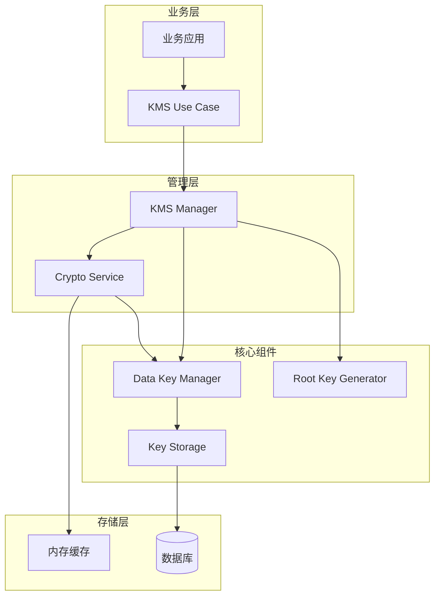

**图表来源**
- [manager.go](file://internal/pkg/kms/manager.go#L1-L50)
- [interfaces.go](file://internal/pkg/kms/interfaces.go#L1-L50)

**章节来源**
- [manager.go](file://internal/pkg/kms/manager.go#L1-L308)
- [interfaces.go](file://internal/pkg/kms/interfaces.go#L1-L126)

## 核心组件分析

### KMS Manager（密钥管理器）

KMS Manager是整个系统的核心控制器，负责协调各个组件的工作，管理密钥的完整生命周期。

```mermaid
classDiagram
class kmsManager {
+config KMSConfig
+rootKeyGen RootKeyGenerator
+dataKeyManager DataKeyManager
+cryptoService CryptoService
+storage KeyStorage
+log Helper
+mu sync.RWMutex
+initialized bool
+shutdown bool
+rotationTicker Ticker
+rotationDone chan struct{}
+Initialize(ctx, config) error
+GetActiveDataKey(ctx) DataKey
+GetDataKeyByVersion(ctx, version) DataKey
+RotateDataKey(ctx) DataKey
+EncryptField(ctx, field, value) EncryptedField
+DecryptField(ctx, field) byte[]
+HashField(value) string
+Close() error
+GetStatus(ctx) KMSStatus
+PerformMaintenance(ctx) error
-ensureActiveDataKey(ctx) error
-startAutoRotation()
-checkInitialized() error
}
class KMSManager {
<<interface>>
+Initialize(ctx, config) error
+GetActiveDataKey(ctx) DataKey
+GetDataKeyByVersion(ctx, version) DataKey
+RotateDataKey(ctx) DataKey
+GetCryptoService() CryptoService
+GetStatus(ctx) KMSStatus
+PerformMaintenance(ctx) error
+Close() error
}
kmsManager ..|> KMSManager : 实现
```

**图表来源**
- [manager.go](file://internal/pkg/kms/manager.go#L13-L30)
- [interfaces.go](file://internal/pkg/kms/interfaces.go#L10-L25)

### Data Key Manager（数据密钥管理器）

Data Key Manager专门负责数据密钥的生成、管理和使用，确保数据加密的安全性和效率。

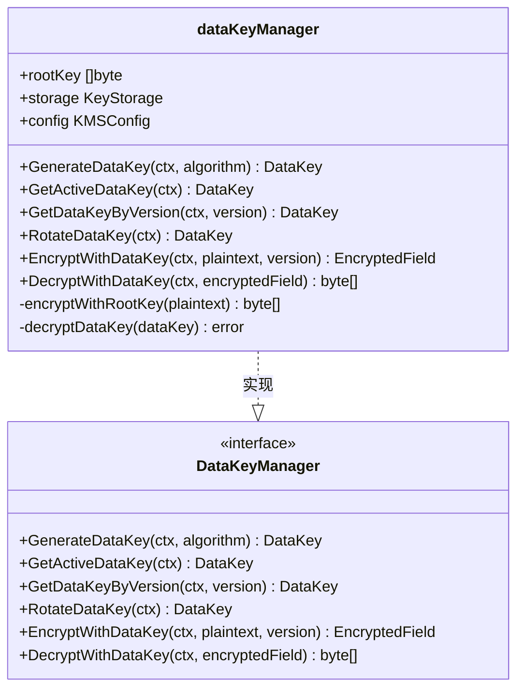

**图表来源**
- [datakey.go](file://internal/pkg/kms/datakey.go#L13-L25)
- [interfaces.go](file://internal/pkg/kms/interfaces.go#L70-L85)

### Root Key Generator（根密钥生成器）

Root Key Generator使用PBKDF2算法生成强根密钥，确保密钥的安全性和不可预测性。

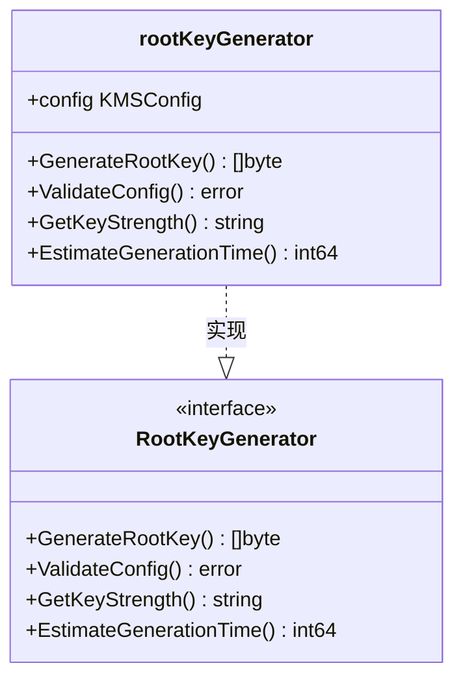

**图表来源**
- [rootkey.go](file://internal/pkg/kms/rootkey.go#L10-L15)
- [interfaces.go](file://internal/pkg/kms/interfaces.go#L55-L65)

**章节来源**
- [manager.go](file://internal/pkg/kms/manager.go#L13-L308)
- [datakey.go](file://internal/pkg/kms/datakey.go#L13-L251)
- [rootkey.go](file://internal/pkg/kms/rootkey.go#L10-L94)

## 密钥层级关系

密钥管理系统采用分层架构，根密钥（Root Key）与数据密钥（Data Key）之间形成严格的安全隔离。

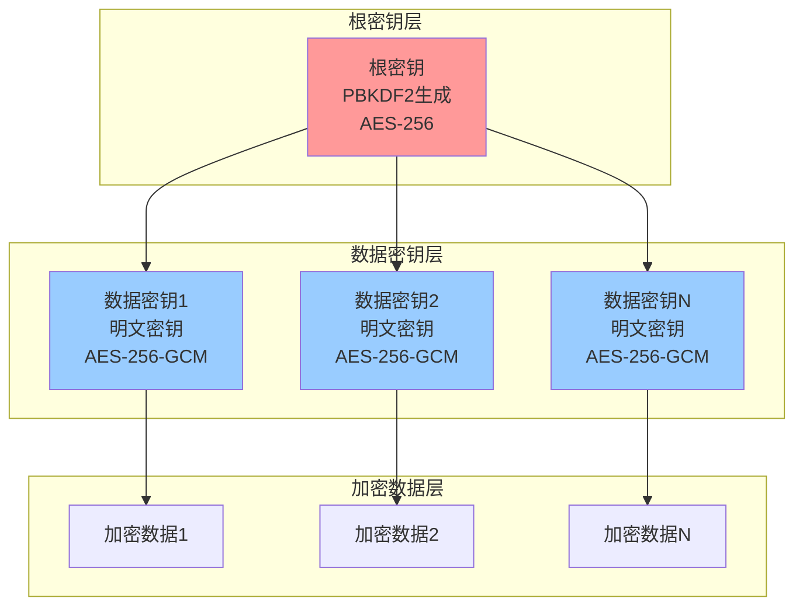

### 安全隔离原则

1. **根密钥保护**：根密钥仅存在于内存中，永不持久化存储
2. **数据密钥隔离**：每个数据密钥独立管理，互不影响
3. **明文密钥限制**：明文密钥仅在内存中存在，使用后立即清除
4. **版本控制**：通过版本号跟踪密钥生命周期

### 密钥生成流程

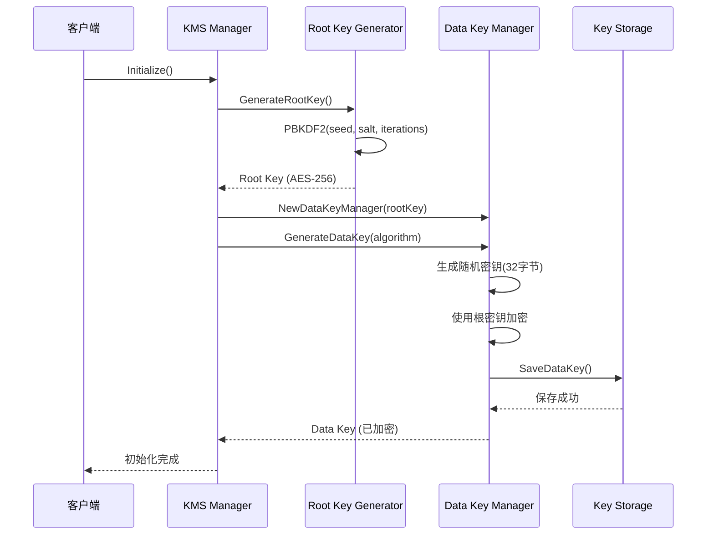

**图表来源**
- [manager.go](file://internal/pkg/kms/manager.go#L45-L85)
- [rootkey.go](file://internal/pkg/kms/rootkey.go#L18-L30)
- [datakey.go](file://internal/pkg/kms/datakey.go#L28-L60)

**章节来源**
- [manager.go](file://internal/pkg/kms/manager.go#L45-L85)
- [rootkey.go](file://internal/pkg/kms/rootkey.go#L18-L94)
- [datakey.go](file://internal/pkg/kms/datakey.go#L28-L60)

## 数据密钥生命周期管理

### 密钥生成与封装

数据密钥的生成过程严格遵循安全规范，确保密钥的随机性和不可预测性。

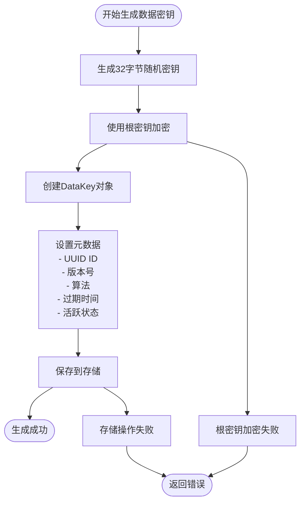

**图表来源**
- [datakey.go](file://internal/pkg/kms/datakey.go#L28-L60)

### 密钥轮换策略

系统支持自动和手动两种密钥轮换模式，确保密钥的安全性。

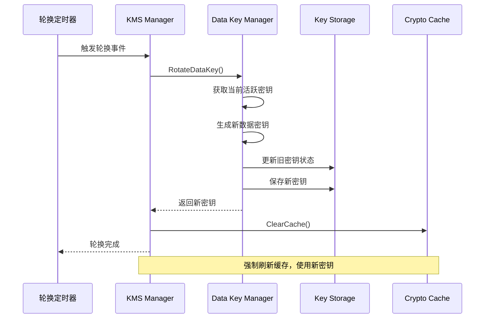

**图表来源**
- [manager.go](file://internal/pkg/kms/manager.go#L240-L270)
- [datakey.go](file://internal/pkg/kms/datakey.go#L62-L90)

### 密钥解封与使用

当需要使用数据密钥时，系统会自动解封密钥并进行必要的验证。

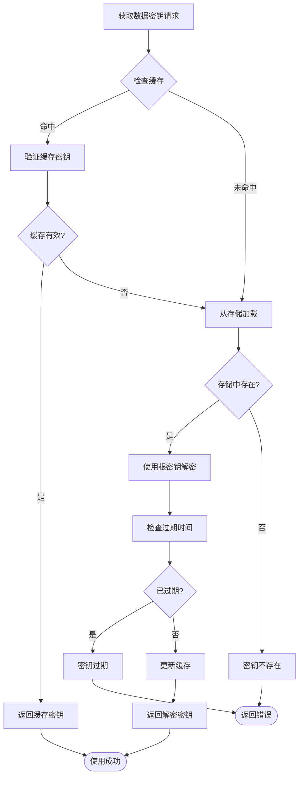

**图表来源**
- [crypto_service.go](file://internal/pkg/kms/crypto_service.go#L130-L170)

**章节来源**
- [datakey.go](file://internal/pkg/kms/datakey.go#L28-L90)
- [manager.go](file://internal/pkg/kms/manager.go#L240-L270)
- [crypto_service.go](file://internal/pkg/kms/crypto_service.go#L130-L170)

## 加解密服务实现

### Crypto Service架构

Crypto Service作为统一的加解密服务，提供了简洁的API接口，隐藏了复杂的密钥管理细节。

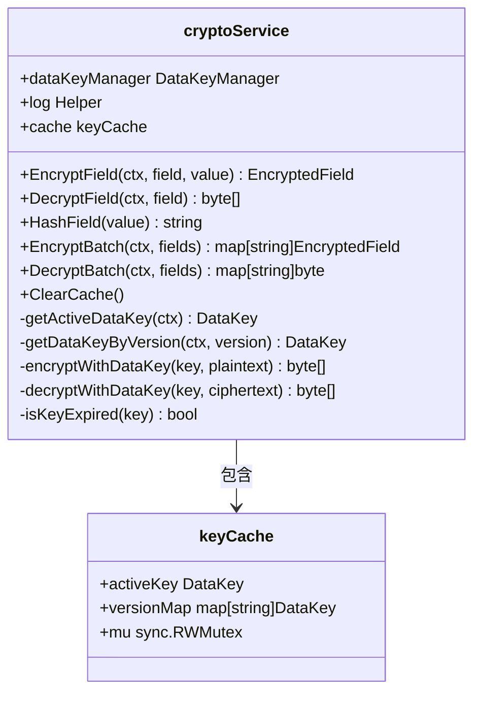

**图表来源**
- [crypto_service.go](file://internal/pkg/kms/crypto_service.go#L18-L25)
- [crypto_service.go](file://internal/pkg/kms/crypto_service.go#L27-L32)

### 密钥缓存机制

为了提升性能，系统实现了智能的密钥缓存机制，减少频繁的密钥查询和解密操作。

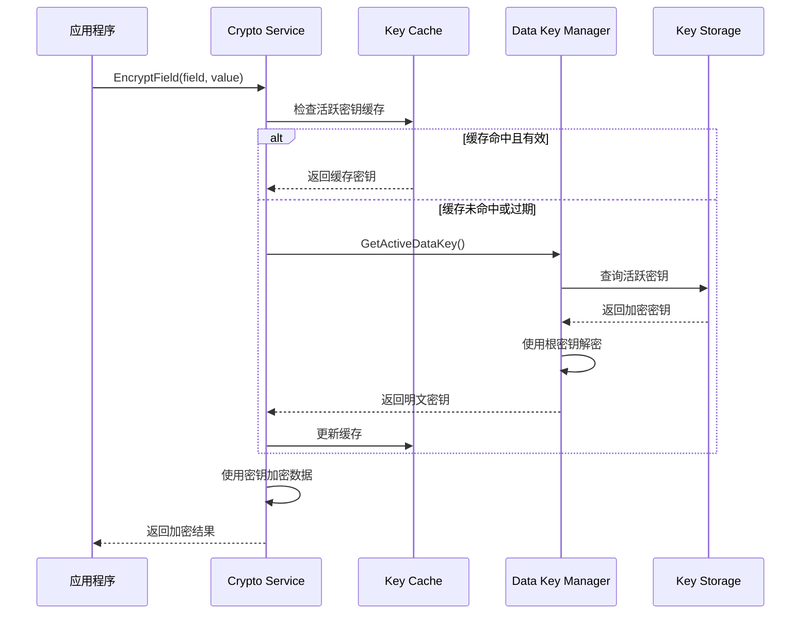

**图表来源**
- [crypto_service.go](file://internal/pkg/kms/crypto_service.go#L130-L170)

### 批量加解密操作

系统支持高效的批量加解密操作，适用于处理大量数据的场景。

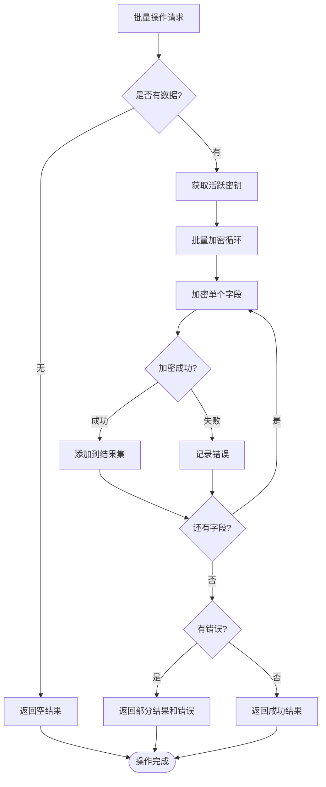

**图表来源**
- [crypto_service.go](file://internal/pkg/kms/crypto_service.go#L75-L120)

**章节来源**
- [crypto_service.go](file://internal/pkg/kms/crypto_service.go#L18-L321)
- [interfaces.go](file://internal/pkg/kms/interfaces.go#L27-L45)

## 数据库设计与存储

### data_keys表结构设计

系统使用专用的data_keys表存储加密后的数据密钥，确保密钥的安全存储和高效查询。

```mermaid
erDiagram
DATA_KEYS {
varchar id PK "UUID主键"
varchar version UK "版本号唯一约束"
varchar algorithm "加密算法"
blob key_data "明文密钥数据"
blob encrypted_key "根密钥加密的密钥"
datetime created_at "创建时间"
datetime expires_at "过期时间"
boolean is_active "是否活跃"
}
DATA_KEYS ||--o{ DATA_KEYS : "版本历史"
INDEX idx_data_keys_version ON DATA_KEYS(version)
INDEX idx_data_keys_active ON DATA_KEYS(is_active)
INDEX idx_data_keys_expires ON DATA_KEYS(expires_at)
INDEX idx_data_keys_created ON DATA_KEYS(created_at)
UNIQUE idx_data_keys_active_unique ON DATA_KEYS(is_active) WHERE is_active = true
```

**图表来源**
- [000002_create_data_keys_table.up.sql](file://internal/data/migrations/000002_create_data_keys_table.up.sql#L1-L21)

### 加密元数据存储方式

数据密钥在存储时采用双重加密策略，确保即使数据库被泄露，密钥也无法直接使用。

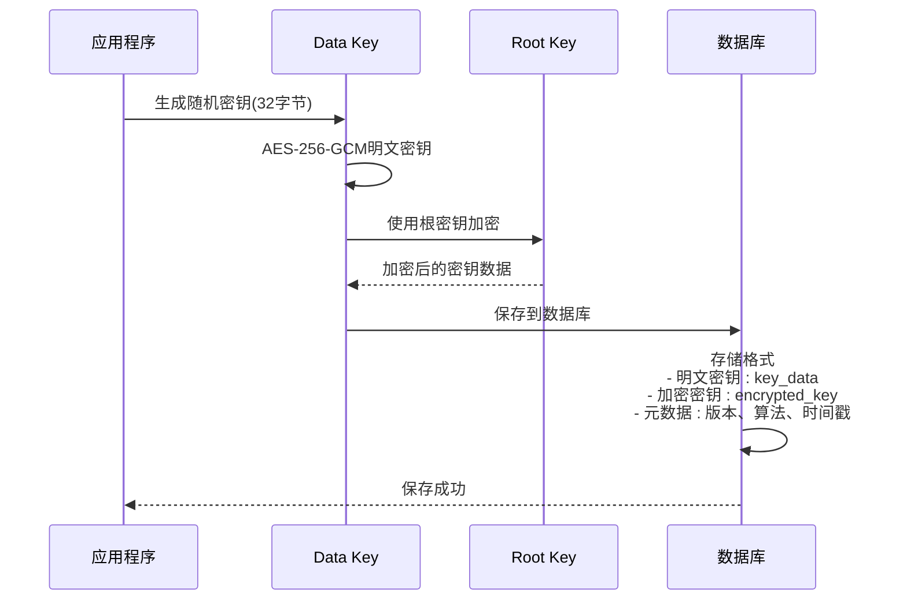

**图表来源**
- [datakey.go](file://internal/pkg/kms/datakey.go#L28-L60)
- [kms.go](file://internal/data/kms.go#L25-L50)

### 密钥统计信息收集

系统提供详细的密钥统计信息，帮助管理员监控密钥使用情况。

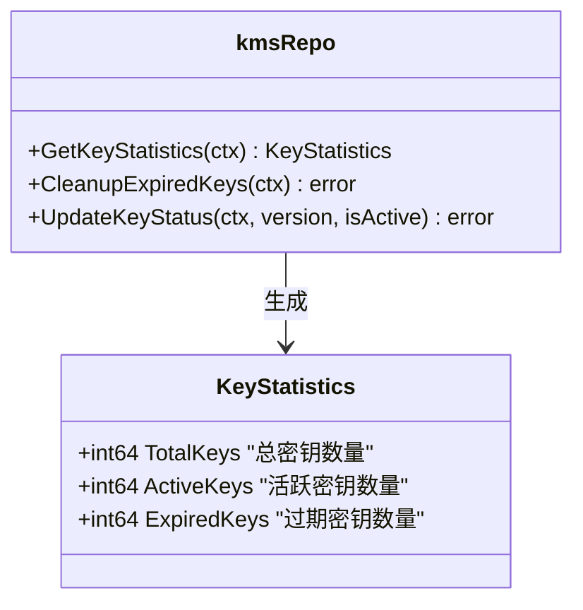

**图表来源**
- [kms.go](file://internal/biz/kms.go#L65-L70)
- [kms.go](file://internal/data/kms.go#L200-L230)

**章节来源**
- [000002_create_data_keys_table.up.sql](file://internal/data/migrations/000002_create_data_keys_table.up.sql#L1-L21)
- [kms.go](file://internal/data/kms.go#L25-L332)
- [kms.go](file://internal/biz/kms.go#L65-L70)

## 业务层使用示例

### 基本加密解密操作

以下是业务层使用KMS进行基本加密解密操作的完整示例：

```go
// 初始化KMS管理器
func initKMS() (kms.KMSManager, error) {
    // 配置KMS参数
    config := &biz.KMSConfig{
        Seed:           "your-secret-seed",
        Salt:           "your-salt-value",
        Iterations:     100000,
        KeyLength:      32,
        RotateInterval: 24 * time.Hour,
        Algorithm:      "AES-256-GCM",
    }
    
    // 创建KMS仓库
    repo := data.NewKMSRepo(dataInstance, logger)
    
    // 创建并初始化KMS管理器
    manager := kms.NewKMSManager(repo, config, logger)
    ctx := context.Background()
    
    if err := manager.Initialize(ctx, config); err != nil {
        return nil, fmt.Errorf("failed to initialize KMS: %w", err)
    }
    
    return manager, nil
}

// 使用KMS加密敏感数据
func encryptSensitiveData(manager kms.KMSManager, fieldName string, data []byte) (*biz.EncryptedField, error) {
    ctx := context.Background()
    
    // 获取加解密服务
    cryptoService := manager.GetCryptoService()
    
    // 加密数据
    encryptedField, err := cryptoService.EncryptField(ctx, fieldName, data)
    if err != nil {
        return nil, fmt.Errorf("encryption failed: %w", err)
    }
    
    return encryptedField, nil
}

// 使用KMS解密敏感数据
func decryptSensitiveData(manager kms.KMSManager, encryptedField *biz.EncryptedField) ([]byte, error) {
    ctx := context.Background()
    
    // 获取加解密服务
    cryptoService := manager.GetCryptoService()
    
    // 解密数据
    decryptedData, err := cryptoService.DecryptField(ctx, encryptedField)
    if err != nil {
        return nil, fmt.Errorf("decryption failed: %w", err)
    }
    
    return decryptedData, nil
}
```

### 批量数据处理

对于需要处理大量数据的场景，可以使用批量操作来提高效率：

```go
// 批量加密多个字段
func batchEncryptData(manager kms.KMSManager, fields map[string][]byte) (map[string]*biz.EncryptedField, error) {
    ctx := context.Background()
    
    // 获取加解密服务
    cryptoService := manager.GetCryptoService()
    
    // 批量加密
    encryptedFields, err := cryptoService.EncryptBatch(ctx, fields)
    if err != nil {
        return nil, fmt.Errorf("batch encryption failed: %w", err)
    }
    
    return encryptedFields, nil
}

// 批量解密多个字段
func batchDecryptData(manager kms.KMSManager, encryptedFields map[string]*biz.EncryptedField) (map[string][]byte, error) {
    ctx := context.Background()
    
    // 获取加解密服务
    cryptoService := manager.GetCryptoService()
    
    // 批量解密
    decryptedFields, err := cryptoService.DecryptBatch(ctx, encryptedFields)
    if err != nil {
        return nil, fmt.Errorf("batch decryption failed: %w", err)
    }
    
    return decryptedFields, nil
}
```

### 密钥轮换操作

定期轮换密钥是保持系统安全的重要措施：

```go
// 手动触发密钥轮换
func rotateDataKey(manager kms.KMSManager) (*biz.DataKey, error) {
    ctx := context.Background()
    
    // 轮换数据密钥
    newKey, err := manager.RotateDataKey(ctx)
    if err != nil {
        return nil, fmt.Errorf("key rotation failed: %w", err)
    }
    
    // 记录轮换日志
    log.Printf("Data key rotated successfully. New version: %s", newKey.Version)
    
    return newKey, nil
}

// 获取当前活跃密钥
func getCurrentActiveKey(manager kms.KMSManager) (*biz.DataKey, error) {
    ctx := context.Background()
    
    // 获取当前活跃密钥
    activeKey, err := manager.GetActiveDataKey(ctx)
    if err != nil {
        return nil, fmt.Errorf("failed to get active key: %w", err)
    }
    
    return activeKey, nil
}
```

### 系统状态监控

实时监控KMS系统的运行状态：

```go
// 获取KMS系统状态
func getKMSStatus(manager kms.KMSManager) (*kms.KMSStatus, error) {
    ctx := context.Background()
    
    // 获取系统状态
    status, err := manager.GetStatus(ctx)
    if err != nil {
        return nil, fmt.Errorf("failed to get KMS status: %w", err)
    }
    
    // 输出状态信息
    log.Printf("KMS Status - Initialized: %v, Shutdown: %v", 
               status.Initialized, status.Shutdown)
    log.Printf("Active Key - Version: %s, Expires: %v", 
               status.ActiveKeyVersion, status.ActiveKeyExpiry)
    log.Printf("Key Statistics - Total: %d, Active: %d, Expired: %d", 
               status.KeyStatistics.TotalKeys, 
               status.KeyStatistics.ActiveKeys, 
               status.KeyStatistics.ExpiredKeys)
    
    return status, nil
}

// 执行定期维护
func performMaintenance(manager kms.KMSManager) error {
    ctx := context.Background()
    
    // 执行维护操作
    if err := manager.PerformMaintenance(ctx); err != nil {
        return fmt.Errorf("maintenance failed: %w", err)
    }
    
    log.Println("KMS maintenance completed successfully")
    return nil
}
```

**章节来源**
- [manager_test.go](file://internal/pkg/kms/manager_test.go#L41-L76)
- [manager_test.go](file://internal/pkg/kms/manager_test.go#L185-L251)

## 安全性最佳实践

### 密钥缓存时效控制

系统实现了智能的密钥缓存机制，平衡性能和安全性：

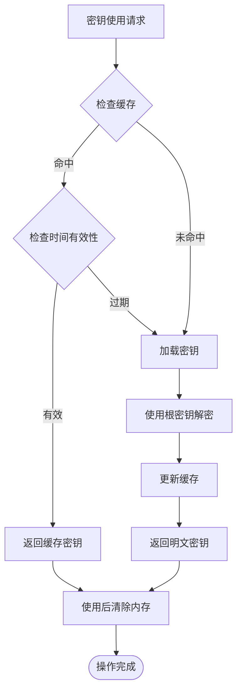

**图表来源**
- [crypto_service.go](file://internal/pkg/kms/crypto_service.go#L130-L170)

### 审计追踪机制

系统提供完整的审计追踪功能，记录所有密钥操作：

```go
// 审计追踪示例
func setupAuditLogging(manager kms.KMSManager) {
    // 记录密钥生成事件
    logEvent := func(operation, keyVersion string, duration time.Duration) {
        auditLog := map[string]interface{}{
            "timestamp": time.Now().UTC(),
            "operation": operation,
            "key_version": keyVersion,
            "duration_ms": duration.Milliseconds(),
            "user_agent": "kms-manager",
        }
        
        // 发送到审计系统
        sendToAuditSystem(auditLog)
    }
    
    // 包装加密操作以添加审计
    originalEncrypt := manager.GetCryptoService().(*cryptoService).EncryptField
    manager.GetCryptoService().(*cryptoService).EncryptField = func(ctx context.Context, field string, value []byte) (*biz.EncryptedField, error) {
        start := time.Now()
        defer func() {
            logEvent("encrypt", "", time.Since(start))
        }()
        return originalEncrypt(ctx, field, value)
    }
}
```

### 异常访问告警

实现多层次的异常访问检测和告警机制：

```go
// 异常访问检测
func setupAccessMonitoring(manager kms.KMSManager) {
    const (
        MAX_FAILED_ATTEMPTS = 5
        WINDOW_DURATION     = 5 * time.Minute
    )
    
    failedAttempts := make(map[string]int)
    lastAttemptTime := make(map[string]time.Time)
    
    monitorAccess := func(ipAddress string) bool {
        now := time.Now()
        lastTime, exists := lastAttemptTime[ipAddress]
        
        if exists && now.Sub(lastTime) < WINDOW_DURATION {
            failedAttempts[ipAddress]++
        } else {
            failedAttempts[ipAddress] = 1
        }
        
        lastAttemptTime[ipAddress] = now
        
        if failedAttempts[ipAddress] >= MAX_FAILED_ATTEMPTS {
            // 触发告警
            alertSystem("Suspicious KMS access detected from IP: " + ipAddress)
            return false
        }
        
        return true
    }
    
    // 在关键操作前添加访问检查
    originalGetActiveKey := manager.GetActiveDataKey
    manager.GetActiveDataKey = func(ctx context.Context) (*biz.DataKey, error) {
        // 获取客户端IP地址
        ipAddr := extractIPAddress(ctx)
        
        if !monitorAccess(ipAddr) {
            return nil, biz.ErrSecurityViolation
        }
        
        return originalGetActiveKey(ctx)
    }
}
```

### 密钥安全存储

确保密钥在存储过程中的安全性：

```go
// 密钥安全存储示例
func secureKeyStorage() {
    // 使用环境变量存储敏感配置
    seed := os.Getenv("KMS_SEED")
    salt := os.Getenv("KMS_SALT")
    
    if seed == "" || salt == "" {
        panic("Missing required KMS configuration")
    }
    
    // 使用硬件安全模块(HSM)存储根密钥
    if useHSM {
        rootKey, err := hsm.GenerateRootKey()
        if err != nil {
            panic("Failed to generate root key in HSM: " + err.Error())
        }
        
        // 将根密钥导出到安全位置
        exportRootKeyToSecureLocation(rootKey)
    }
    
    // 实施密钥备份策略
    go func() {
        ticker := time.NewTicker(24 * time.Hour)
        defer ticker.Stop()
        
        for {
            <-ticker.C
            backupKeysToSecureLocation()
        }
    }()
}
```

**章节来源**
- [crypto_service.go](file://internal/pkg/kms/crypto_service.go#L280-L321)
- [manager.go](file://internal/pkg/kms/manager.go#L240-L270)

## 故障排除指南

### 常见错误及解决方案

#### 1. 密钥初始化失败

**错误现象**：
```
Failed to initialize KMS manager: config validation failed: invalid seed
```

**解决方案**：
```go
// 检查配置参数
func validateKMSConfig(config *biz.KMSConfig) error {
    if config.Seed == "" {
        return fmt.Errorf("seed cannot be empty")
    }
    
    if len(config.Salt) < 8 {
        return fmt.Errorf("salt must be at least 8 characters long")
    }
    
    if config.Iterations < 10000 {
        return fmt.Errorf("iterations should be at least 10000 for security")
    }
    
    if config.KeyLength != 16 && config.KeyLength != 24 && config.KeyLength