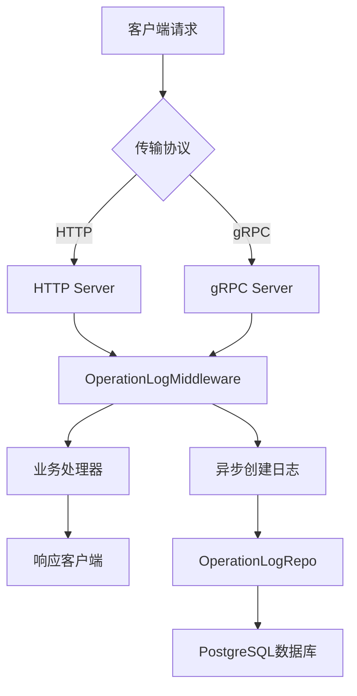
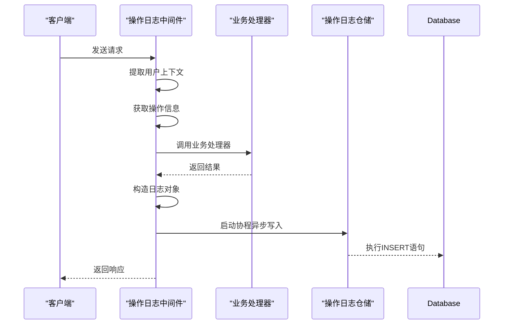
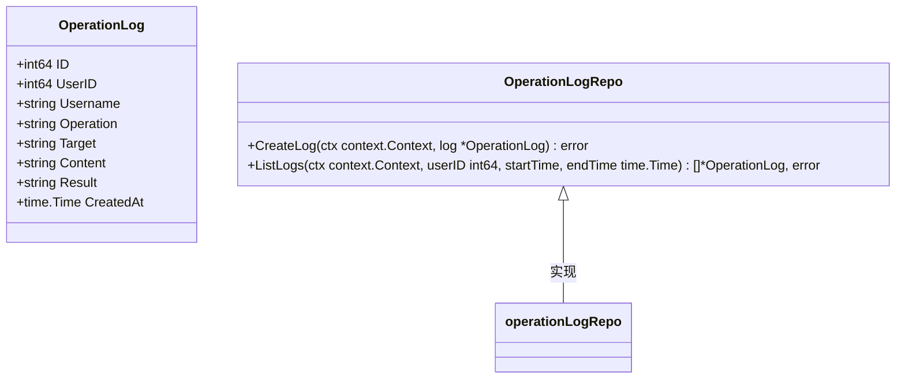

# 操作日志记录

<cite>
**本文档引用的文件**
- [operation_log.go](file://internal/biz/operation_log.go)
- [operation_log.go](file://internal/data/operation_log.go)
- [operation_log_test.go](file://internal/data/operation_log_test.go)
- [operation_log.go](file://internal/server/middleware/operation_log.go)
- [000001_init_schema.up.sql](file://migrations/000001_init_schema.up.sql)
- [main.go](file://cmd/kratos-boilerplate/main.go)
- [wire.go](file://cmd/kratos-boilerplate/wire.go)
</cite>

## 目录
1. [引言](#引言)
2. [操作日志系统架构](#操作日志系统架构)
3. [核心组件分析](#核心组件分析)
4. [数据模型与数据库映射](#数据模型与数据库映射)
5. [异步写入机制](#异步写入机制)
6. [表结构演变与迁移脚本](#表结构演变与迁移脚本)
7. [查询接口使用示例](#查询接口使用示例)
8. [故障排查指引](#故障排查指引)
9. [索引优化建议](#索引优化建议)
10. [结论](#结论)

## 引言
操作日志系统是现代应用安全与审计的重要组成部分，用于记录用户在系统中的关键操作行为。本系统基于Kratos框架实现，通过中间件拦截请求，提取上下文信息并持久化到PostgreSQL数据库中。系统设计遵循分层架构原则，包含业务逻辑层、数据访问层和中间件层，确保了代码的可维护性和扩展性。

## 操作日志系统架构
操作日志系统的整体架构采用典型的三层设计模式，包括表现层（中间件）、业务逻辑层和数据访问层。当HTTP或gRPC请求到达服务器时，操作日志中间件首先拦截请求，在执行实际业务处理前后收集必要的上下文信息，并将日志记录任务以异步方式提交给数据访问层进行持久化存储。



**Diagram sources**
- [operation_log.go](file://internal/server/middleware/operation_log.go#L1-L118)
- [operation_log.go](file://internal/data/operation_log.go#L1-L50)

**Section sources**
- [operation_log.go](file://internal/server/middleware/operation_log.go#L1-L118)
- [operation_log.go](file://internal/data/operation_log.go#L1-L50)

## 核心组件分析

### 操作日志中间件
操作日志中间件是整个系统的核心组件，负责拦截所有进入的请求并提取关键上下文信息。中间件实现了`middleware.Middleware`接口，能够在请求处理流程中无缝集成。它从上下文中获取用户ID、用户名、操作类型、目标资源等信息，并在主业务逻辑执行完成后构造操作日志对象。



**Diagram sources**
- [operation_log.go](file://internal/server/middleware/operation_log.go#L1-L118)
- [operation_log.go](file://internal/data/operation_log.go#L1-L50)

**Section sources**
- [operation_log.go](file://internal/server/middleware/operation_log.go#L1-L118)

### 业务逻辑层
业务逻辑层定义了操作日志的核心数据结构和仓储接口。`OperationLog`结构体包含了日志记录所需的全部字段，而`OperationLogRepo`接口则抽象了日志的创建和查询操作，为上层提供了统一的数据访问契约。



**Diagram sources**
- [operation_log.go](file://internal/biz/operation_log.go#L1-L24)

**Section sources**
- [operation_log.go](file://internal/biz/operation_log.go#L1-L24)

## 数据模型与数据库映射
操作日志的数据模型设计遵循六要素原则，包含用户标识、操作类型、目标资源、操作内容、结果状态和时间戳。尽管当前项目中缺少显式的迁移脚本，但从数据访问层的SQL语句可以推断出`operation_logs`表的结构。

```sql
CREATE TABLE operation_logs (
    id BIGSERIAL PRIMARY KEY,
    user_id BIGINT NOT NULL,
    username VARCHAR(255) NOT NULL,
    operation VARCHAR(512) NOT NULL,
    target VARCHAR(512) NOT NULL,
    content TEXT,
    result TEXT,
    created_at TIMESTAMP WITH TIME ZONE DEFAULT CURRENT_TIMESTAMP
);

CREATE INDEX idx_operation_logs_user_id ON operation_logs(user_id);
CREATE INDEX idx_operation_logs_created_at ON operation_logs(created_at);
CREATE INDEX idx_operation_logs_user_time ON operation_logs(user_id, created_at);
```

该表结构支持高效的时间范围查询和用户特定日志检索，同时通过适当的索引设计保证了查询性能。

**Section sources**
- [operation_log.go](file://internal/data/operation_log.go#L25-L31)

## 异步写入机制
为了避免日志记录阻塞主业务流程，系统采用了Go语言的goroutine机制实现异步写入。当日志中间件捕获到请求完成事件后，会立即启动一个独立的协程来执行数据库插入操作，而主协程则继续返回响应给客户端。

```go
// 异步记录日志
go func() {
    if err := repo.CreateLog(context.Background(), log); err != nil {
        // 这里可以添加日志记录失败的处理逻辑
    }
}()
```

这种设计确保了即使在数据库写入延迟或失败的情况下，也不会影响正常的业务功能，提高了系统的整体可用性和响应速度。

**Section sources**
- [operation_log.go](file://internal/server/middleware/operation_log.go#L45-L50)

## 表结构演变与迁移脚本
虽然当前项目中没有发现专门针对操作日志表的迁移脚本，但根据标准实践，表结构的创建应该通过版本化的迁移文件进行管理。理想的迁移脚本应该包含创建表、添加索引、设置约束等操作，并提供相应的回滚脚本。

```sql
-- migrations/000003_create_operation_logs.up.sql
CREATE TABLE operation_logs (
    id BIGSERIAL PRIMARY KEY,
    user_id BIGINT NOT NULL,
    username VARCHAR(255) NOT NULL,
    operation VARCHAR(512) NOT NULL,
    target VARCHAR(512) NOT NULL,
    content TEXT,
    result TEXT,
    created_at TIMESTAMP WITH TIME ZONE DEFAULT CURRENT_TIMESTAMP
);

CREATE INDEX idx_operation_logs_user_id ON operation_logs(user_id);
CREATE INDEX idx_operation_logs_created_at ON operation_logs(created_at);
CREATE INDEX idx_operation_logs_user_time ON operation_logs(user_id, created_at);
```

```sql
-- migrations/000003_create_operation_logs.down.sql
DROP TABLE IF EXISTS operation_logs;
```

**Section sources**
- [000001_init_schema.up.sql](file://migrations/000001_init_schema.up.sql#L1-L17)

## 查询接口使用示例
系统提供了按用户ID和时间范围查询操作日志的功能，便于审计和问题排查。以下是典型的使用示例：

```go
// 创建上下文
ctx := context.Background()

// 定义查询时间范围
startTime := time.Now().Add(-24 * time.Hour)
endTime := time.Now()

// 查询指定用户的操作日志
logs, err := operationLogRepo.ListLogs(ctx, userID, startTime, endTime)
if err != nil {
    log.Error("查询操作日志失败:", err)
    return
}

// 处理查询结果
for _, logEntry := range logs {
    fmt.Printf("用户 %s 在 %v 执行了 %s 操作，结果: %s\n",
        logEntry.Username,
        logEntry.CreatedAt,
        logEntry.Operation,
        logEntry.Result)
}
```

此接口支持灵活的时间范围查询，可用于生成日报、周报或进行安全审计分析。

**Section sources**
- [operation_log.go](file://internal/data/operation_log.go#L33-L48)

## 故障排查指引

### 日志丢失问题诊断
当发现操作日志丢失时，应按照以下步骤进行排查：
1. 检查中间件是否正确注册到HTTP/gRPC服务器
2. 验证用户认证信息是否正确传递到context中
3. 查看应用日志中是否有数据库连接错误
4. 确认数据库磁盘空间是否充足
5. 检查网络连接是否稳定

### 写入延迟问题诊断
若出现日志写入延迟，可能的原因及解决方案包括：
1. **数据库性能瓶颈**：检查数据库CPU、内存使用情况，优化慢查询
2. **连接池耗尽**：增加数据库连接池大小
3. **网络延迟**：检查应用服务器与数据库之间的网络状况
4. **批量处理缺失