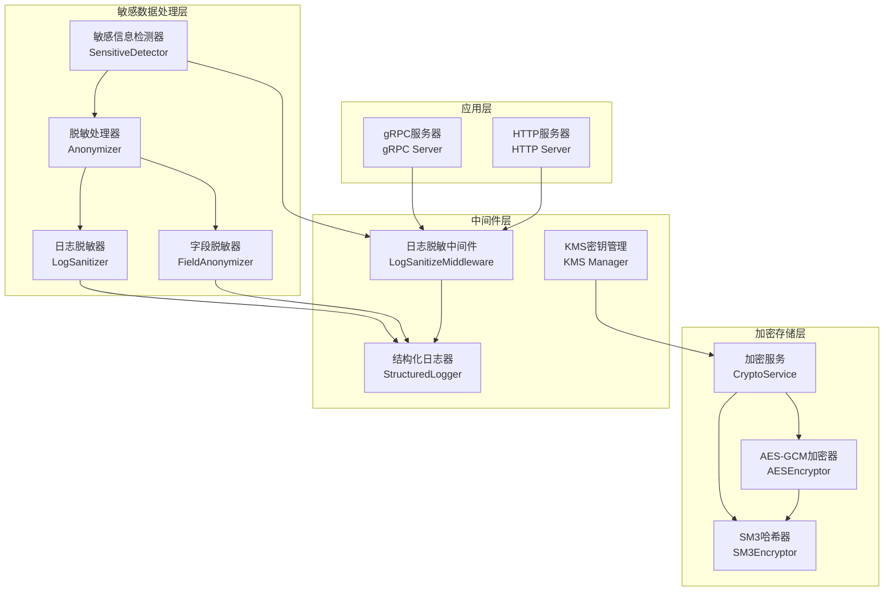
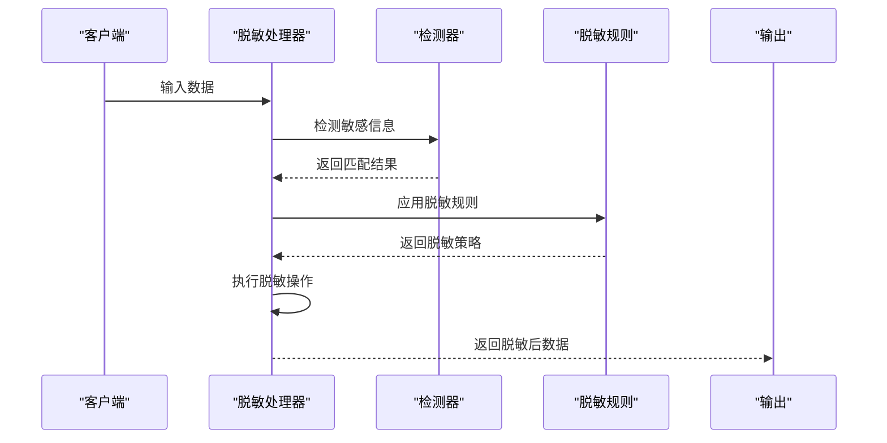
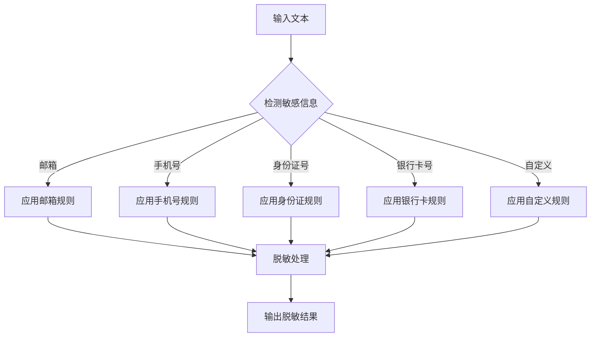
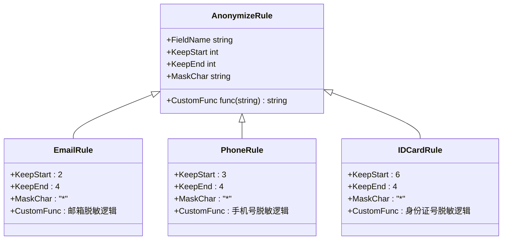
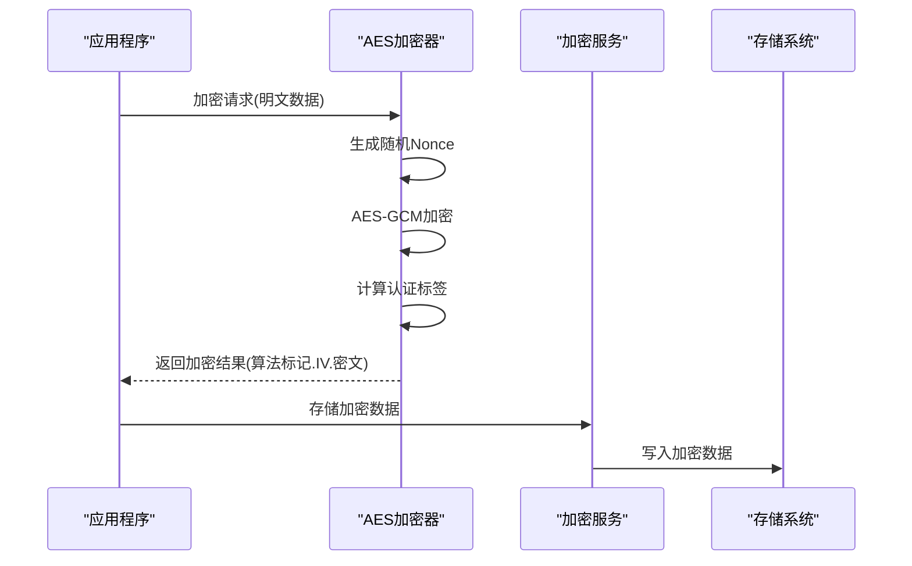
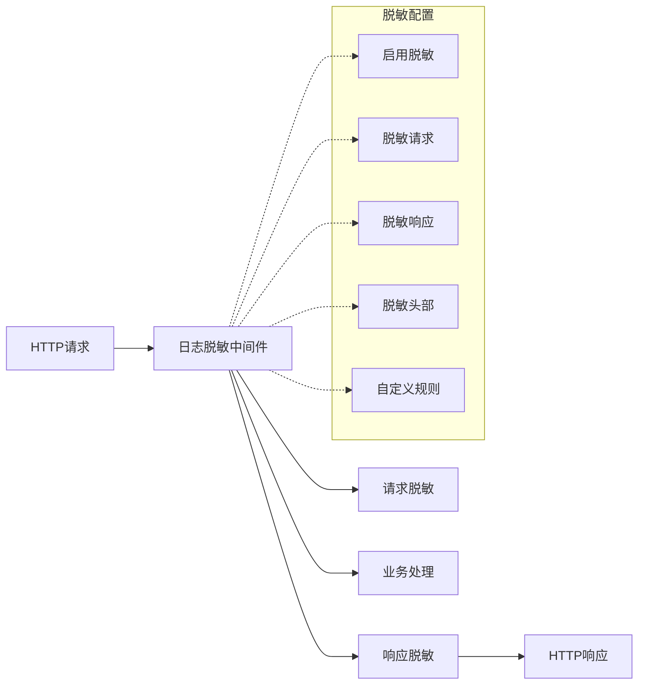
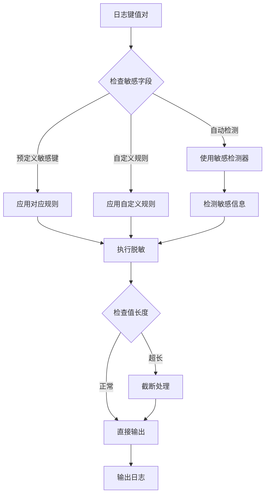
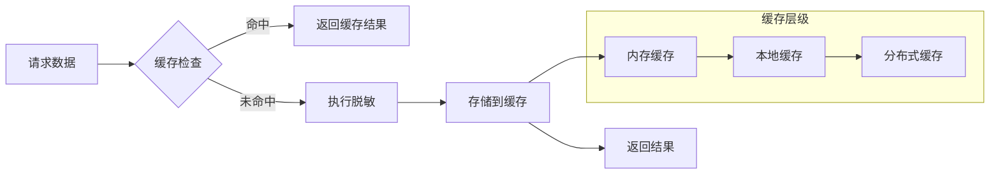

# 敏感数据处理机制

<cite>
**本文档引用的文件**
- [anonymizer.go](file://internal/pkg/sensitive/anonymizer.go)
- [rules.go](file://internal/pkg/sensitive/rules.go)
- [middleware.go](file://internal/pkg/sensitive/middleware.go)
- [structured_logger.go](file://internal/pkg/sensitive/structured_logger.go)
- [interfaces.go](file://internal/pkg/sensitive/interfaces.go)
- [factory.go](file://internal/pkg/sensitive/factory.go)
- [aes.go](file://internal/pkg/crypto/aes.go)
- [sm3.go](file://internal/pkg/crypto/sm3.go)
- [anonymizer_test.go](file://internal/pkg/sensitive/anonymizer_test.go)
</cite>

## 目录
1. [简介](#简介)
2. [项目架构概览](#项目架构概览)
3. [核心组件分析](#核心组件分析)
4. [敏感数据识别机制](#敏感数据识别机制)
5. [脱敏处理系统](#脱敏处理系统)
6. [加密存储机制](#加密存储机制)
7. [日志脱敏中间件](#日志脱敏中间件)
8. [结构化日志隐私保护](#结构化日志隐私保护)
9. [性能优化策略](#性能优化策略)
10. [故障排除指南](#故障排除指南)
11. [总结](#总结)

## 简介

本项目实现了一套完整的敏感数据处理机制，包括敏感信息的自动识别、智能脱敏和安全存储。该系统基于规则引擎设计，能够自动检测手机号、身份证号、邮箱等敏感字段，并在日志输出或API响应中执行脱敏替换。同时集成了AES对称加密与SM3哈希算法，确保数据的安全存储和传输。

系统的核心设计理念是"零信任"原则，即任何可能包含敏感信息的数据都必须经过严格的脱敏处理，即使是在内部系统间传递时也必须保证数据安全。通过多层次的防护机制，系统能够在不影响业务逻辑的前提下，有效防止敏感数据泄露。

## 项目架构概览



**图表来源**
- [anonymizer.go](file://internal/pkg/sensitive/anonymizer.go#L1-L50)
- [middleware.go](file://internal/pkg/sensitive/middleware.go#L1-L50)
- [structured_logger.go](file://internal/pkg/sensitive/structured_logger.go#L1-L50)

系统采用分层架构设计，将敏感数据处理功能分布在不同的层次中：

- **敏感数据处理层**：负责敏感信息的识别、脱敏和转换
- **加密存储层**：提供数据加密和哈希计算功能
- **中间件层**：集成到请求处理链中，实现自动化字段过滤
- **应用层**：通过HTTP和gRPC服务器提供服务

## 核心组件分析

### 敏感信息检测器

敏感信息检测器是整个系统的基础组件，负责识别各种类型的敏感数据。它使用正则表达式模式来检测不同类型的敏感信息。

```mermaid
classDiagram
class SensitiveDetector {
+emailRegex *regexp.Regexp
+phoneRegex *regexp.Regexp
+idCardRegex *regexp.Regexp
+bankCardRegex *regexp.Regexp
+DetectSensitiveInfo(text string, infoType string) []string
+HasSensitiveInfo(text string, infoType string) bool
+DetectEmail(text string) []string
+DetectPhone(text string) []string
+DetectIDCard(text string) []string
+DetectBankCard(text string) []string
+DetectAll(text string) map[string][]string
}
class anonymizer {
+defaultRules map[string]AnonymizeRule
+detector SensitiveDetector
+AnonymizeString(value string, rule AnonymizeRule) string
+AnonymizeObject(obj MakeSensitive) interface{}
+AnonymizeBatch(objects []MakeSensitive) []interface{}
+AnonymizeValue(value interface{}, rules map[string]AnonymizeRule) interface{}
}
class logSanitizer {
+anonymizer Anonymizer
+detector SensitiveDetector
+rules map[string]AnonymizeRule
+SanitizeLogContent(content interface{}) string
+SanitizeLogMessage(message string) string
+ContainsSensitiveInfo(content string) bool
}
SensitiveDetector <|-- anonymizer : "使用"
SensitiveDetector <|-- logSanitizer : "使用"
```

**图表来源**
- [anonymizer.go](file://internal/pkg/sensitive/anonymizer.go#L15-L30)
- [interfaces.go](file://internal/pkg/sensitive/interfaces.go#L60-L75)

检测器支持以下敏感信息类型：
- **邮箱地址**：使用标准邮箱格式正则表达式
- **手机号码**：专门针对中国大陆手机号格式
- **身份证号码**：符合国家标准的18位身份证号格式
- **银行卡号**：支持12-19位的银行卡号格式

**章节来源**
- [anonymizer.go](file://internal/pkg/sensitive/anonymizer.go#L280-L320)
- [interfaces.go](file://internal/pkg/sensitive/interfaces.go#L60-L75)

### 脱敏处理器

脱敏处理器是系统的核心组件，提供了灵活的脱敏规则和多种脱敏策略。



**图表来源**
- [anonymizer.go](file://internal/pkg/sensitive/anonymizer.go#L15-L50)
- [rules.go](file://internal/pkg/sensitive/rules.go#L10-L50)

脱敏处理器支持以下特性：
- **多层级脱敏**：支持字符串、结构体、切片、映射等多种数据类型
- **自定义规则**：允许用户定义自己的脱敏规则
- **批量处理**：支持批量脱敏多个对象
- **递归处理**：能够处理嵌套的数据结构

**章节来源**
- [anonymizer.go](file://internal/pkg/sensitive/anonymizer.go#L50-L150)
- [anonymizer.go](file://internal/pkg/sensitive/anonymizer.go#L200-L280)

## 敏感数据识别机制

### 正则表达式模式

系统使用精心设计的正则表达式来识别各种敏感数据类型：

```go
// 邮箱正则表达式
emailRegex := regexp.MustCompile(`[a-zA-Z0-9._%+-]+@[a-zA-Z0-9.-]+\.[a-zA-Z]{2,}`)

// 手机号正则表达式（中国）
phoneRegex := regexp.MustCompile(`1[3-9]\d{9}`)

// 身份证号正则表达式
idCardRegex := regexp.MustCompile(`[1-9]\d{5}(18|19|20)\d{2}(0[1-9]|1[0-2])(0[1-9]|[12]\d|3[01])\d{3}[\dXx]`)

// 银行卡号正则表达式
bankCardRegex := regexp.MustCompile(`[1-9]\d{11,19}`)
```

### 自定义识别规则

系统支持通过配置文件或代码动态添加新的识别规则：



**图表来源**
- [rules.go](file://internal/pkg/sensitive/rules.go#L100-L150)
- [anonymizer.go](file://internal/pkg/sensitive/anonymizer.go#L280-L320)

**章节来源**
- [rules.go](file://internal/pkg/sensitive/rules.go#L100-L150)
- [anonymizer.go](file://internal/pkg/sensitive/anonymizer.go#L280-L320)

## 脱敏处理系统

### 预定义脱敏规则

系统内置了多种预定义的脱敏规则，每种规则都有特定的脱敏策略：



**图表来源**
- [rules.go](file://internal/pkg/sensitive/rules.go#L10-L80)
- [interfaces.go](file://internal/pkg/sensitive/interfaces.go#L20-L30)

### 字段级脱敏器

字段脱敏器提供了针对特定字段类型的专用脱敏方法：

- **邮箱脱敏**：保留用户名前两个字符和域名部分
- **手机号脱敏**：保留前三位和后四位，中间用星号替代
- **身份证号脱敏**：保留前六位地址码和后四位数字
- **姓名脱敏**：保留首尾字符，中间用星号替代
- **银行卡号脱敏**：保留前四位和后四位，中间用星号替代
- **地址脱敏**：保留前六个字符（通常是省市区）

**章节来源**
- [anonymizer.go](file://internal/pkg/sensitive/anonymizer.go#L200-L230)
- [rules.go](file://internal/pkg/sensitive/rules.go#L10-L80)

## 加密存储机制

### AES对称加密

系统使用AES-GCM模式进行对称加密，提供数据的机密性和完整性保护：



**图表来源**
- [aes.go](file://internal/pkg/crypto/aes.go#L30-L80)
- [aes.go](file://internal/pkg/crypto/aes.go#L80-L120)

AES加密器的特点：
- **算法标记**：每个加密结果包含算法标识符，便于后续解密
- **随机IV**：每次加密使用随机初始化向量，增强安全性
- **认证加密**：AES-GCM提供加密和认证双重保护
- **格式化输出**：加密结果采用统一格式：算法标记.IV.密文

### SM3哈希算法

SM3是中国国家密码标准的哈希算法，用于数据完整性验证：

```go
// SM3加密器实现
type SM3Encryptor struct {
    key []byte
}

// 哈希计算
func (e *SM3Encryptor) Hash(data []byte) string {
    h := sm3.New()
    h.Write(data)
    return hex.EncodeToString(h.Sum(nil))
}
```

SM3算法的优势：
- **国密合规**：符合中国国家密码标准
- **高效计算**：相比SHA-256具有更好的性能
- **不可逆性**：单向哈希函数，无法从哈希值还原原始数据
- **抗碰撞性**：具有良好的抗碰撞特性

**章节来源**
- [aes.go](file://internal/pkg/crypto/aes.go#L30-L80)
- [sm3.go](file://internal/pkg/crypto/sm3.go#L15-L50)

## 日志脱敏中间件

### 中间件架构

日志脱敏中间件集成到Kratos框架的请求处理链中，自动对请求和响应数据进行脱敏处理：



**图表来源**
- [middleware.go](file://internal/pkg/sensitive/middleware.go#L50-L100)
- [middleware.go](file://internal/pkg/sensitive/middleware.go#L150-L200)

### 配置选项

日志脱敏中间件提供了丰富的配置选项：

```go
type LogSanitizeConfig struct {
    Enabled          bool                     // 是否启用脱敏
    SanitizeRequest  bool                     // 是否脱敏请求
    SanitizeResponse bool                     // 是否脱敏响应
    SanitizeHeaders  bool                     // 是否脱敏请求头
    CustomRules      map[string]AnonymizeRule // 自定义脱敏规则
    ExcludePaths     []string                 // 排除路径
    MaxLogLength     int                      // 最大日志长度
}
```

关键配置特性：
- **路径排除**：可以配置不需要脱敏的API路径
- **头部过滤**：自动过滤敏感的HTTP头部信息
- **长度限制**：防止过长的日志内容影响性能
- **自定义规则**：支持用户定义特殊的脱敏规则

**章节来源**
- [middleware.go](file://internal/pkg/sensitive/middleware.go#L20-L50)
- [middleware.go](file://internal/pkg/sensitive/middleware.go#L150-L200)

## 结构化日志隐私保护

### 结构化日志器

结构化日志器提供了高级的隐私保护功能，能够自动检测和脱敏敏感字段：

```mermaid
classDiagram
class StructuredLogger {
+helper *log.Helper
+logger log.Logger
+anonymizer Anonymizer
+rules map[string]AnonymizeRule
+config *StructuredLogConfig
+Infow(msg string, keysAndValues ...interface{})
+Debugw(msg string, keysAndValues ...interface{})
+Errorw(msg string, keysAndValues ...interface{})
+sanitizeKeyValues(keysAndValues ...interface{}) []interface{}
+isSensitiveKey(key string) bool
+sanitizeValue(key string, value interface{}) interface{}
}
class StructuredLogConfig {
+Enabled bool
+AutoDetect bool
+CustomRules map[string]AnonymizeRule
+SensitiveKeys []string
+MaxValueLength int
+TruncateThreshold int
}
StructuredLogger --> StructuredLogConfig : "使用"
StructuredLogger --> Anonymizer : "使用"
```

**图表来源**
- [structured_logger.go](file://internal/pkg/sensitive/structured_logger.go#L10-L50)
- [structured_logger.go](file://internal/pkg/sensitive/structured_logger.go#L20-L40)

### 自动检测机制

结构化日志器具备自动检测敏感信息的能力：



**图表来源**
- [structured_logger.go](file://internal/pkg/sensitive/structured_logger.go#L300-L350)
- [structured_logger.go](file://internal/pkg/sensitive/structured_logger.go#L350-L380)

自动检测功能包括：
- **敏感字段识别**：根据字段名称自动识别敏感信息
- **内容检测**：对非敏感字段的内容进行敏感信息检测
- **长度控制**：自动截断过长的日志内容
- **格式化输出**：保持日志的结构化格式

**章节来源**
- [structured_logger.go](file://internal/pkg/sensitive/structured_logger.go#L300-L380)

## 性能优化策略

### 缓存机制

为了提高性能，系统实现了多级缓存机制：



### 并发优化

系统采用多种并发优化策略：

- **无锁设计**：大部分脱敏操作采用无锁算法
- **批量处理**：支持批量脱敏减少系统调用开销
- **异步处理**：对于非关键路径的脱敏操作采用异步处理
- **连接池**：复用数据库和网络连接

### 性能监控

系统提供了详细的性能监控指标：

- **处理时间**：记录每个脱敏操作的耗时
- **吞吐量**：统计单位时间内的处理数量
- **缓存命中率**：监控缓存系统的效率
- **内存使用**：跟踪内存消耗情况

**章节来源**
- [anonymizer.go](file://internal/pkg/sensitive/anonymizer.go#L50-L100)
- [middleware.go](file://internal/pkg/sensitive/middleware.go#L100-L150)

## 故障排除指南

### 常见问题诊断

1. **脱敏规则不生效**
   - 检查规则配置是否正确
   - 验证字段名称是否匹配
   - 确认自定义规则是否被正确加载

2. **性能问题**
   - 分析脱敏操作的热点
   - 检查缓存配置是否合理
   - 优化正则表达式模式

3. **日志异常**
   - 检查日志配置是否正确
   - 验证敏感信息检测是否准确
   - 确认日志格式是否符合预期

### 调试工具

系统提供了多种调试工具：

```go
// 脱敏内容检查
helper := NewSensitiveLogHelper()
content := "包含敏感信息的文本"
sanitized := helper.SanitizeForLog(content)
contains := helper.ContainsSensitive(content)

// 日志安全值包装
safeValue := NewLogSafeValue(unsafeData)
log.Info("安全日志", "data", safeValue)
```

**章节来源**
- [middleware.go](file://internal/pkg/sensitive/middleware.go#L250-L300)
- [structured_logger.go](file://internal/pkg/sensitive/structured_logger.go#L250-L300)

## 总结

本项目实现了一套完整的敏感数据处理机制，具有以下特点：

### 技术优势

1. **全面覆盖**：支持多种敏感数据类型的识别和脱敏
2. **灵活配置**：提供丰富的配置选项和自定义规则
3. **高性能**：采用缓存和并发优化策略，确保高并发场景下的低延迟
4. **易于集成**：与Kratos框架无缝集成，部署简单

### 安全保障

1. **多重防护**：从数据采集到存储的全流程安全保护
2. **国密合规**：支持SM3等国密算法，满足国内法规要求
3. **审计追踪**：完整的日志记录和审计功能
4. **可扩展性**：支持自定义扩展和第三方集成

### 应用价值

该系统为企业级应用提供了可靠的数据隐私保护解决方案，特别适用于金融、医疗、政务等对数据安全要求较高的行业。通过自动化的敏感数据处理，既保证了数据安全，又提高了开发效率，降低了人工干预的风险。