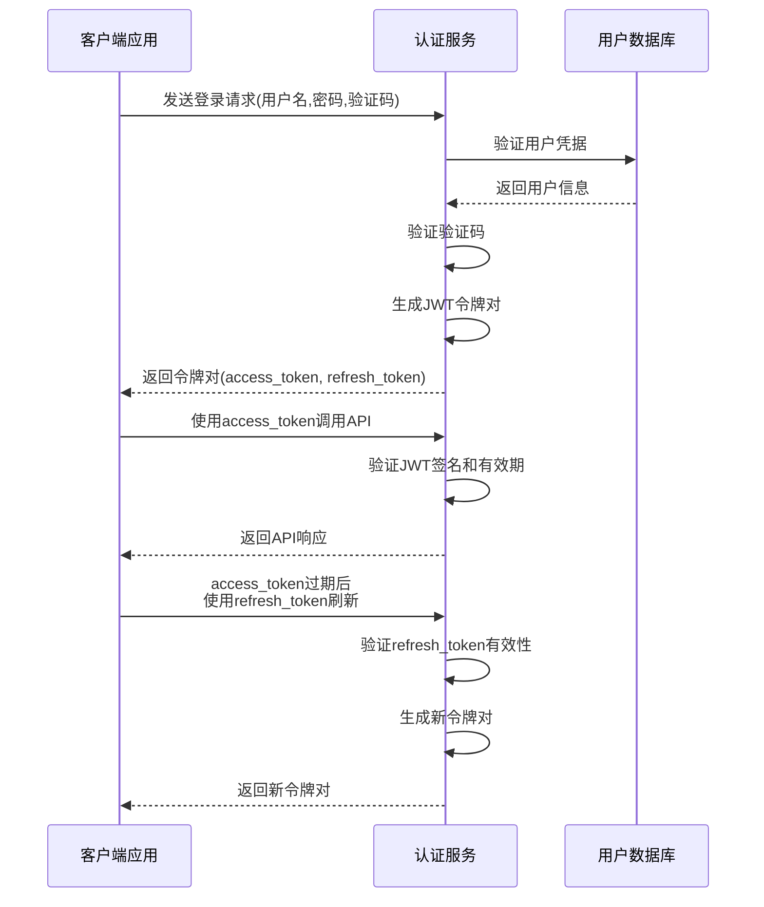
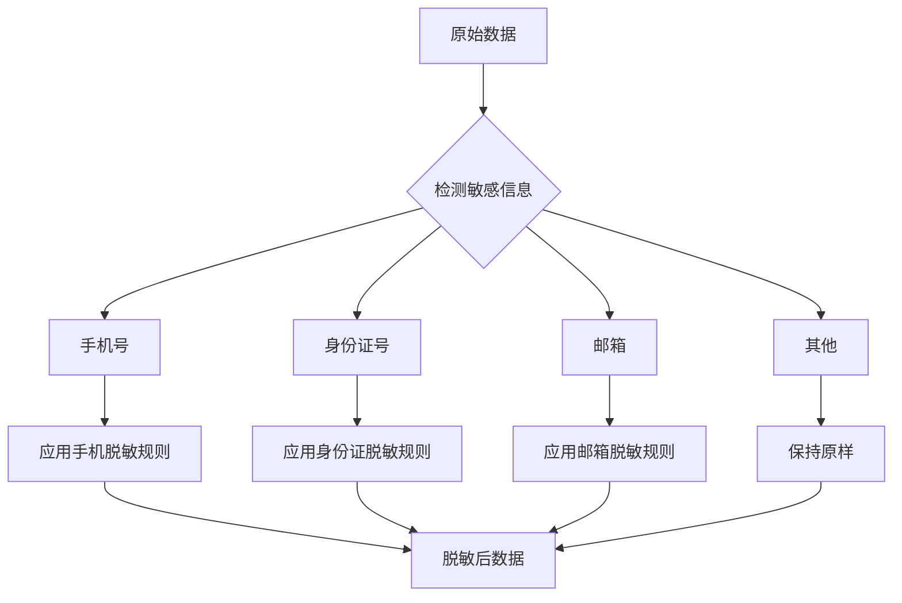
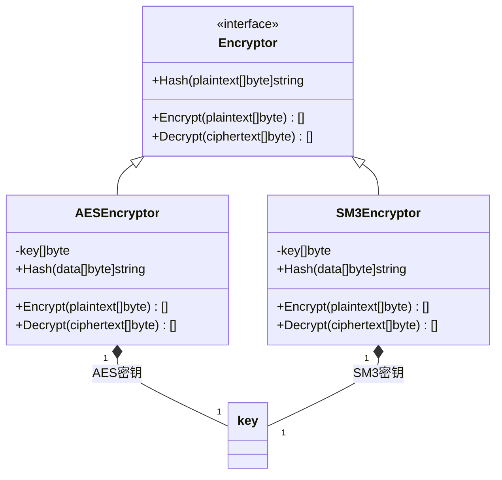

# 核心功能详解

<cite>
**本文档引用的文件**
- [auth.go](file://internal/biz/auth.go)
- [auth_test.go](file://internal/biz/auth_test.go)
- [anonymizer.go](file://internal/pkg/sensitive/anonymizer.go)
- [rules.go](file://internal/pkg/sensitive/rules.go)
- [operation_log.go](file://internal/biz/operation_log.go)
- [middleware.go](file://internal/middleware/operation_log.go)
- [kms.go](file://internal/biz/kms.go)
- [manager.go](file://internal/pkg/kms/manager.go)
- [rootkey.go](file://internal/pkg/kms/rootkey.go)
- [datakey.go](file://internal/pkg/kms/datakey.go)
- [aes.go](file://internal/pkg/crypto/aes.go)
- [sm3.go](file://internal/pkg/crypto/sm3.go)
- [feature.proto](file://api/feature/v1/feature.proto)
- [config.yaml](file://configs/config.yaml)
</cite>

## 目录
1. [认证授权](#认证授权)
2. [敏感数据处理](#敏感数据处理)
3. [操作日志](#操作日志)
4. [密钥管理（KMS）](#密钥管理kms)
5. [功能开关系统](#功能开关系统)

## 认证授权

本模块提供完整的企业级认证鉴权解决方案，支持多种认证策略、多因素认证(MFA)、细粒度权限控制和基于角色的访问控制(RBAC)。系统实现了JWT令牌管理、验证码支持、登录失败锁定机制及TOTP扩展点。

### JWT生成与验证

认证模块使用JWT作为主要的身份验证机制，支持访问令牌和刷新令牌。访问令牌用于API调用时的身份验证，有效期可配置；刷新令牌用于获取新的访问令牌，有效期通常更长。系统通过`DefaultAuthConfig`中的`JWTSecretKey`配置项设置签名密钥，并在`Login`方法中生成包含用户信息和权限的JWT令牌。

**图示来源**
- [auth.go](file://internal/biz/auth.go#L188-L223)
- [auth.proto](file://api/auth/v1/auth.proto#L183-L234)

### 验证码支持

系统集成了验证码机制以防止暴力破解攻击。用户在注册和登录时需要提供验证码，验证码类型包括图形验证码、短信验证码和邮件验证码。验证码通过`GetCaptcha`接口获取，通过`VerifyCaptcha`接口验证，具有可配置的过期时间（默认5分钟）。

### 登录失败锁定机制

为增强账户安全性，系统实现了登录失败锁定机制。当用户连续登录失败达到预设次数（默认5次）时，账户将被临时锁定一段时间（默认30分钟）。锁定状态可通过`GetLockStatus`接口查询，返回是否锁定、解锁时间和失败尝试次数等信息。

### TOTP扩展点

系统设计了TOTP（基于时间的一次性密码）扩展点，支持Google Authenticator等标准MFA应用。虽然当前默认未启用，但代码中已预留了`totpCode`参数和相关处理逻辑，可轻松扩展实现双因素认证功能。

**章节来源**
- [auth.go](file://internal/biz/auth.go#L188-L223)
- [auth_test.go](file://internal/biz/auth_test.go#L284-L323)
- [auth.proto](file://api/auth/v1/auth.proto#L183-L234)

## 敏感数据处理

本模块提供全面的敏感数据保护机制，包括数据脱敏和加密存储两大核心功能，确保个人隐私和敏感信息的安全。

### 数据脱敏机制

系统通过`anonymizer`组件实现敏感数据的自动识别和脱敏处理。该组件能够识别手机号、身份证号、邮箱、姓名、银行卡号和地址等常见敏感字段，并应用相应的脱敏规则。

#### 脱敏规则

| 字段类型 | 脱敏规则 | 示例 |
|---------|---------|------|
| 手机号 | 保留前3位和后4位，中间用*替代 | 138****5678 |
| 邮箱 | 保留前2位和@后部分，中间用*替代 | te**@example.com |
| 身份证号 | 保留前6位和后4位，中间用*替代 | 110101********1234 |
| 姓名 | 单字名保留首字加*，两字名保留首尾加*，多字名保留首尾中间用*替代 | 张*丰 |
| 银行卡号 | 保留前4位和后4位，中间用*替代 | 6222********7890 |
| 地址 | 保留省市区，详细地址用*替代 | 北京市朝阳区******** |

**图示来源**
- [anonymizer.go](file://internal/pkg/sensitive/anonymizer.go#L157-L205)
- [rules.go](file://internal/pkg/sensitive/rules.go#L62-L114)

### 加密存储机制

对于需要加密存储的敏感数据，系统提供了AES-GCM和SM3两种加密算法支持。

#### AES-GCM加密

AES-GCM（Advanced Encryption Standard in Galois/Counter Mode）是一种对称加密算法，提供机密性和完整性保护。加密后的数据格式为：算法标记位.IV.密文，其中IV（初始化向量）确保相同明文每次加密结果不同。

#### SM3哈希

SM3是中国国家密码管理局发布的密码杂凑算法，适用于数字签名和消息认证。系统使用SM3计算数据的哈希值，用于数据完整性校验。

**图示来源**
- [aes.go](file://internal/pkg/crypto/aes.go#L0-L149)
- [sm3.go](file://internal/pkg/crypto/sm3.go#L0-L72)

**章节来源**
- [anonymizer.go](file://internal/pkg/sensitive/anonymizer.go#L157-L205)
- [rules.go](file://internal/pkg/sensitive/rules.go#L62-L114)
- [aes.go](file://internal/pkg/crypto/aes.go#L0-L149)
- [sm3.go](file://internal/pkg/crypto/sm3.go#L0-L72)

## 操作日志

系统实现了全面的操作日志记录机制，用于审计用户行为和系统活动，支持详细的日志粒度和灵活的存储方式。

### 日志记录粒度

操作日志遵循六要素模型，记录完整的操作上下文：

- **用户标识**：执行操作的用户ID和用户名
- **操作类型**：如登录、注册、数据修改等
- **操作对象**：被操作的目标资源
- **操作内容**：具体的操作详情
- **操作结果**：成功