# 认证授权系统

<cite>
**本文档引用的文件**
- [internal/biz/auth.go](file://internal/biz/auth.go)
- [internal/pkg/auth/strategies.go](file://internal/pkg/auth/strategies.go)
- [internal/pkg/captcha/captcha.go](file://internal/pkg/captcha/captcha.go)
- [api/auth/v1/auth.proto](file://api/auth/v1/auth.proto)
- [internal/service/auth.go](file://internal/service/auth.go)
- [internal/data/auth.go](file://internal/data/auth.go)
- [configs/config.yaml](file://configs/config.yaml)
- [frontend/src/views/Login.vue](file://frontend/src/views/Login.vue)
- [internal/biz/auth_test.go](file://internal/biz/auth_test.go)
</cite>

## 目录
1. [简介](#简介)
2. [系统架构概览](#系统架构概览)
3. [JWT令牌认证机制](#jwt令牌认证机制)
4. [验证码(Captcha)支持机制](#验证码captcha支持机制)
5. [策略模式实现](#策略模式实现)
6. [登录失败锁定逻辑](#登录失败锁定逻辑)
7. [TOTP双因子认证](#totp双因子认证)
8. [gRPC接口设计](#grpc接口设计)
9. [配置管理](#配置管理)
10. [性能优化策略](#性能优化策略)
11. [故障排除指南](#故障排除指南)
12. [总结](#总结)

## 简介

本项目实现了一套完整的认证授权系统，采用现代化的微服务架构设计，基于JWT(JSON Web Token)技术实现无状态身份验证，并提供了灵活的验证码支持机制和可扩展的安全策略。系统支持多种认证方式，包括传统的用户名密码认证、图形验证码、短信验证码、邮件验证码以及未来的TOTP双因子认证。

## 系统架构概览

认证授权系统采用分层架构设计，遵循Clean Architecture原则，确保代码的可维护性和可扩展性。

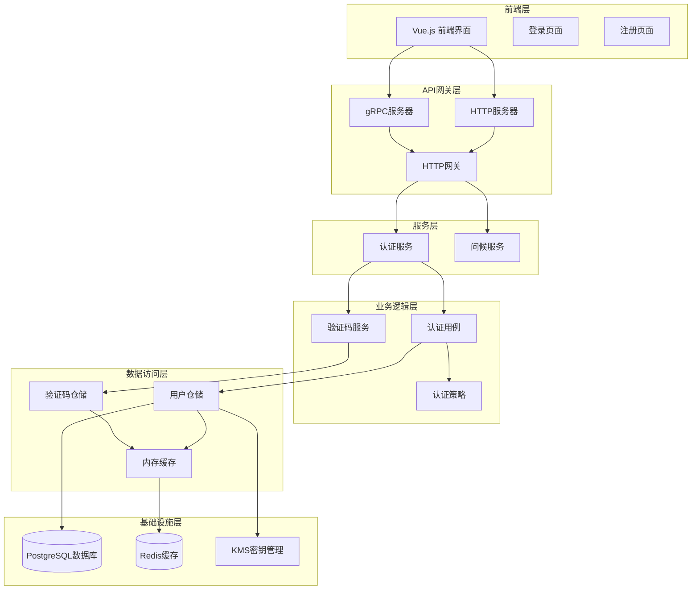

**图表来源**
- [internal/service/auth.go](file://internal/service/auth.go#L1-L235)
- [internal/biz/auth.go](file://internal/biz/auth.go#L1-L695)
- [internal/data/auth.go](file://internal/data/auth.go#L1-L438)

## JWT令牌认证机制

### 令牌结构设计

系统采用JWT技术实现无状态身份验证，支持访问令牌和刷新令牌两种类型的令牌：

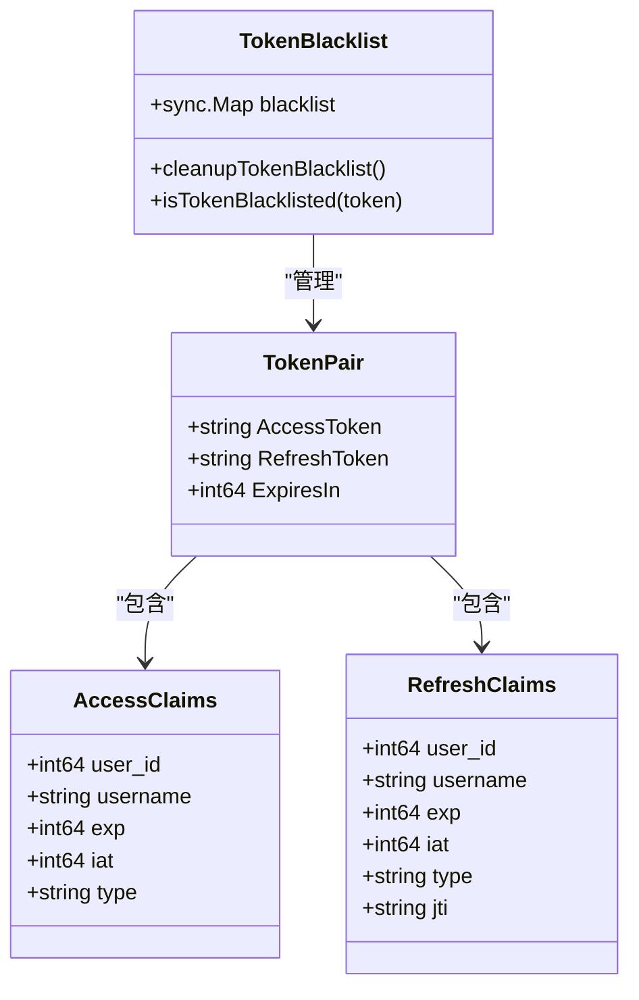

**图表来源**
- [internal/biz/auth.go](file://internal/biz/auth.go#L100-L110)
- [internal/biz/auth.go](file://internal/biz/auth.go#L450-L480)

### 令牌生成流程

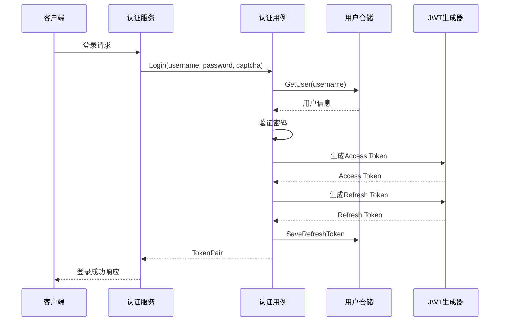

**图表来源**
- [internal/biz/auth.go](file://internal/biz/auth.go#L300-L350)
- [internal/service/auth.go](file://internal/service/auth.go#L70-L100)

### 令牌解析与验证

系统实现了完整的JWT令牌解析和验证机制，包括过期时间检查、签名验证和类型校验：

```go
// 令牌解析示例
func (uc *authUsecase) parseAccessToken(tokenStr string) (jwt.MapClaims, error) {
    // 检查令牌是否在黑名单中
    if _, ok := uc.tokenBlacklist.Load(tokenStr); ok {
        return nil, ErrTokenInvalid
    }

    token, err := jwt.Parse(tokenStr, func(token *jwt.Token) (interface{}, error) {
        if _, ok := token.Method.(*jwt.SigningMethodHMAC); !ok {
            return nil, fmt.Errorf("unexpected signing method: %v", token.Header["alg"])
        }
        return []byte(uc.config.JWTSecretKey), nil
    })

    if err != nil {
        if ve, ok := err.(*jwt.ValidationError); ok {
            if ve.Errors&jwt.ValidationErrorExpired != 0 {
                return nil, ErrTokenExpired
            }
        }
        return nil, ErrTokenInvalid
    }

    claims, ok := token.Claims.(jwt.MapClaims)
    if !ok || !token.Valid || claims["type"] != "access" {
        return nil, ErrTokenInvalid
    }

    return claims, nil
}
```

**章节来源**
- [internal/biz/auth.go](file://internal/biz/auth.go#L500-L550)

### 令牌过期处理

系统支持自动令牌刷新机制，避免频繁重新登录：

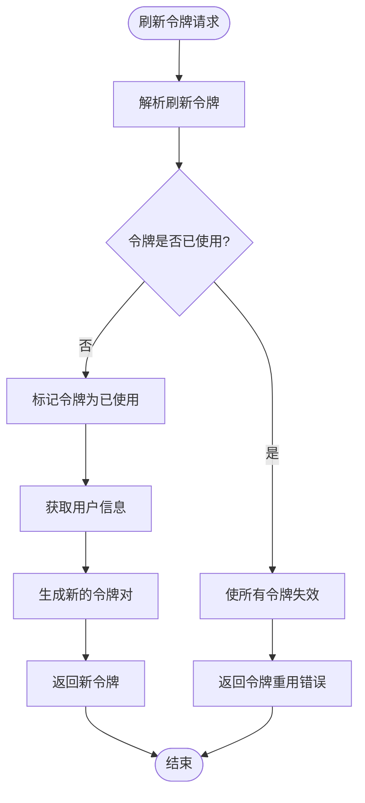

**图表来源**
- [internal/biz/auth.go](file://internal/biz/auth.go#L380-L420)

**章节来源**
- [internal/biz/auth.go](file://internal/biz/auth.go#L380-L420)

## 验证码(Captcha)支持机制

### 验证码类型支持

系统支持多种验证码类型，具有良好的可扩展性设计：

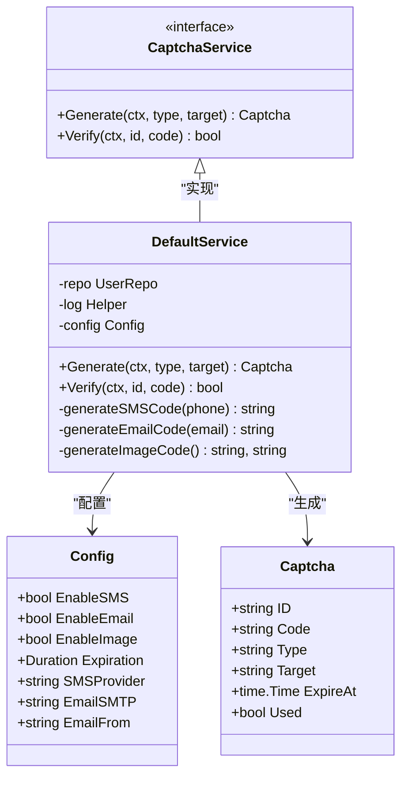

**图表来源**
- [internal/pkg/captcha/captcha.go](file://internal/pkg/captcha/captcha.go#L20-L50)
- [internal/biz/auth.go](file://internal/biz/auth.go#L130-L140)

### 验证码生成流程

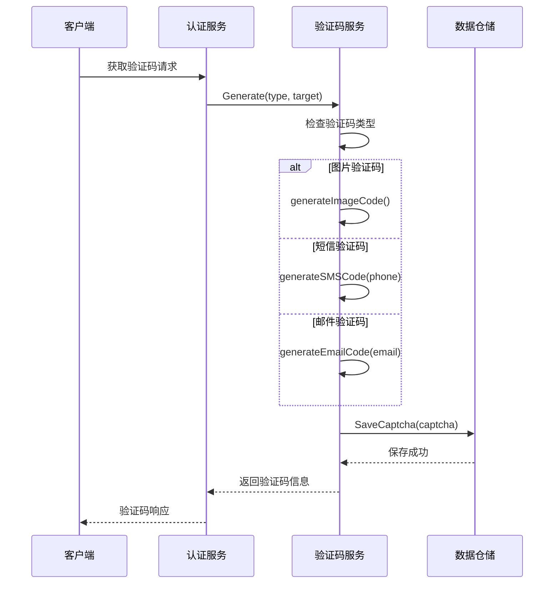

**图表来源**
- [internal/pkg/captcha/captcha.go](file://internal/pkg/captcha/captcha.go#L60-L120)

### 验证码验证机制

系统实现了严格的验证码验证流程，包括过期检查和重复使用检测：

```go
func (s *DefaultService) Verify(ctx context.Context, captchaID, captchaCode string) (bool, error) {
    if captchaID == "" || captchaCode == "" {
        return false, biz.ErrCaptchaInvalid
    }

    // 获取验证码
    captcha, err := s.repo.GetCaptcha(ctx, captchaID)
    if err != nil {
        return false, fmt.Errorf("获取验证码失败: %v", err)
    }

    // 检查验证码是否已过期
    if captcha.ExpireAt.Before(time.Now()) {
        return false, biz.ErrCaptchaExpired
    }

    // 检查验证码是否已使用
    if captcha.Used {
        return false, fmt.Errorf("验证码已使用")
    }

    // 验证码比对(不区分大小写)
    if !equalFold(captcha.Code, captchaCode) {
        return false, nil
    }

    // 标记验证码为已使用
    if err := s.repo.MarkCaptchaUsed(ctx, captchaID); err != nil {
        s.log.Warnf("标记验证码为已使用失败: %v", err)
    }

    return true, nil
}
```

**章节来源**
- [internal/pkg/captcha/captcha.go](file://internal/pkg/captcha/captcha.go#L130-L170)

### 可扩展策略设计

系统采用策略模式设计验证码生成和验证逻辑，支持轻松添加新的验证码类型：

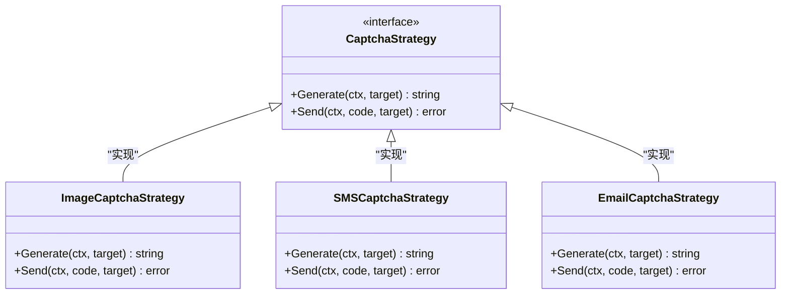

**图表来源**
- [internal/pkg/captcha/captcha.go](file://internal/pkg/captcha/captcha.go#L60-L100)

**章节来源**
- [internal/pkg/captcha/captcha.go](file://internal/pkg/captcha/captcha.go#L60-L170)

## 策略模式实现

### 认证策略架构

系统采用策略模式实现灵活的认证机制，支持多种认证方式的插拔式设计：

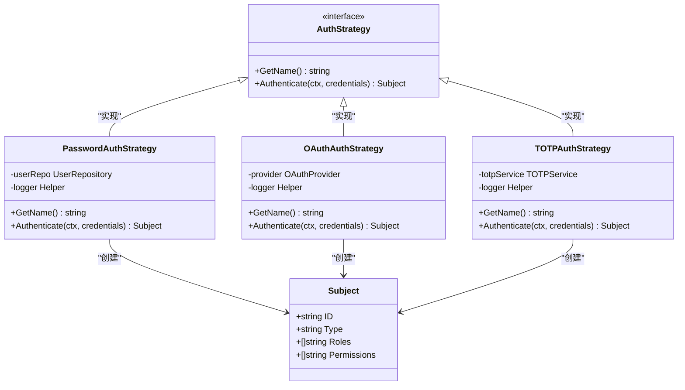

**图表来源**
- [internal/pkg/auth/strategies.go](file://internal/pkg/auth/strategies.go#L15-L50)

### 密码认证策略

```go
type PasswordAuthStrategy struct {
    userRepo UserRepository
    logger   *log.Helper
}

func (s *PasswordAuthStrategy) Authenticate(ctx context.Context, credentials interface{}) (*Subject, error) {
    creds, ok := credentials.(*PasswordCredentials)
    if !ok {
        return nil, fmt.Errorf("invalid credentials type for password auth")
    }
    
    if creds.Username == "" || creds.Password == "" {
        return nil, fmt.Errorf("username and password are required")
    }
    
    user, err := s.userRepo.GetByUsername(ctx, creds.Username)
    if err != nil {
        s.logger.WithContext(ctx).Errorf("failed to get user: %v", err)
        return nil, fmt.Errorf("authentication failed")
    }
    
    if user.Status != "active" {
        return nil, fmt.Errorf("user account is %s", user.Status)
    }
    
    // 验证密码
    if err := bcrypt.CompareHashAndPassword([]byte(user.Password), []byte(creds.Password)); err != nil {
        s.logger.WithContext(ctx).Warnf("password mismatch for user: %s", user.Username)
        return nil, fmt.Errorf("authentication failed")
    }
    
    subject := &Subject{
        ID:          user.ID,
        Type:        "user",
        Permissions: user.Permissions,
        Roles:       user.Roles,
    }
    
    s.logger.WithContext(ctx).Infof("password authentication successful for user: %s", user.Username)
    return subject, nil
}
```

**章节来源**
- [internal/pkg/auth/strategies.go](file://internal/pkg/auth/strategies.go#L40-L80)

## 登录失败锁定逻辑

### 账户锁定机制

系统实现了智能的账户锁定机制，防止暴力破解攻击：

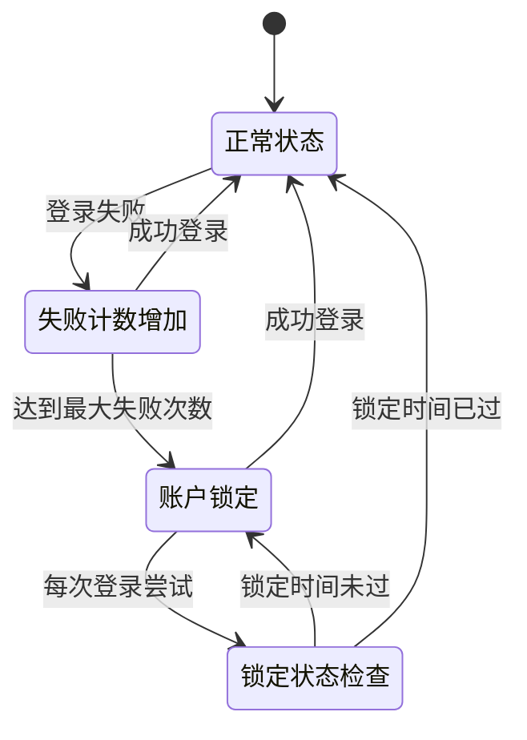

**图表来源**
- [internal/biz/auth.go](file://internal/biz/auth.go#L580-L620)

### 锁定状态管理

```go
func (uc *authUsecase) recordFailedAttempt(ctx context.Context, username string) {
    // 获取当前锁定状态
    lock, err := uc.repo.GetLock(ctx, username)
    if err != nil {
        if err != ErrUserNotFound {
            uc.log.Errorf("获取账户锁定状态失败: %v", err)
            return
        }
        // 不存在则创建新的锁定记录
        lock = &AccountLock{
            Username:       username,
            FailedAttempts: 0,
            LastAttempt:    time.Now(),
        }
    }

    now := time.Now()
    lock.FailedAttempts++
    lock.LastAttempt = now

    // 达到最大尝试次数，进行锁定
    if lock.FailedAttempts >= uc.config.MaxLoginAttempts {
        lock.LockUntil = now.Add(uc.config.LockDuration)
    }

    // 保存锁定记录
    if err := uc.repo.SaveLock(ctx, lock); err != nil {
        uc.log.Errorf("保存账户锁定状态失败: %v", err)
    }
}
```

**章节来源**
- [internal/biz/auth.go](file://internal/biz/auth.go#L580-L620)

### 防暴力破解措施

系统采用多层防护机制防止暴力破解：

1. **失败次数限制**：达到最大失败次数后锁定账户
2. **锁定时间递增**：每次连续失败后锁定时间递增
3. **智能解锁**：锁定时间过后自动解锁
4. **验证码增强**：多次失败后强制要求验证码

## TOTP双因子认证

### 预留接口设计

系统为未来的TOTP双因子认证预留了完整的接口设计：

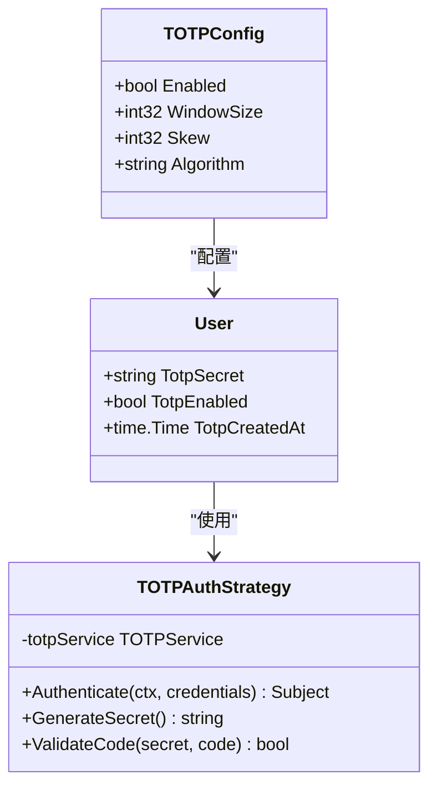

**图表来源**
- [internal/biz/auth.go](file://internal/biz/auth.go#L188-L200)

### TOTP集成流程

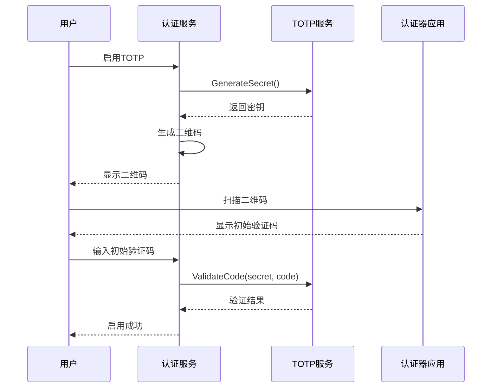

**图表来源**
- [internal/biz/auth.go](file://internal/biz/auth.go#L320-L340)

### 当前实现状态

目前系统已经为TOTP认证做好了准备，但尚未完全实现：

```go
// 验证TOTP码（当前实现为模拟）
func (uc *authUsecase) verifyTOTP(secret, code string) bool {
    // 实际项目中应该使用TOTP库实现验证
    // 这里简单模拟
    return code == "123456" // 临时模拟，实际应使用如 github.com/pquerna/otp
}
```

**章节来源**
- [internal/biz/auth.go](file://internal/biz/auth.go#L640-L650)

## gRPC接口设计

### Protobuf接口定义

系统使用Protocol Buffers定义gRPC接口，提供RESTful风格的HTTP API：

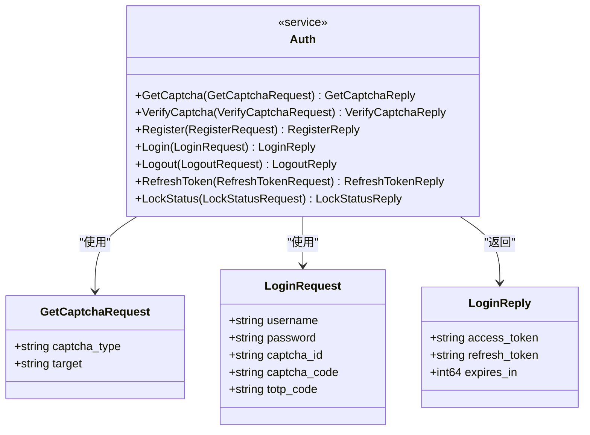

**图表来源**
- [api/auth/v1/auth.proto](file://api/auth/v1/auth.proto#L10-L80)

### HTTP网关映射

系统通过Google API注解将gRPC接口映射为HTTP API：

```protobuf
// 获取验证码
rpc GetCaptcha(GetCaptchaRequest) returns (GetCaptchaReply) {
    option (google.api.http) = {
        get: "/api/v1/auth/captcha"
    };
}

// 用户登录
rpc Login(LoginRequest) returns (LoginReply) {
    option (google.api.http) = {
        post: "/api/v1/auth/login"
        body: "*"
    };
}
```

**章节来源**
- [api/auth/v1/auth.proto](file://api/auth/v1/auth.proto#L15-L35)

### 接口调用示例

以下是典型的认证接口调用流程：

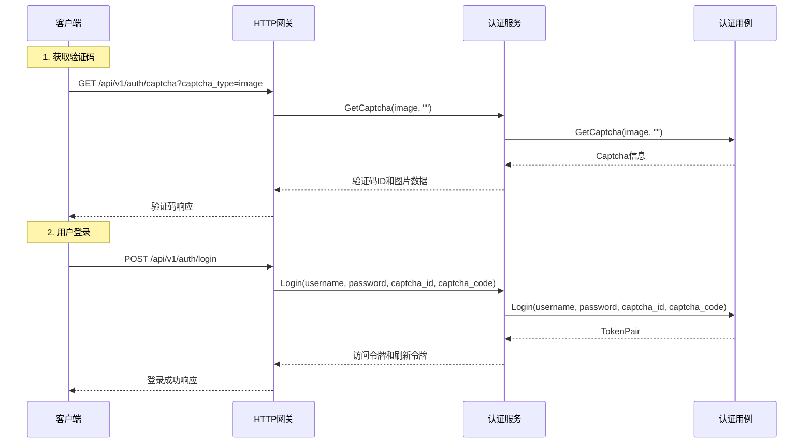

**图表来源**
- [internal/service/auth.go](file://internal/service/auth.go#L20-L100)

**章节来源**
- [internal/service/auth.go](file://internal/service/auth.go#L20-L100)

## 配置管理

### 配置结构设计

系统采用YAML配置文件管理认证相关配置：

```yaml
auth:
  jwt_secret_key: "your-super-secret-jwt-key-here"
  access_token_expiration: "24h"
  refresh_token_expiration: "7d"
  captcha_enabled: true
  captcha_expiration: "5m"
  max_login_attempts: 5
  lock_duration: "30m"
  totp_enabled: false
```

**章节来源**
- [configs/config.yaml](file://configs/config.yaml#L20-L28)

### 配置参数详解

| 参数 | 类型 | 默认值 | 描述 |
|------|------|--------|------|
| `jwt_secret_key` | string | "your-secret-key" | JWT签名密钥 |
| `access_token_expiration` | duration | 15m | 访问令牌过期时间 |
| `refresh_token_expiration` | duration | 7d | 刷新令牌过期时间 |
| `captcha_enabled` | boolean | true | 是否启用验证码 |
| `captcha_expiration` | duration | 5m | 验证码过期时间 |
| `max_login_attempts` | integer | 5 | 最大登录尝试次数 |
| `lock_duration` | duration | 30m | 账户锁定持续时间 |
| `totp_enabled` | boolean | false | 是否启用TOTP双因子认证 |

### 动态配置更新

系统支持运行时配置更新，无需重启服务即可调整认证参数。

## 性能优化策略

### 缓存策略

系统采用多层缓存策略提升性能：

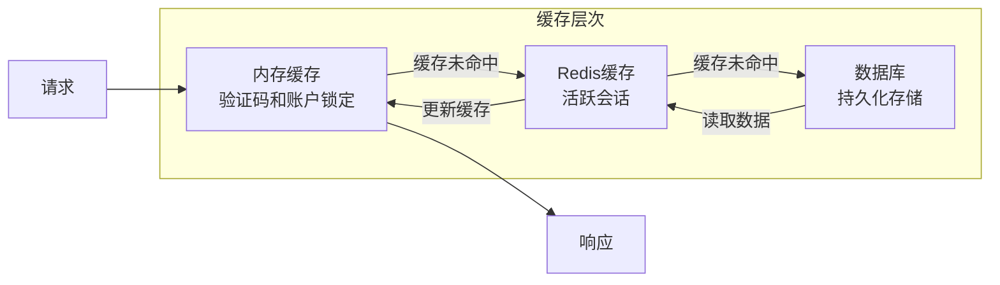

**图表来源**
- [internal/data/auth.go](file://internal/data/auth.go#L20-L30)

### 会话状态缓存

```go
type userRepo struct {
    data *Data
    log  *log.Helper
    enc  crypto.Encryptor
    kms  kms.KMSManager

    // 内存存储验证码和账户锁定信息（实际项目应使用Redis等缓存）
    captchas      sync.Map // map[captchaID]*biz.Captcha
    accountLocks  sync.Map // map[username]*biz.AccountLock
    refreshTokens sync.Map // map[tokenID]struct{tokenUsername string, used bool}
}
```

**章节来源**
- [internal/data/auth.go](file://internal/data/auth.go#L20-L30)

### 数据库查询优化

1. **索引优化**：为常用查询字段建立索引
2. **批量操作**：合并多个数据库操作
3. **连接池管理**：合理配置数据库连接池
4. **读写分离**：分离读写操作提升并发能力

### 前端性能优化

前端实现了验证码自动刷新和表单验证优化：

```javascript
// 自动刷新验证码
const refreshCaptcha = async () => {
  try {
    const response = await getCaptcha('image');
    captchaId.value = response.data.captcha_id;
    captchaImage.value = `data:image/png;base64,${response.data.image_data}`;
  } catch (error: any) {
    console.error('验证码获取失败:', error);
    ElMessage.error('获取验证码失败');
  }
};
```

**章节来源**
- [frontend/src/views/Login.vue](file://frontend/src/views/Login.vue#L90-L110)

## 故障排除指南

### 常见问题诊断

#### 1. 令牌无效问题

**症状**：客户端收到"Token Invalid"错误

**可能原因**：
- JWT密钥不匹配
- 令牌格式错误
- 令牌被加入黑名单

**解决方案**：
```bash
# 检查JWT密钥配置
grep -r "jwt_secret_key" configs/

# 验证令牌格式
echo "your-token-here" | base64 -d

# 检查令牌黑名单状态
curl -X GET "http://localhost:8000/api/v1/auth/lock-status/username"
```

#### 2. 跨域认证失败

**症状**：浏览器控制台显示跨域错误

**解决方案**：
```go
// 确保正确配置CORS中间件
srv := http.NewServer(
    http.Address(":8000"),
    http.CORS(cors.AllowAll()), // 允许所有来源
)
```

#### 3. 验证码过期问题

**症状**：验证码验证总是失败

**解决方案**：
```go
// 检查验证码过期时间配置
auth:
  captcha_expiration: "5m"  # 确保时间配置正确

// 验证码生成后立即使用
await refreshCaptcha(); // 获取新验证码
await handleLogin();    // 立即使用
```

#### 4. 数据库连接问题

**症状**：认证操作超时或失败

**解决方案**：
```sql
-- 检查数据库连接状态
SELECT count(*) FROM users;

-- 查看慢查询日志
SHOW VARIABLES LIKE 'slow_query_log';

-- 检查连接池状态
SELECT * FROM pg_stat_activity WHERE datname = 'your_db';
```

### 日志分析

系统提供了详细的日志记录，帮助诊断问题：

```go
// 启用详细日志
logger := log.NewStdLogger(os.Stdout)
logger.SetLevel(log.LevelDebug)

// 关键操作日志示例
uc.log.WithContext(ctx).Infof("password authentication successful for user: %s", user.Username)
uc.log.WithContext(ctx).Warnf("password mismatch for user: %s", user.Username)
uc.log.Errorf("failed to get user: %v", err)
```

### 监控指标

建议监控以下关键指标：

1. **认证成功率**：登录成功的百分比
2. **验证码使用率**：验证码的使用频率
3. **账户锁定率**：被锁定的账户比例
4. **令牌刷新率**：令牌刷新的频率
5. **响应时间**：认证操作的平均响应时间

## 总结

本认证授权系统是一个设计精良、功能完备的企业级解决方案，具有以下特点：

### 主要优势

1. **安全性**：采用JWT无状态认证，支持多种安全机制
2. **可扩展性**：策略模式设计，易于添加新的认证方式
3. **高性能**：多层缓存策略，优化数据库访问
4. **易维护**：清晰的分层架构，良好的代码组织
5. **国际化**：支持多种验证码类型和认证方式

### 技术亮点

- **JWT令牌管理**：完整的令牌生成、解析和过期处理
- **验证码系统**：支持图片、短信、邮件等多种类型
- **账户锁定**：智能的暴力破解防护机制
- **TOTP预留**：为未来双因子认证做好准备
- **gRPC接口**：标准化的API设计，支持HTTP和gRPC

### 未来改进方向

1. **TOTP实现**：完整实现双因子认证功能
2. **OAuth集成**：支持第三方登录
3. **多因素认证**：扩展更多认证因子
4. **审计日志**：完善操作审计功能
5. **性能监控**：集成APM监控工具

该系统为企业应用提供了坚实的安全基础，能够满足现代Web应用的各种认证需求，同时保持了良好的可扩展性和维护性。