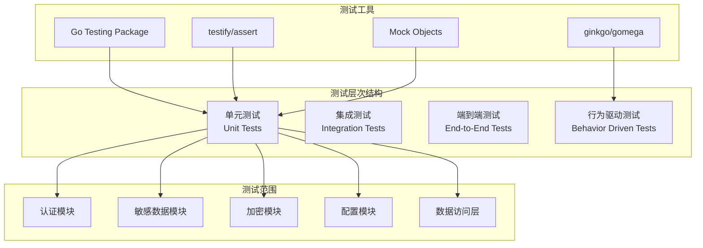
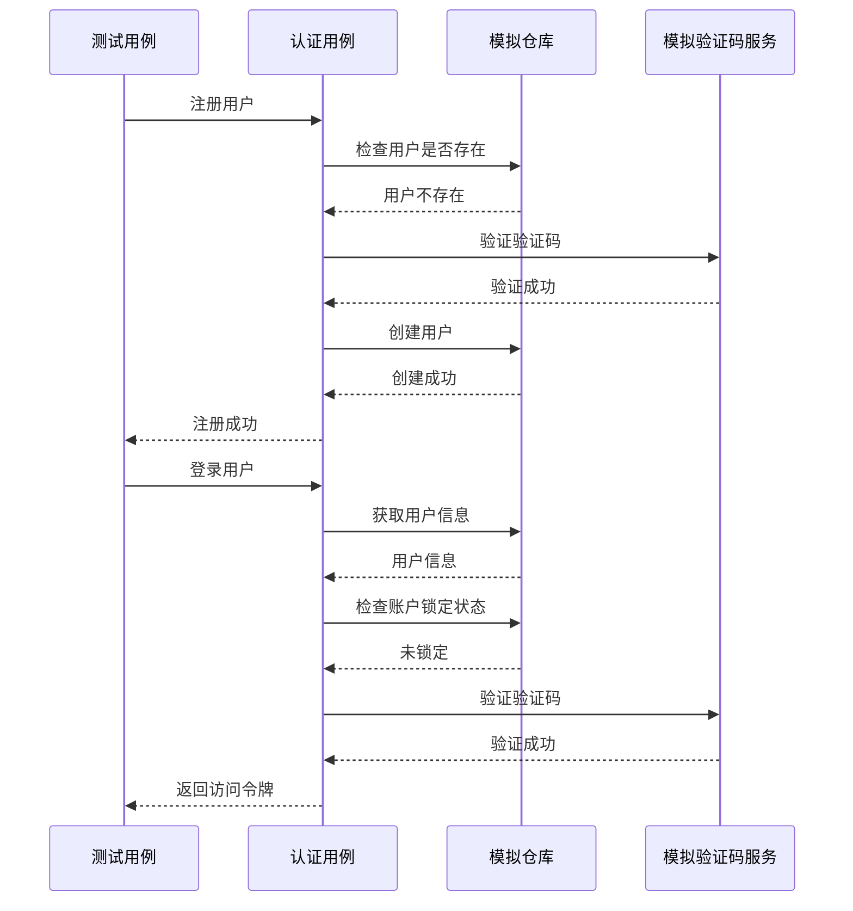
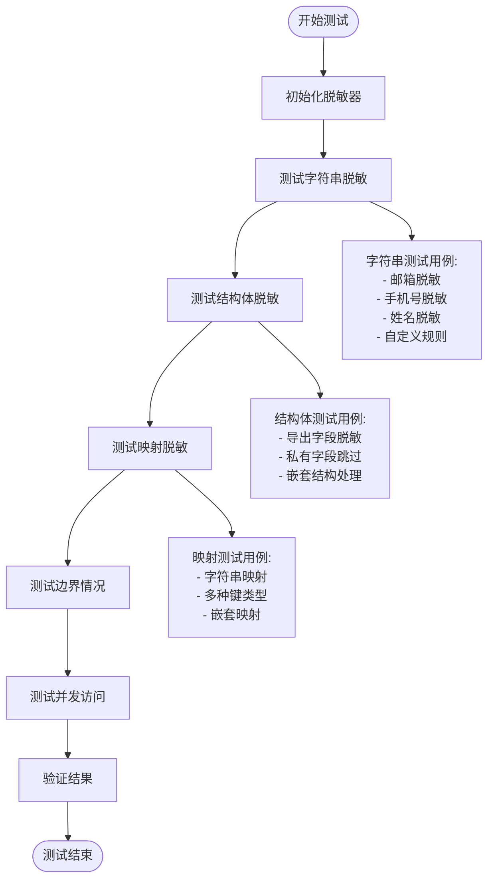
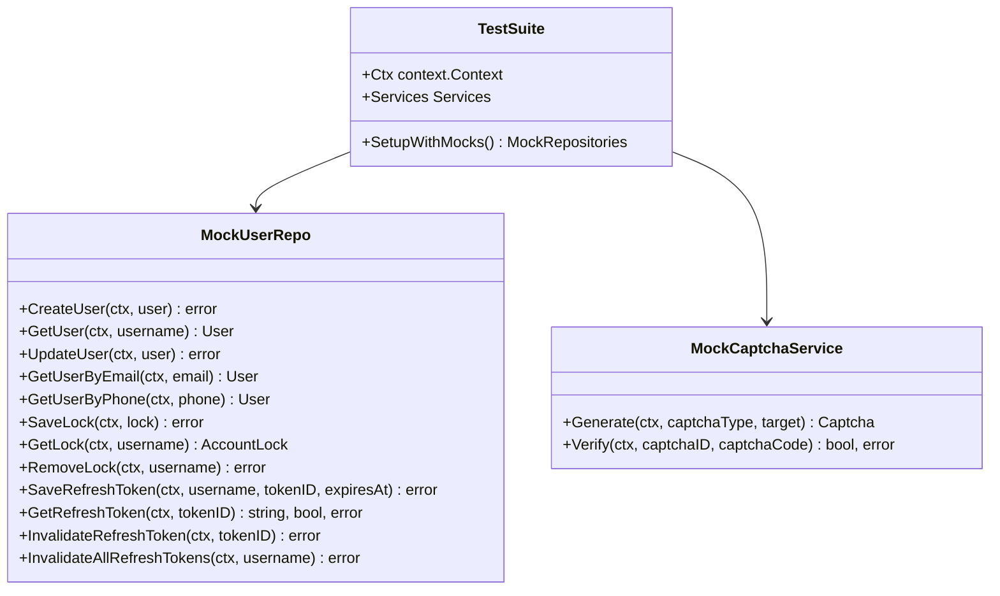
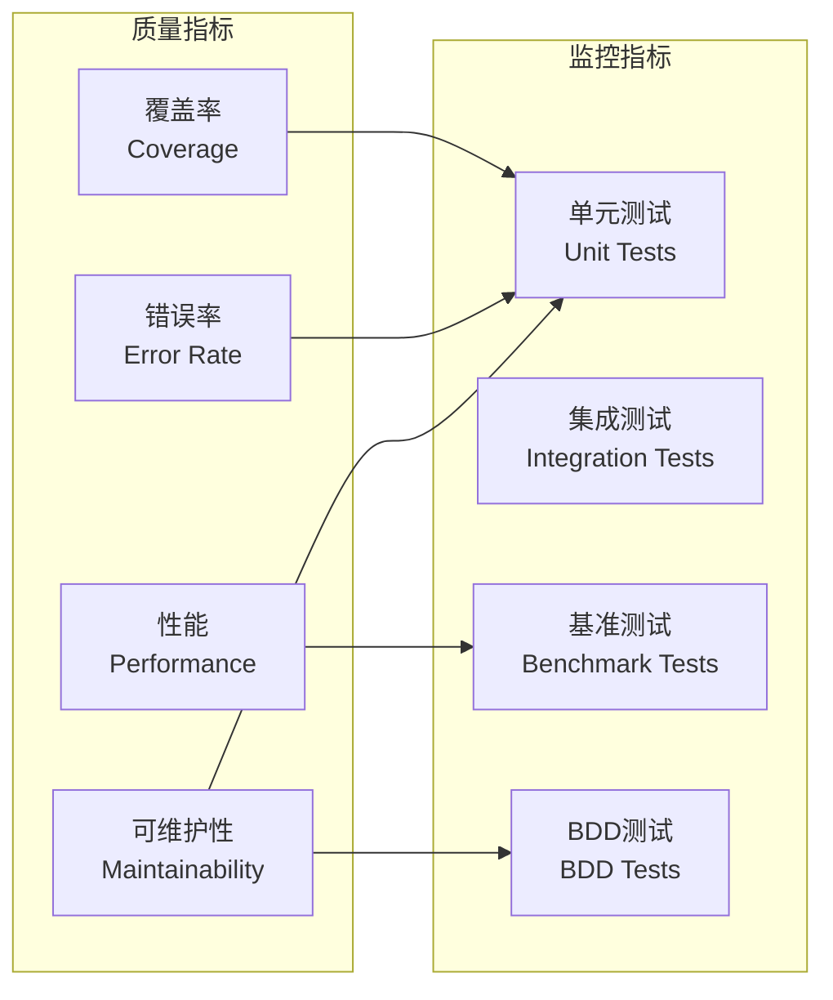
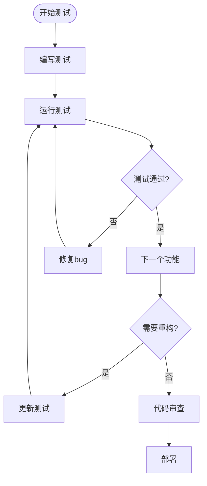

# 单元测试

<cite>
**本文档引用的文件**
- [auth_test.go](file://internal/biz/auth_test.go)
- [anonymizer_test.go](file://internal/pkg/sensitive/anonymizer_test.go)
- [aes_test.go](file://internal/pkg/crypto/aes_test.go)
- [config_test.go](file://internal/pkg/config/config_test.go)
- [auth_simple_test.go](file://internal/data/auth_simple_test.go)
- [base_modules_test.go](file://test/integration/base_modules_test.go)
- [auth_bdd_test.go](file://test/bdd/auth/auth_bdd_test.go)
</cite>

## 目录
1. [简介](#简介)
2. [项目测试架构](#项目测试架构)
3. [核心测试组件](#核心测试组件)
4. [测试用例设计原则](#测试用例设计原则)
5. [表格驱动测试](#表格驱动测试)
6. [Mock对象和依赖注入](#mock对象和依赖注入)
7. [测试覆盖率和质量保证](#测试覆盖率和质量保证)
8. [测试运行和CI/CD集成](#测试运行和cicd集成)
9. [最佳实践和常见问题](#最佳实践和常见问题)
10. [总结](#总结)

## 简介

本项目采用全面的测试策略，包含单元测试、集成测试、端到端测试和行为驱动测试（BDD）。单元测试作为测试金字塔的基础层，专注于隔离测试单个函数和方法，确保每个组件的逻辑正确性。

项目使用Go语言内置的testing包配合第三方库如testify/assert和ginkgo/gomega来构建高质量的单元测试。测试覆盖了用户认证、敏感数据脱敏、加密解密、配置管理等核心功能模块。

## 项目测试架构



**图表来源**
- [auth_test.go](file://internal/biz/auth_test.go#L1-L50)
- [anonymizer_test.go](file://internal/pkg/sensitive/anonymizer_test.go#L1-L50)
- [aes_test.go](file://internal/pkg/crypto/aes_test.go#L1-L50)

## 核心测试组件

### 用户认证测试（auth_test.go）

用户认证模块的测试涵盖了完整的认证生命周期，包括注册、登录、令牌刷新和注销功能。



**图表来源**
- [auth_test.go](file://internal/biz/auth_test.go#L130-L180)
- [auth_test.go](file://internal/biz/auth_test.go#L200-L250)

### 敏感数据脱敏测试（anonymizer_test.go）

敏感数据脱敏模块的测试确保各种数据类型的正确脱敏处理。



**图表来源**
- [anonymizer_test.go](file://internal/pkg/sensitive/anonymizer_test.go#L42-L90)
- [anonymizer_test.go](file://internal/pkg/sensitive/anonymizer_test.go#L234-L262)
- [anonymizer_test.go](file://internal/pkg/sensitive/anonymizer_test.go#L305-L332)

**章节来源**
- [auth_test.go](file://internal/biz/auth_test.go#L1-L529)
- [anonymizer_test.go](file://internal/pkg/sensitive/anonymizer_test.go#L1-L532)

## 测试用例设计原则

### 输入验证测试

测试用例必须验证所有可能的输入组合，包括有效输入、无效输入和边界条件。

```go
// 示例：输入验证测试
func TestInputValidation(t *testing.T) {
	tests := []struct {
		name        string
		input       string
		expectedErr bool
	}{
		{"有效邮箱", "test@example.com", false},
		{"无效邮箱", "invalid-email", true},
		{"空字符串", "", true},
		{"超长字符串", strings.Repeat("a", 1000), true},
	}
	
	for _, tt := range tests {
		t.Run(tt.name, func(t *testing.T) {
			err := validateEmail(tt.input)
			if tt.expectedErr {
				assert.Error(t, err)
			} else {
				assert.NoError(t, err)
			}
		})
	}
}
```

### 预期输出断言

每个测试用例都应该明确指定预期的输出结果。

```go
// 示例：预期输出断言
func TestExpectedOutput(t *testing.T) {
	result := processInput("test")
	
	assert.Equal(t, "expected_output", result)
	assert.NotNil(t, result)
	assert.NotEmpty(t, result)
}
```

### 错误处理检查

测试必须覆盖所有可能的错误场景和异常处理路径。

```go
// 示例：错误处理测试
func TestErrorHandling(t *testing.T) {
	// 测试数据库连接失败
	result, err := connectToDatabase("")
	assert.Error(t, err)
	assert.Nil(t, result)
	
	// 测试权限不足
	result, err = accessRestrictedResource()
	assert.Error(t, err)
	assert.Equal(t, ErrPermissionDenied, err)
}
```

**章节来源**
- [auth_test.go](file://internal/biz/auth_test.go#L130-L200)
- [aes_test.go](file://internal/pkg/crypto/aes_test.go#L150-L200)

## 表格驱动测试

项目广泛使用表格驱动测试（Table-Driven Tests）来提高测试覆盖率和代码可维护性。

### 基本表格驱动测试

```go
// 示例：基本表格驱动测试
func TestBasicTableDriven(t *testing.T) {
	tests := []struct {
		name     string
		input    int
		expected int
	}{
		{"加法测试1", 1, 2},
		{"加法测试2", 2, 4},
		{"加法测试3", 3, 6},
	}
	
	for _, tt := range tests {
		t.Run(tt.name, func(t *testing.T) {
			result := double(tt.input)
			assert.Equal(t, tt.expected, result)
		})
	}
}
```

### 复杂表格驱动测试

```go
// 示例：复杂表格驱动测试（来自auth_test.go）
func TestLogin_TableDriven(t *testing.T) {
	tests := []struct {
		name           string
		username       string
		password       string
		captchaID      string
		captchaCode    string
		expectedError  error
		expectedTokens bool
	}{
		{
			name:           "成功登录",
			username:       "testuser",
			password:       "correct_password",
			captchaID:      "valid_captcha",
			captchaCode:    "123456",
			expectedError:  nil,
			expectedTokens: true,
		},
		{
			name:           "密码错误",
			username:       "testuser",
			password:       "wrong_password",
			captchaID:      "valid_captcha",
			captchaCode:    "123456",
			expectedError:  ErrPasswordIncorrect,
			expectedTokens: false,
		},
		{
			name:           "验证码错误",
			username:       "testuser",
			password:       "correct_password",
			captchaID:      "valid_captcha",
			captchaCode:    "wrong_code",
			expectedError:  ErrCaptchaInvalid,
			expectedTokens: false,
		},
	}
	
	for _, tt := range tests {
		t.Run(tt.name, func(t *testing.T) {
			// 测试逻辑...
		})
	}
}
```

### 表格驱动测试的优势

1. **高覆盖率**：一次定义即可覆盖多种场景
2. **易于扩展**：添加新测试用例只需增加一行
3. **清晰表达**：测试意图一目了然
4. **减少重复**：避免冗余的测试代码

**章节来源**
- [auth_test.go](file://internal/biz/auth_test.go#L480-L529)
- [aes_test.go](file://internal/pkg/crypto/aes_test.go#L20-L60)

## Mock对象和依赖注入

### Mock对象设计

项目使用mock.Mock结构体来创建模拟对象，实现依赖解耦和测试隔离。



**图表来源**
- [auth_test.go](file://internal/biz/auth_test.go#L15-L120)
- [auth_bdd_test.go](file://test/bdd/auth/auth_bdd_test.go#L20-L40)

### 依赖注入模式

```go
// 示例：依赖注入测试
func TestWithDependencyInjection(t *testing.T) {
	// 创建模拟依赖
	mockRepo := new(mockUserRepo)
	mockCaptcha := new(mockCaptchaService)
	
	// 配置模拟行为
	mockRepo.On("GetUser", mock.Anything, "testuser").Return(&User{}, nil)
	mockCaptcha.On("Verify", mock.Anything, "captcha123", "123456").Return(true, nil)
	
	// 注入依赖
	authService := NewAuthService(mockRepo, mockCaptcha)
	
	// 执行测试
	result, err := authService.Login("testuser", "password", "captcha123", "123456")
	
	// 验证结果
	assert.NoError(t, err)
	assert.NotNil(t, result)
	
	// 验证模拟调用
	mockRepo.AssertExpectations(t)
	mockCaptcha.AssertExpectations(t)
}
```

### 并发测试

```go
// 示例：并发测试
func TestConcurrentAccess(t *testing.T) {
	anonymizer := NewAnonymizer()
	var wg sync.WaitGroup
	
	for i := 0; i < 10; i++ {
		wg.Add(1)
		go func(index int) {
			defer wg.Done()
			email := fmt.Sprintf("user%d@example.com", index)
			result := anonymizer.AnonymizeString(email, EmailRule)
			assert.Contains(t, result, "@example.com")
		}(i)
	}
	
	wg.Wait()
}
```

**章节来源**
- [auth_test.go](file://internal/biz/auth_test.go#L15-L120)
- [anonymizer_test.go](file://internal/pkg/sensitive/anonymizer_test.go#L423-L475)

## 测试覆盖率和质量保证

### 测试覆盖率报告

项目使用Go的内置覆盖率工具生成详细的测试覆盖率报告。

```bash
# 运行测试并生成覆盖率报告
go test ./... -coverprofile=coverage.out
go tool cover -html=coverage.out -o coverage.html
```

### 覆盖率目标

- **单元测试覆盖率**：≥ 80%
- **关键业务逻辑覆盖率**：≥ 90%
- **边界条件覆盖率**：≥ 70%

### 质量指标



### 性能基准测试

```go
// 示例：性能基准测试
func BenchmarkAnonymization(b *testing.B) {
	anonymizer := NewAnonymizer()
	
	b.ResetTimer()
	for i := 0; i < b.N; i++ {
		anonymizer.AnonymizeString("test@example.com", EmailRule)
	}
}

func BenchmarkEncryption(b *testing.B) {
	encryptor, _ := NewAESEncryptor(make([]byte, 32))
	
	b.ResetTimer()
	for i := 0; i < b.N; i++ {
		encryptor.Encrypt([]byte("test data"))
	}
}
```

**章节来源**
- [aes_test.go](file://internal/pkg/crypto/aes_test.go#L400-L450)
- [base_modules_test.go](file://test/integration/base_modules_test.go#L350-L412)

## 测试运行和CI/CD集成

### 测试命令

```bash
# 运行所有单元测试
go test ./...

# 运行特定包的测试
go test ./internal/biz

# 运行带有详细输出的测试
go test ./... -v

# 运行测试并生成覆盖率报告
go test ./... -coverprofile=coverage.out

# 运行基准测试
go test ./... -bench=.

# 运行特定测试函数
go test ./... -run=TestLogin
```

### CI/CD集成

```yaml
# 示例：GitHub Actions配置
name: Test Suite
on: [push, pull_request]

jobs:
  test:
    runs-on: ubuntu-latest
    steps:
      - uses: actions/checkout@v2
      - uses: actions/setup-go@v2
        with:
          go-version: '1.19'
      
      - name: Run unit tests
        run: |
          go test ./... -v -coverprofile=coverage.out
        
      - name: Upload coverage report
        uses: codecov/codecov-action@v2
        with:
          file: ./coverage.out
```

### 测试环境配置

```go
// 示例：测试环境配置
func TestMain(m *testing.M) {
	// 设置测试环境
	os.Setenv("ENVIRONMENT", "test")
	os.Setenv("DATABASE_URL", "test://localhost:5432/testdb")
	
	// 运行测试
	code := m.Run()
	
	// 清理资源
	cleanup()
	
	os.Exit(code)
}
```

**章节来源**
- [base_modules_test.go](file://test/integration/base_modules_test.go#L1-L50)

## 最佳实践和常见问题

### 测试命名规范

```go
// 推荐的测试函数命名
func TestUserService_CreateUser_Success(t *testing.T) {}
func TestUserService_CreateUser_ValidationError(t *testing.T) {}
func TestUserService_CreateUser_DatabaseError(t *testing.T) {}

// 推荐的测试表命名
func TestAnonymizer_AnonymizeString_EmailRule(t *testing.T) {}
func TestAnonymizer_AnonymizeString_PhoneRule(t *testing.T) {}
```

### 常见问题和解决方案

#### 1. 外部服务依赖

**问题**：测试依赖外部服务（数据库、Redis、外部API）

**解决方案**：使用Mock对象或内存实现

```go
// 使用内存数据库进行测试
func TestWithMemoryDatabase(t *testing.T) {
	db, err := sql.Open("sqlite3", ":memory:")
	require.NoError(t, err)
	defer db.Close()
	
	// 使用内存数据库进行测试
}
```

#### 2. 时间相关测试

**问题**：时间相关的测试难以预测和重复

**解决方案**：使用时间模拟器

```go
// 使用时间模拟器
func TestWithTimeMock(t *testing.T) {
	originalTimeNow := timeNow
	defer func() { timeNow = originalTimeNow }()
	
	timeNow = func() time.Time { return fixedTime }
	
	// 测试时间相关逻辑
}
```

#### 3. 并发测试

**问题**：并发测试容易出现竞态条件

**解决方案**：使用WaitGroup和同步机制

```go
// 正确的并发测试
func TestConcurrentSafety(t *testing.T) {
	var wg sync.WaitGroup
	results := make(chan string, 10)
	
	for i := 0; i < 10; i++ {
		wg.Add(1)
		go func(id int) {
			defer wg.Done()
			result := processConcurrently(id)
			results <- result
		}(i)
	}
	
	wg.Wait()
	close(results)
	
	// 验证结果
	for result := range results {
		assert.NotEmpty(t, result)
	}
}
```

#### 4. 测试数据管理

**问题**：测试数据污染和重复

**解决方案**：使用独立的测试数据库和清理机制

```go
// 测试数据隔离
func TestWithIsolatedData(t *testing.T) {
	// 创建独立的测试数据库
	db := createTestDatabase()
	
	// 清理测试数据
	defer cleanupTestData(db)
	
	// 执行测试
}
```

### 测试维护策略



**章节来源**
- [auth_test.go](file://internal/biz/auth_test.go#L480-L529)
- [aes_test.go](file://internal/pkg/crypto/aes_test.go#L400-L487)

## 总结

本项目建立了完善的单元测试体系，涵盖了以下关键方面：

### 主要成就

1. **全面的测试覆盖**：从核心业务逻辑到边缘情况的全面测试
2. **高质量的测试代码**：使用表格驱动测试和Mock对象确保测试质量
3. **完善的工具链**：集成Go测试框架、testify/assert和ginkgo/gomega
4. **持续集成支持**：完整的CI/CD测试流程

### 关键优势

- **隔离性**：通过Mock对象实现完全的测试隔离
- **可维护性**：表格驱动测试提高代码复用和维护效率
- **可靠性**：全面的错误处理和边界条件测试
- **性能**：包含基准测试确保性能要求

### 未来改进方向

1. **增加测试覆盖率**：特别是边缘条件和异常处理
2. **优化测试性能**：减少测试执行时间
3. **完善测试文档**：建立更详细的测试指南
4. **扩展测试类型**：考虑更多集成测试和端到端测试

通过这套完整的单元测试体系，项目能够确保代码质量和系统稳定性，为持续交付提供了坚实的基础。