# 端到端（E2E）测试全面指南

<cite>
**本文档引用的文件**
- [auth_e2e_test.go](file://test/e2e/scenarios/auth_e2e_test.go)
- [api_client.go](file://test/e2e/helpers/api_client.go)
- [test_user.go](file://test/e2e/helpers/test_user.go)
- [auth.ts](file://frontend/src/api/auth.ts)
- [auth.ts](file://frontend/src/stores/auth.ts)
- [docker-compose.test.yml](file://test/config/docker-compose.test.yml)
- [test.yaml](file://test/config/test.yaml)
- [setup.sh](file://test/scripts/setup.sh)
- [run_all.sh](file://test/scripts/run_all.sh)
- [auth.go](file://internal/service/auth.go)
</cite>

## 目录
1. [简介](#简介)
2. [项目架构概览](#项目架构概览)
3. [核心组件分析](#核心组件分析)
4. [测试环境搭建](#测试环境搭建)
5. [API客户端封装](#api客户端封装)
6. [测试用户生命周期管理](#测试用户生命周期管理)
7. [前后端契约一致性验证](#前后端契约一致性验证)
8. [关键测试场景](#关键测试场景)
9. [会话状态维护](#会话状态维护)
10. [动态验证码处理](#动态验证码处理)
11. [UI与API同步验证](#ui与api同步验证)
12. [故障排查路径](#故障排查路径)
13. [性能考虑](#性能考虑)
14. [总结](#总结)

## 简介

端到端（E2E）测试是一种全面的测试方法，它模拟真实用户从前端界面发起请求直至后端持久化变更的完整流程。本指南基于kratos-boilerplate项目的auth_e2e_test.go文件，详细说明了如何通过api_client.go封装HTTP客户端，模拟注册、登录、获取用户信息等全链路操作。

E2E测试的核心价值在于：
- 验证系统整体功能的正确性
- 检查前后端接口的一致性
- 确保用户工作流的完整性
- 发现集成层面的问题

## 项目架构概览

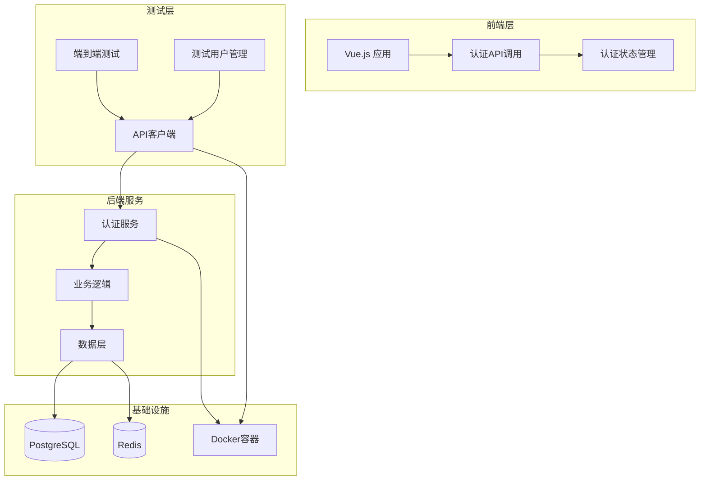

**图表来源**
- [auth_e2e_test.go](file://test/e2e/scenarios/auth_e2e_test.go#L1-L50)
- [api_client.go](file://test/e2e/helpers/api_client.go#L1-L30)
- [auth.ts](file://frontend/src/api/auth.ts#L1-L30)

## 核心组件分析

### 测试套件结构

端到端测试采用Ginkgo框架组织，提供了清晰的测试结构：

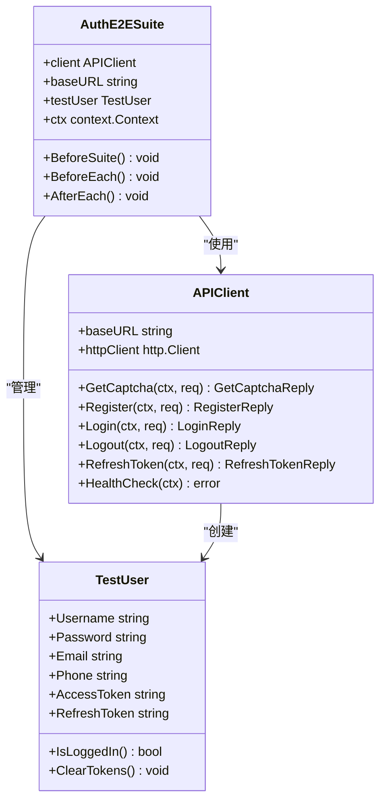

**图表来源**
- [auth_e2e_test.go](file://test/e2e/scenarios/auth_e2e_test.go#L25-L40)
- [api_client.go](file://test/e2e/helpers/api_client.go#L15-L25)
- [test_user.go](file://test/e2e/helpers/test_user.go#L10-L20)

**章节来源**
- [auth_e2e_test.go](file://test/e2e/scenarios/auth_e2e_test.go#L1-L100)
- [api_client.go](file://test/e2e/helpers/api_client.go#L1-L50)
- [test_user.go](file://test/e2e/helpers/test_user.go#L1-L50)

## 测试环境搭建

### Docker Compose配置

测试环境通过Docker Compose快速搭建，包含以下服务：

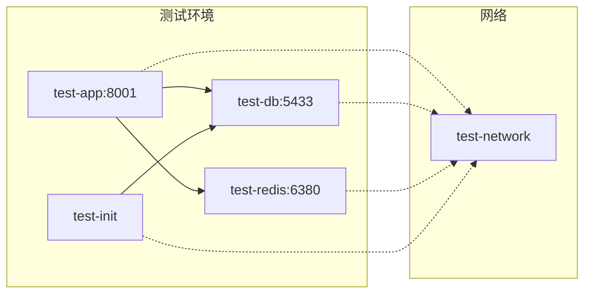

**图表来源**
- [docker-compose.test.yml](file://test/config/docker-compose.test.yml#L1-L50)

### 环境准备脚本

```bash
#!/bin/bash
# 测试环境设置流程
./scripts/setup.sh
make test-e2e
```

**章节来源**
- [docker-compose.test.yml](file://test/config/docker-compose.test.yml#L1-L112)
- [setup.sh](file://test/scripts/setup.sh#L1-L100)

## API客户端封装

### HTTP客户端设计

APIClient类封装了所有HTTP API调用，提供了统一的错误处理和响应解析：

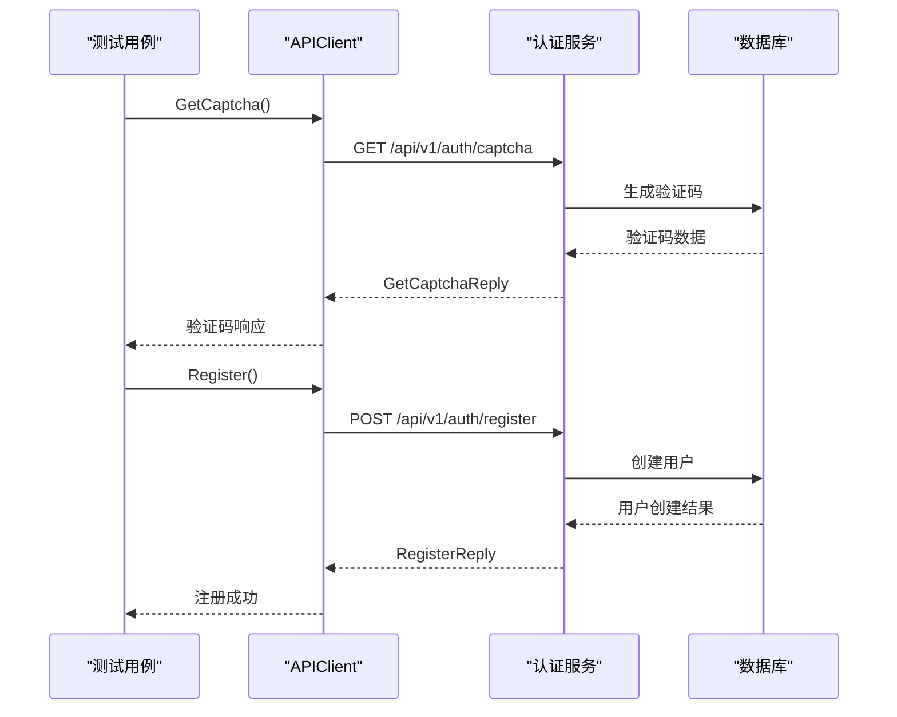

**图表来源**
- [api_client.go](file://test/e2e/helpers/api_client.go#L40-L80)
- [auth_e2e_test.go](file://test/e2e/scenarios/auth_e2e_test.go#L50-L100)

### 错误处理机制

API客户端实现了完善的错误处理：

```go
// handleHTTPError 处理HTTP错误响应
func (c *APIClient) handleHTTPError(resp *http.Response) error {
    body, _ := io.ReadAll(resp.Body)
    
    // 尝试解析Kratos错误格式
    var kratosErr struct {
        Code    int32  `json:"code"`
        Reason  string `json:"reason"`
        Message string `json:"message"`
    }
    
    if json.Unmarshal(body, &kratosErr) == nil && kratosErr.Code != 0 {
        return errors.New(int(kratosErr.Code), kratosErr.Reason, kratosErr.Message)
    }
    
    // 如果不是Kratos错误格式，返回HTTP错误
    return &HTTPError{
        StatusCode: resp.StatusCode,
        Message:    string(body),
    }
}
```

**章节来源**
- [api_client.go](file://test/e2e/helpers/api_client.go#L150-L200)

## 测试用户生命周期管理

### 用户创建策略

测试用户采用唯一命名策略，确保测试隔离：

```mermaid
flowchart TD
Start([开始创建测试用户]) --> GenSuffix[生成随机后缀]
GenSuffix --> CreateUsername[创建用户名<br/>testuser_{suffix}]
CreateUsername --> CreatePassword[设置默认密码<br/>TestPassword123!]
CreatePassword --> CreateEmail[创建邮箱<br/>testuser_{suffix}@example.com]
CreateEmail --> CreatePhone[生成手机号<br/>138{random_numbers}]
CreatePhone --> CreateUser[构建TestUser对象]
CreateUser --> End([返回测试用户])
CreateUser --> CloneUser{需要克隆用户?}
CloneUser --> |是| CloneOp[生成新后缀<br/>添加_clone后缀]
CloneUser --> |否| End
CloneOp --> CreateUser
```

**图表来源**
- [test_user.go](file://test/e2e/helpers/test_user.go#L15-L50)

### 用户状态管理

```go
// TestUser 结构体定义
type TestUser struct {
    Username     string
    Password     string
    Email        string
    Phone        string
    Name         string
    AccessToken  string
    RefreshToken string
}

// 用户状态检查方法
func (u *TestUser) IsLoggedIn() bool {
    return u.AccessToken != ""
}

// 清除令牌方法
func (u *TestUser) ClearTokens() {
    u.AccessToken = ""
    u.RefreshToken = ""
}
```

**章节来源**
- [test_user.go](file://test/e2e/helpers/test_user.go#L10-L80)

## 前后端契约一致性验证

### API调用对比

前端和后端的API调用保持严格一致：

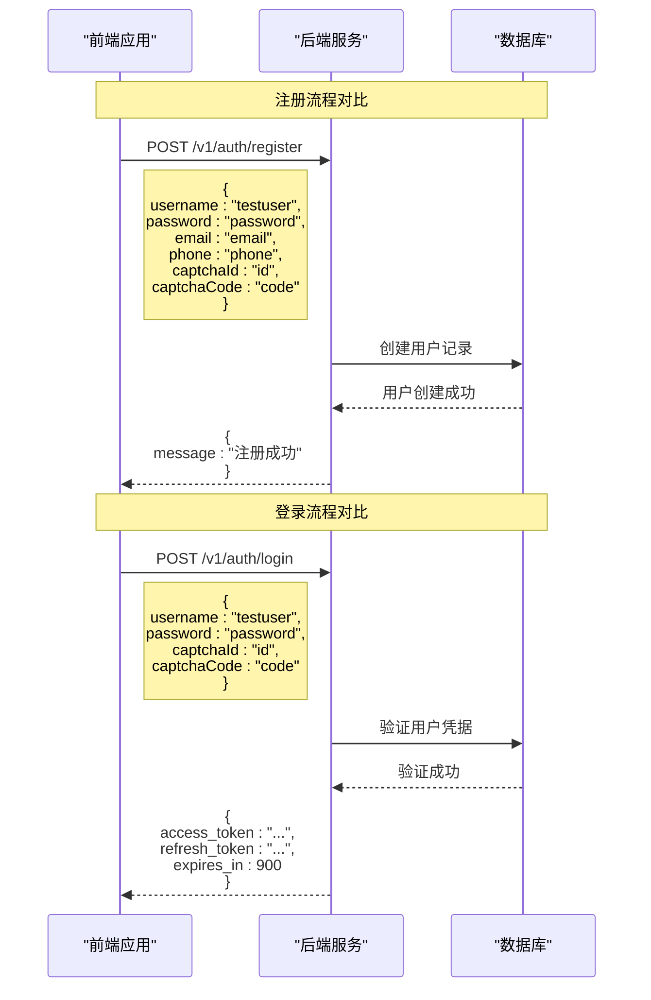

**图表来源**
- [auth.ts](file://frontend/src/api/auth.ts#L40-L80)
- [auth.go](file://internal/service/auth.go#L60-L100)

### 类型定义一致性

前后端共享相同的类型定义：

```typescript
// 前端API响应类型
interface LoginResponse {
    access_token: string;
    refresh_token: string;
    expires_in: number;
}

// 后端protobuf定义
message LoginReply {
    string access_token = 1;
    string refresh_token = 2;
    int64 expires_in = 3;
}
```

**章节来源**
- [auth.ts](file://frontend/src/api/auth.ts#L1-L99)
- [auth.go](file://internal/service/auth.go#L1-L50)

## 关键测试场景

### 完整注册流程

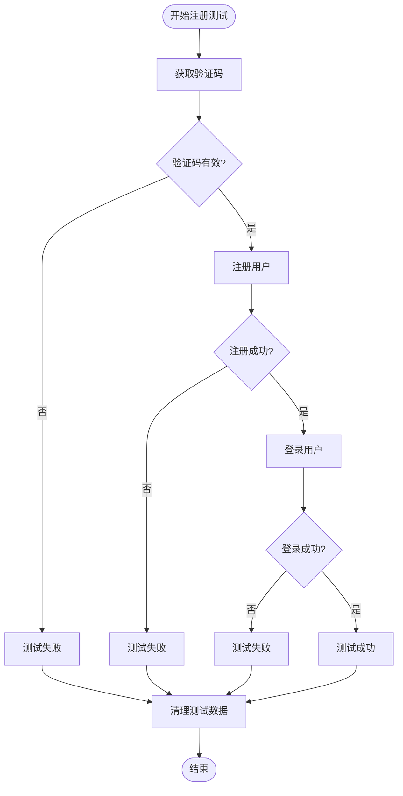

**图表来源**
- [auth_e2e_test.go](file://test/e2e/scenarios/auth_e2e_test.go#L50-L100)

### 登录失败处理

```go
// 多次登录失败后账户锁定测试
for i := 0; i < 5; i++ {
    captchaResp, err := client.GetCaptcha(ctx, &v1.GetCaptchaRequest{
        CaptchaType: "image",
        Target:      "",
    })
    Expect(err).NotTo(HaveOccurred())
    
    _, err = client.Login(ctx, &v1.LoginRequest{
        Username:    testUser.Username,
        Password:    "wrong_password",
        CaptchaId:   captchaResp.CaptchaId,
        CaptchaCode: "123456",
    })
    Expect(err).To(HaveOccurred())
}

// 检查账户锁定状态
lockStatus, err := client.GetLockStatus(ctx, &v1.LockStatusRequest{
    Username: testUser.Username,
})
Expect(err).NotTo(HaveOccurred())
Expect(lockStatus.IsLocked).To(BeTrue())
```

**章节来源**
- [auth_e2e_test.go](file://test/e2e/scenarios/auth_e2e_test.go#L200-L250)

## 会话状态维护

### 令牌管理

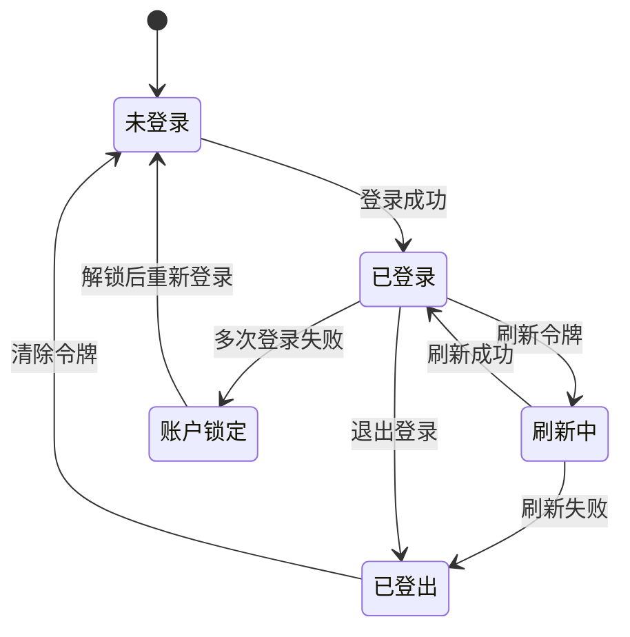

### 前端状态同步

```typescript
// 前端认证状态管理
const useAuthStore = defineStore('auth', () => {
    const accessToken = ref<string | null>(localStorage.getItem('access_token'));
    const refreshTokenValue = ref<string | null>(localStorage.getItem('refresh_token'));
    const isAuthenticated = ref<boolean>(!!accessToken.value);
    
    // 登录操作
    const loginAction = async (data: LoginData) => {
        const response = await login(data);
        const { access_token, refresh_token } = response.data;
        
        // 更新状态
        accessToken.value = access_token;
        refreshTokenValue.value = refresh_token;
        isAuthenticated.value = true;
        
        // 同步到本地存储
        localStorage.setItem('access_token', access_token);
        localStorage.setItem('refresh_token', refresh_token);
    };
});
```

**章节来源**
- [auth.ts](file://frontend/src/stores/auth.ts#L1-L99)

## 动态验证码处理

### 验证码生命周期

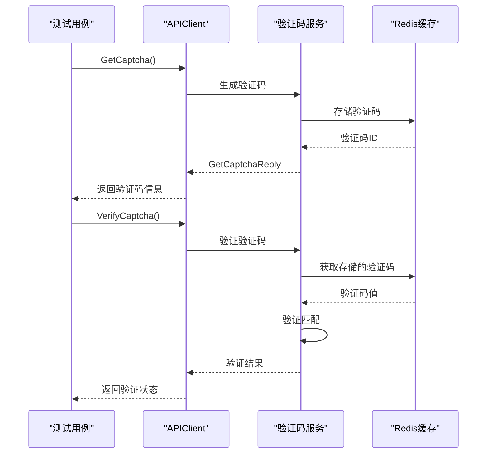

**图表来源**
- [api_client.go](file://test/e2e/helpers/api_client.go#L40-L80)
- [auth_e2e_test.go](file://test/e2e/scenarios/auth_e2e_test.go#L100-L150)

### 固定验证码配置

在测试环境中使用固定验证码简化测试：

```yaml
# test.yaml
auth:
  captcha_enabled: true
  fixed_captcha_code: "123456"  # 测试环境固定验证码
  captcha_expiration: "5m"
```

**章节来源**
- [test.yaml](file://test/config/test.yaml#L20-L30)

## UI与API同步验证

### 组件间通信

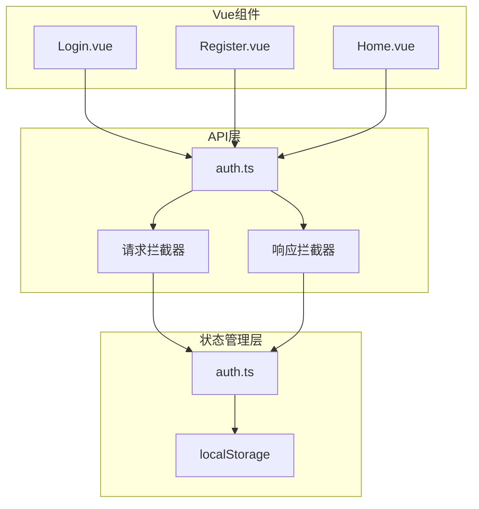

**图表来源**
- [auth.ts](file://frontend/src/api/auth.ts#L15-L40)
- [auth.ts](file://frontend/src/stores/auth.ts#L1-L30)

### 自动化验证

```typescript
// 响应拦截器自动处理认证状态
request.interceptors.response.use(
    (response) => {
        return response.data;
    },
    (error) => {
        if (error.response?.status === 401) {
            // 处理token过期
            localStorage.removeItem('access_token');
            localStorage.removeItem('refresh_token');
            window.location.href = '/login';
        }
        return Promise.reject(error);
    }
);
```

**章节来源**
- [auth.ts](file://frontend/src/api/auth.ts#L30-L50)

## 故障排查路径

### 常见问题诊断

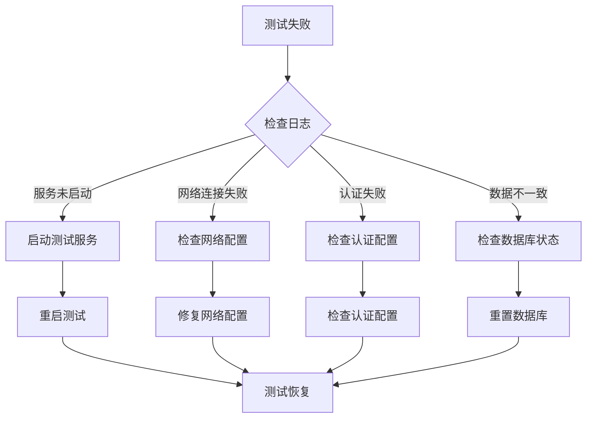

### 日志关联分析

```bash
# 查看测试服务日志
docker-compose -f test/config/docker-compose.test.yml logs test-app

# 查看数据库日志
docker-compose -f test/config/docker-compose.test.yml logs test-db

# 查看Redis日志
docker-compose -f test/config/docker-compose.test.yml logs test-redis

# 运行单个E2E测试
go test -tags=e2e -v ./test/e2e/scenarios/auth_e2e_test.go
```

### 调试技巧

1. **启用详细输出**：使用`--verbose`标志获取更多调试信息
2. **检查环境变量**：确认`TEST_SERVER_URL`等环境变量正确设置
3. **验证服务健康状态**：使用健康检查端点确认服务可用性
4. **监控数据库状态**：检查数据库连接和事务状态

**章节来源**
- [run_all.sh](file://test/scripts/run_all.sh#L1-L100)

## 性能考虑

### 测试执行优化

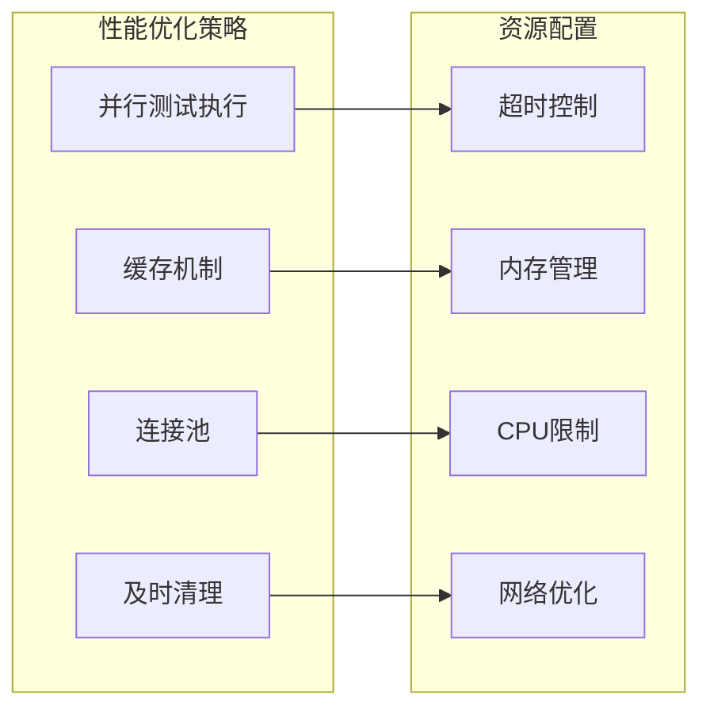

### 并发控制

```yaml
# test.yaml
test:
  concurrency:
    max_goroutines: 10
    max_operations: 100
  timeout:
    unit: "30s"
    integration: "2m"
    e2e: "5m"
```

**章节来源**
- [test.yaml](file://test/config/test.yaml#L30-L40)

## 总结

端到端测试是确保系统完整性和可靠性的关键手段。通过本指南介绍的方法和技术，可以：

1. **建立完整的测试流程**：从环境搭建到测试执行的全流程自动化
2. **实现前后端一致性验证**：确保API契约的准确性和稳定性
3. **提供可靠的故障排查机制**：快速定位和解决测试过程中的问题
4. **保证系统的高可用性**：通过全面的测试覆盖发现潜在问题

### 最佳实践建议

1. **持续集成**：将E2E测试集成到CI/CD流水线中
2. **定期更新**：随着系统演进更新测试用例
3. **监控告警**：建立测试失败的实时告警机制
4. **文档维护**：保持测试文档与代码同步更新

通过遵循这些原则和实践，可以构建一个健壮、可维护的端到端测试体系，为系统的稳定运行提供有力保障。