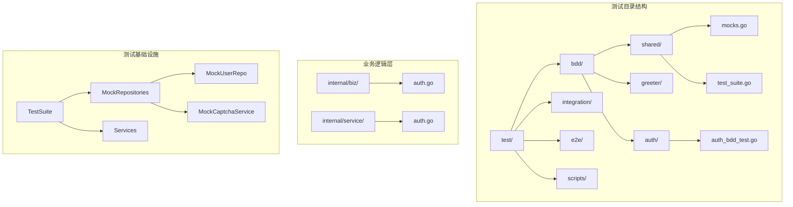
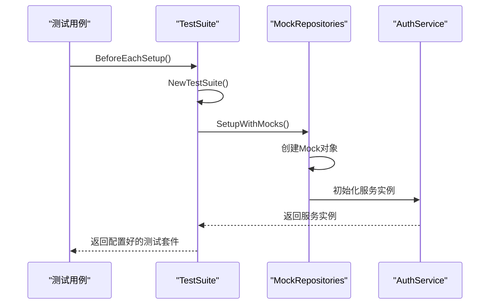
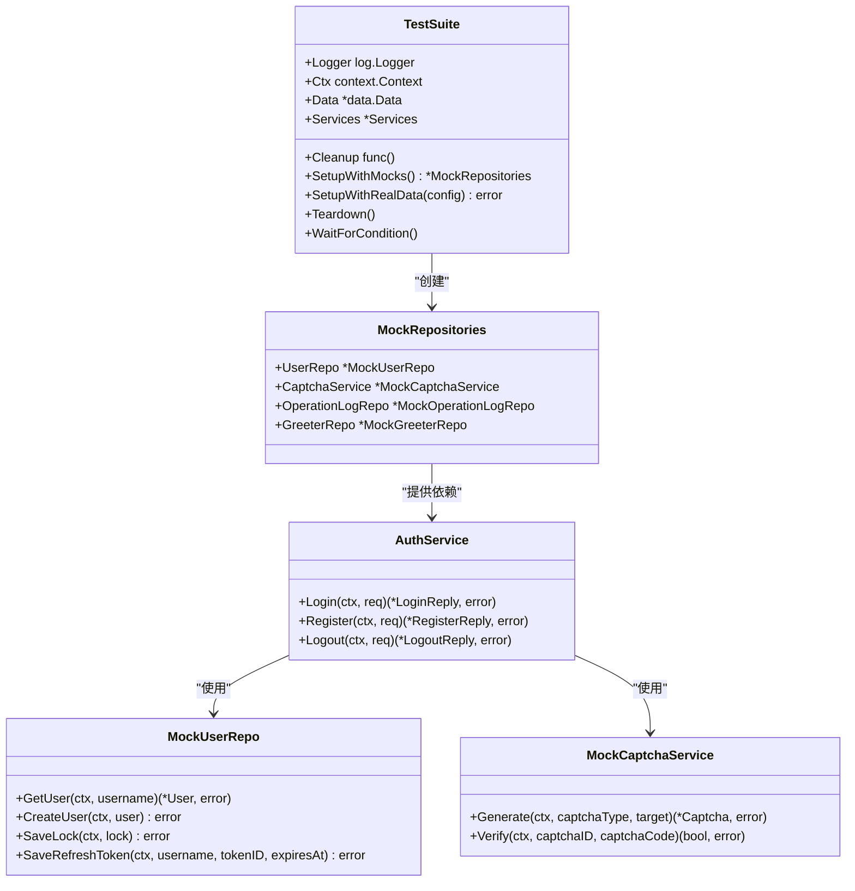
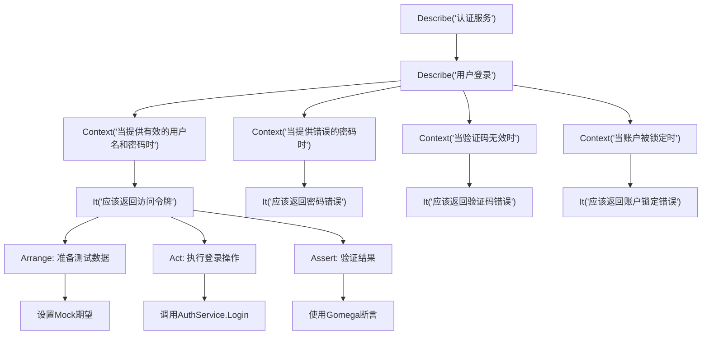
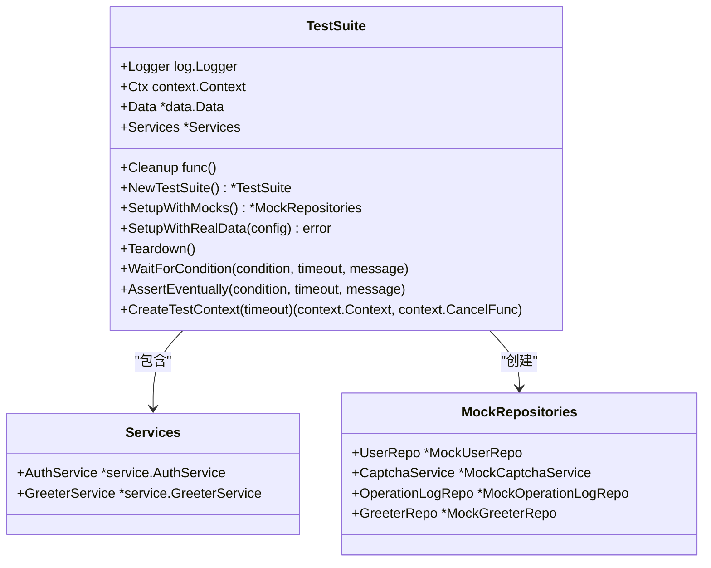
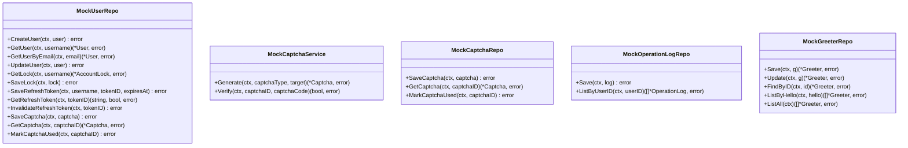
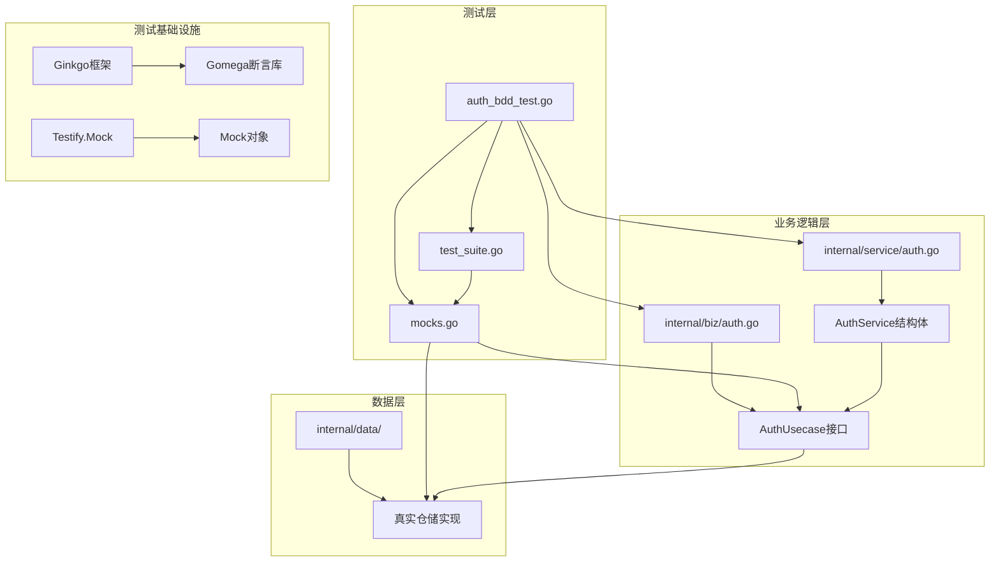

# 行为驱动开发（BDD）测试

<cite>
**本文档引用的文件**
- [auth_bdd_test.go](file://test/bdd/auth/auth_bdd_test.go)
- [test_suite.go](file://test/bdd/shared/test_suite.go)
- [mocks.go](file://test/bdd/shared/mocks.go)
- [auth.go](file://internal/service/auth.go)
- [auth.go](file://internal/biz/auth.go)
- [test.yaml](file://test/config/test.yaml)
- [run_all.sh](file://test/scripts/run_all.sh)
</cite>

## 目录
1. [简介](#简介)
2. [项目结构概览](#项目结构概览)
3. [核心组件分析](#核心组件分析)
4. [架构概览](#架构概览)
5. [详细组件分析](#详细组件分析)
6. [依赖关系分析](#依赖关系分析)
7. [性能考虑](#性能考虑)
8. [故障排除指南](#故障排除指南)
9. [结论](#结论)

## 简介

本文档深入分析了Kratos Boilerplate项目中的行为驱动开发（BDD）测试框架，重点介绍了Ginkgo/Gomega框架的使用实践。该项目采用分层架构设计，通过BDD测试确保业务逻辑的正确性和可维护性。

BDD测试框架的核心优势在于：
- **可读性强**：使用自然语言描述测试场景
- **语义清晰**：遵循'Describe-Context-It'结构
- **产品对齐**：测试用例直接反映业务需求
- **高保真测试**：通过模拟组件构建真实测试环境

## 项目结构概览



**图表来源**
- [test_suite.go](file://test/bdd/shared/test_suite.go#L1-L50)
- [mocks.go](file://test/bdd/shared/mocks.go#L1-L30)

**章节来源**
- [test/README.md](file://test/README.md#L1-L42)

## 核心组件分析

### BDD测试套件入口

BDD测试套件通过统一的入口点启动，使用Ginkgo框架的标准注册机制：

```go
func TestAuthServiceBDD(t *testing.T) {
    shared.RegisterBDDSuite(t, "AuthService BDD Suite")
}
```

这种设计模式的优势：
- **集中管理**：所有BDD测试通过单一入口启动
- **配置统一**：共享测试套件的初始化逻辑
- **扩展性强**：易于添加新的测试套件

### 测试套件初始化机制

TestSuite提供了完整的测试环境初始化功能：



**图表来源**
- [test_suite.go](file://test/bdd/shared/test_suite.go#L40-L80)

**章节来源**
- [test_suite.go](file://test/bdd/shared/test_suite.go#L40-L120)

## 架构概览



**图表来源**
- [test_suite.go](file://test/bdd/shared/test_suite.go#L15-L35)
- [mocks.go](file://test/bdd/shared/mocks.go#L10-L50)

## 详细组件分析

### auth_bdd_test.go - BDD测试描述

auth_bdd_test.go展示了标准的BDD测试结构，遵循'Describe-Context-It'模式：



**图表来源**
- [auth_bdd_test.go](file://test/bdd/auth/auth_bdd_test.go#L20-L100)

#### 测试用例结构分析

每个测试用例都遵循AAA模式（Arrange-Act-Assert）：

1. **Arrange阶段**：准备测试数据和设置Mock期望
2. **Act阶段**：执行被测试的操作
3. **Assert阶段**：验证结果符合预期

```go
// AAA模式示例
It("应该返回访问令牌", func() {
    // Arrange - 准备测试数据
    loginReq := &v1.LoginRequest{
        Username:    "testuser",
        Password:    "password123",
        CaptchaId:   "captcha-123",
        CaptchaCode: "123456",
    }
    
    // 设置Mock期望
    mocks.UserRepo.On("GetUser", ctx, "testuser").Return(user, nil)
    mocks.UserRepo.On("GetLock", ctx, "testuser").Return(nil, biz.ErrUserNotFound)
    mocks.CaptchaService.On("Verify", ctx, "captcha-123", "123456").Return(true, nil)
    
    // Act - 执行测试
    response, err := testSuite.Services.AuthService.Login(ctx, loginReq)
    
    // Assert - 验证结果
    Expect(err).NotTo(HaveOccurred())
    Expect(response).NotTo(BeNil())
    Expect(response.AccessToken).NotTo(BeEmpty())
})
```

**章节来源**
- [auth_bdd_test.go](file://test/bdd/auth/auth_bdd_test.go#L30-L80)

### test_suite.go - 测试套件初始化

TestSuite类提供了完整的测试环境管理功能：



**图表来源**
- [test_suite.go](file://test/bdd/shared/test_suite.go#L15-L35)

#### 异步测试处理

TestSuite提供了专门的异步测试处理机制：

```go
// 等待条件满足
func (ts *TestSuite) WaitForCondition(condition func() bool, timeout time.Duration, message string) {
    Eventually(condition, timeout, 100*time.Millisecond).Should(BeTrue(), message)
}

// 断言条件最终满足
func (ts *TestSuite) AssertEventually(condition func() bool, timeout time.Duration, message string) {
    Eventually(condition, timeout, 100*time.Millisecond).Should(BeTrue(), message)
}

// 断言条件持续满足
func (ts *TestSuite) AssertConsistently(condition func() bool, duration time.Duration, message string) {
    Consistently(condition, duration, 100*time.Millisecond).Should(BeTrue(), message)
}
```

**章节来源**
- [test_suite.go](file://test/bdd/shared/test_suite.go#L150-L180)

### mocks.go - 模拟依赖组件

mocks.go文件定义了所有需要模拟的组件，确保测试的独立性和可控性：



**图表来源**
- [mocks.go](file://test/bdd/shared/mocks.go#L10-L100)

#### 高保真测试环境构建

模拟组件的设计原则：

1. **完整覆盖**：模拟所有外部依赖
2. **行为控制**：精确控制模拟对象的行为
3. **状态管理**：维护模拟对象的内部状态
4. **验证追踪**：记录和验证方法调用

```go
// 模拟用户仓储的典型实现
func (m *MockUserRepo) GetUser(ctx context.Context, username string) (*biz.User, error) {
    args := m.Called(ctx, username)
    if args.Get(0) == nil {
        return nil, args.Error(1)
    }
    return args.Get(0).(*biz.User), args.Error(1)
}
```

**章节来源**
- [mocks.go](file://test/bdd/shared/mocks.go#L15-L80)

## 依赖关系分析



**图表来源**
- [auth_bdd_test.go](file://test/bdd/auth/auth_bdd_test.go#L1-L20)
- [test_suite.go](file://test/bdd/shared/test_suite.go#L1-L30)

**章节来源**
- [auth_bdd_test.go](file://test/bdd/auth/auth_bdd_test.go#L1-L30)
- [test_suite.go](file://test/bdd/shared/test_suite.go#L1-L50)

## 性能考虑

### 测试执行优化

1. **并行执行**：Ginkgo支持测试用例并行执行
2. **资源复用**：TestSuite提供资源池管理
3. **异步等待**：智能等待机制避免不必要的超时
4. **内存管理**：及时清理测试资源

### 性能监控指标

- **测试执行时间**：单个测试用例的平均执行时间
- **并发度**：同时执行的测试用例数量
- **内存使用**：测试过程中的内存峰值
- **Mock调用次数**：验证Mock期望的准确性

## 故障排除指南

### 常见问题及解决方案

#### 1. Mock期望不匹配

**问题症状**：测试失败，提示Mock期望未满足

**解决方案**：
```go
// 确保Mock期望与实际调用一致
mocks.UserRepo.On("GetUser", ctx, "testuser").Return(user, nil)
// 验证Mock调用
mocks.UserRepo.AssertExpectations(GinkgoT())
```

#### 2. 异步测试超时

**问题症状**：异步操作测试超时

**解决方案**：
```go
// 使用合适的等待时间
testSuite.WaitForCondition(
    func() bool { return conditionMet },
    5*time.Second,
    "条件应在5秒内满足"
)
```

#### 3. 测试环境配置错误

**问题症状**：测试无法连接数据库或Redis

**解决方案**：
- 检查test.yaml配置文件
- 确认测试数据库已正确初始化
- 验证网络连接和端口配置

**章节来源**
- [test_suite.go](file://test/bdd/shared/test_suite.go#L150-L200)
- [test.yaml](file://test/config/test.yaml#L1-L40)

## 结论

Kratos项目的BDD测试框架展现了现代软件测试的最佳实践：

### 主要优势

1. **可读性强**：使用自然语言描述测试场景
2. **结构清晰**：遵循DDD模式的分层架构
3. **高保真度**：通过模拟组件构建真实测试环境
4. **易于维护**：模块化设计便于扩展和维护

### 最佳实践总结

1. **测试隔离**：每个测试用例独立，不依赖其他测试的状态
2. **数据清理**：使用适当的清理机制确保测试后环境干净
3. **Mock使用**：在单元测试中使用Mock隔离外部依赖
4. **场景覆盖**：全面覆盖正常和异常场景
5. **断言清晰**：使用Gomega提供语义化的断言

### 发展建议

1. **测试覆盖率**：持续提升测试覆盖率
2. **性能监控**：建立测试性能监控体系
3. **自动化集成**：与CI/CD流水线深度集成
4. **文档完善**：持续更新测试文档和最佳实践

通过这套完整的BDD测试框架，开发团队能够高效地验证业务逻辑的正确性，确保产品质量，同时提高开发效率和代码质量。