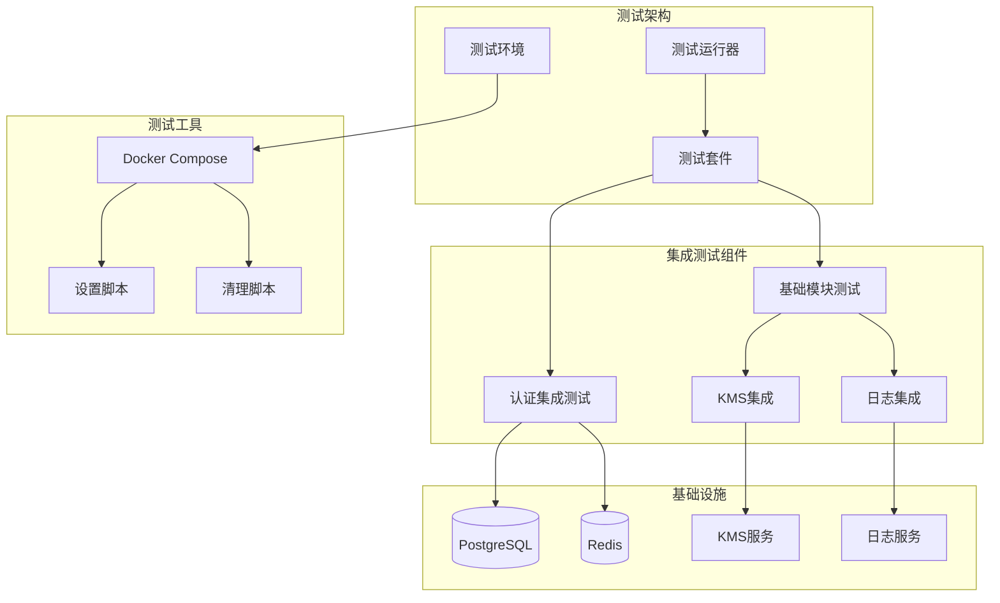
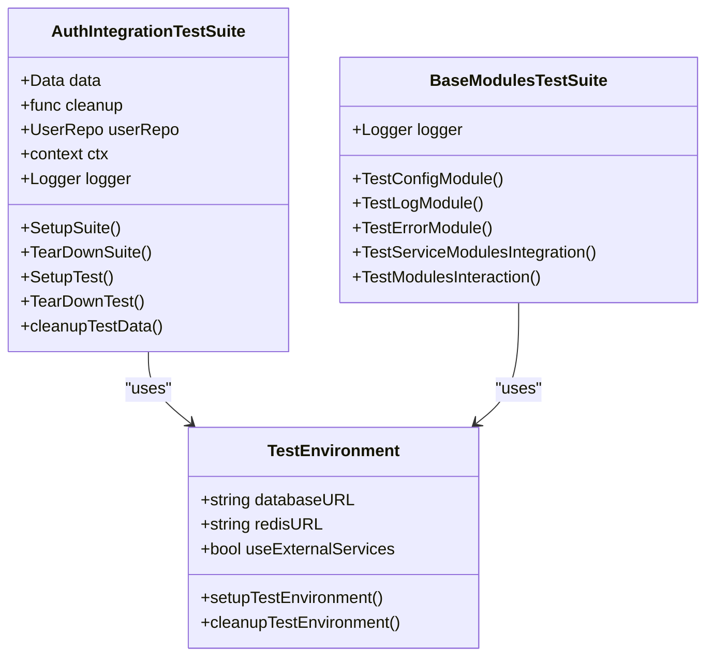
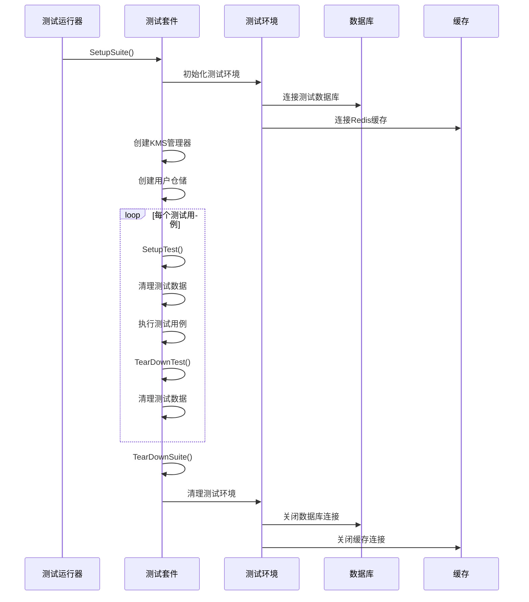
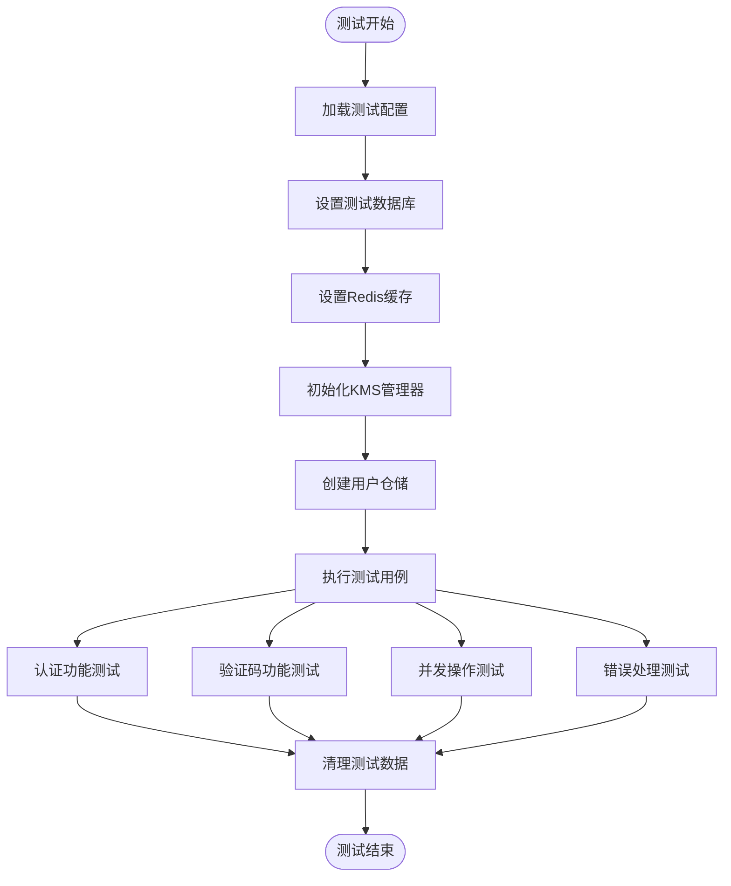
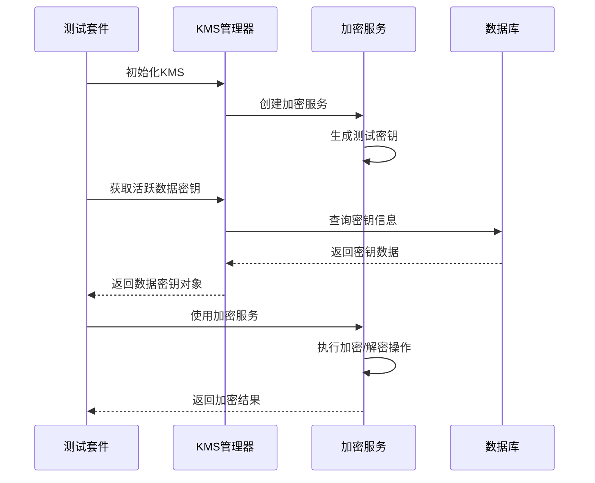
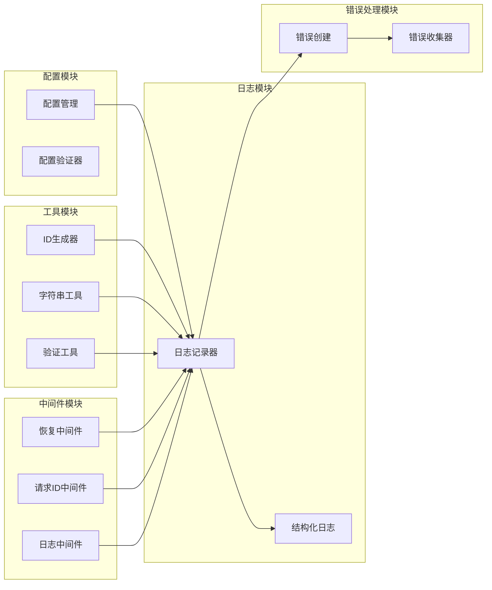
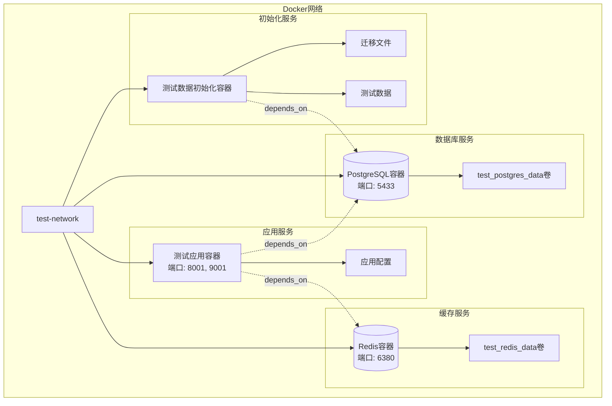
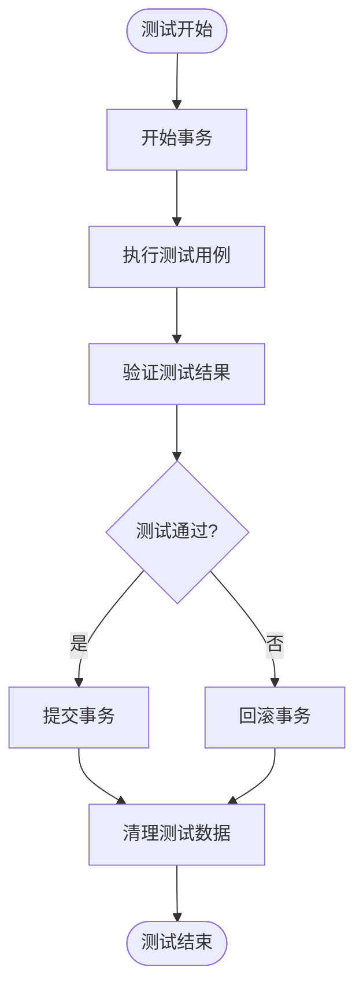
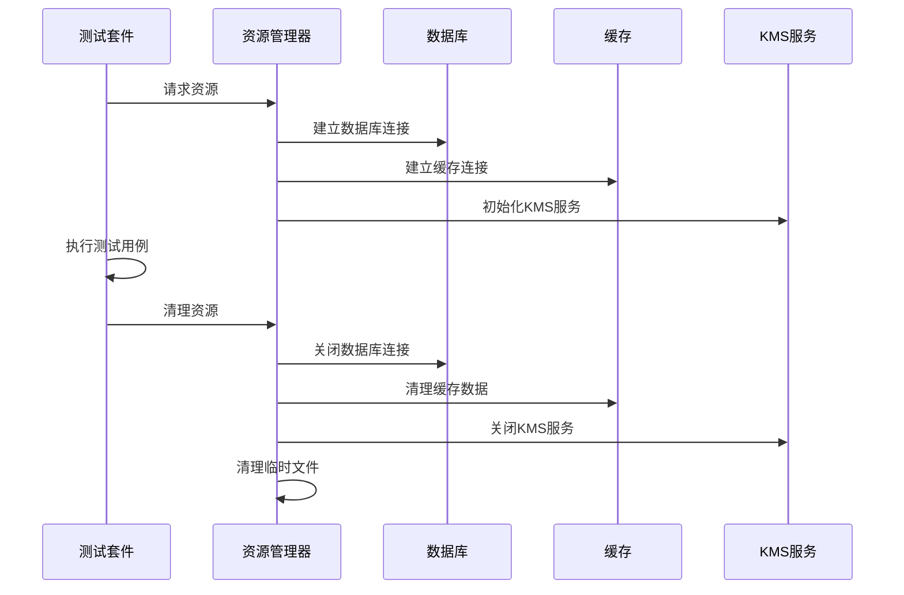
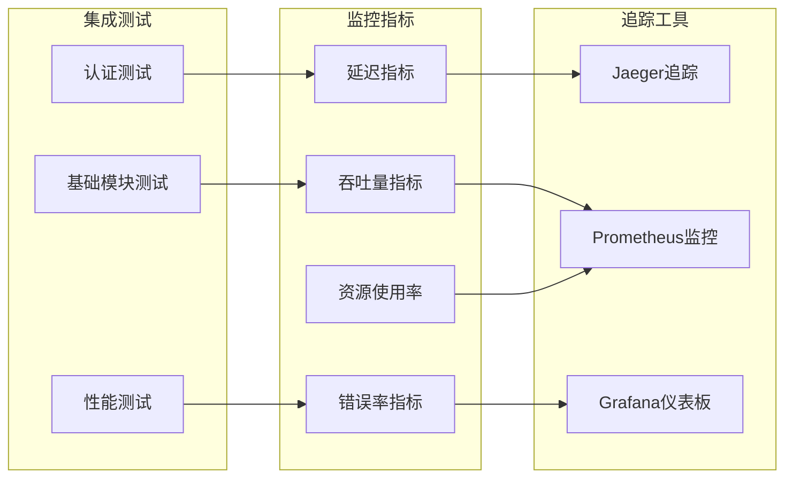

# 集成测试技术文档

<cite>
**本文档引用的文件**
- [auth_integration_test.go](file://test/integration/database/auth_integration_test.go)
- [base_modules_test.go](file://test/integration/base_modules_test.go)
- [docker-compose.test.yml](file://test/config/docker-compose.test.yml)
- [setup.sh](file://test/scripts/setup.sh)
- [run_all.sh](file://test/scripts/run_all.sh)
- [test.yaml](file://test/config/test.yaml)
- [operation_log_test.go](file://internal/data/operation_log_test.go)
- [auth_database_test.go](file://internal/data/auth_database_test.go)
- [manager_test.go](file://internal/pkg/kms/manager_test.go)
</cite>

## 目录
1. [简介](#简介)
2. [项目架构概览](#项目架构概览)
3. [核心集成测试组件](#核心集成测试组件)
4. [认证服务集成测试](#认证服务集成测试)
5. [基础模块集成测试](#基础模块集成测试)
6. [测试环境容器编排](#测试环境容器编排)
7. [自动化部署脚本](#自动化部署脚本)
8. [测试数据管理策略](#测试数据管理策略)
9. [性能监控与追踪](#性能监控与追踪)
10. [最佳实践指南](#最佳实践指南)
11. [故障排除指南](#故障排除指南)
12. [总结](#总结)

## 简介

本文档详细介绍了Kratos Boilerplate项目中的集成测试体系，重点关注多个系统组件协同工作的正确性验证。集成测试确保认证服务、数据库、缓存、KMS密钥管理等核心模块能够无缝协作，为系统的整体可靠性提供保障。

集成测试是软件测试金字塔的重要组成部分，它验证不同模块间的接口和数据流，确保系统作为一个整体能够正常工作。在本项目中，集成测试涵盖了认证服务与PostgreSQL数据库、Redis缓存的交互，以及KMS密钥管理、操作日志等基础模块的联动验证。

## 项目架构概览



**图表来源**
- [docker-compose.test.yml](file://test/config/docker-compose.test.yml#L1-L112)
- [setup.sh](file://test/scripts/setup.sh#L1-L325)

## 核心集成测试组件

### 测试套件设计模式

集成测试采用Go语言的测试套件模式，通过`testing`包提供的`Suite`接口实现测试的组织和管理：



**图表来源**
- [auth_integration_test.go](file://test/integration/database/auth_integration_test.go#L20-L50)
- [base_modules_test.go](file://test/integration/base_modules_test.go#L1-L50)

### 测试生命周期管理

集成测试遵循严格的生命周期管理，确保测试环境的一致性和可重复性：



**图表来源**
- [auth_integration_test.go](file://test/integration/database/auth_integration_test.go#L30-L100)

**章节来源**
- [auth_integration_test.go](file://test/integration/database/auth_integration_test.go#L20-L100)
- [base_modules_test.go](file://test/integration/base_modules_test.go#L1-L100)

## 认证服务集成测试

### 认证集成测试套件

认证集成测试套件专门验证认证服务与底层基础设施的集成情况，包括数据库操作、缓存管理和KMS密钥处理：



**图表来源**
- [auth_integration_test.go](file://test/integration/database/auth_integration_test.go#L30-L100)

### 数据库集成验证

认证集成测试通过真实的PostgreSQL数据库验证数据持久化和查询操作：

```go
// 配置测试数据库
config := &conf.Data{
    Database: &conf.Data_Database{
        Driver: "postgres",
        Source: databaseURL,
    },
    Redis: &conf.Data_Redis{
        Addr:    redisURL,
        Network: "tcp",
    },
}

var err error
suite.data, suite.cleanup, err = data.NewData(config, suite.logger)
require.NoError(suite.T(), err, "Failed to setup test database")
```

### Redis缓存集成测试

Redis缓存集成测试验证缓存读写操作和会话管理功能：

```go
// 保存验证码到缓存
err := suite.userRepo.SaveCaptcha(suite.ctx, captcha)
assert.NoError(suite.T(), err)

// 从缓存获取验证码
retrievedCaptcha, err := suite.userRepo.GetCaptcha(suite.ctx, captcha.ID)
assert.NoError(suite.T(), err)
assert.Equal(suite.T(), captcha.ID, retrievedCaptcha.ID)
```

### KMS密钥管理集成

KMS密钥管理集成测试验证加密密钥的生成、存储和使用：



**图表来源**
- [auth_integration_test.go](file://test/integration/database/auth_integration_test.go#L350-L400)

**章节来源**
- [auth_integration_test.go](file://test/integration/database/auth_integration_test.go#L1-L400)

## 基础模块集成测试

### 模块间交互验证

基础模块集成测试验证各个基础模块之间的协调工作能力：



**图表来源**
- [base_modules_test.go](file://test/integration/base_modules_test.go#L15-L100)

### 配置管理集成测试

配置管理集成测试验证配置加载、验证和动态更新功能：

```go
// 测试基本配置操作
assert.Equal(t, "", manager.GetString("nonexistent"))
assert.Equal(t, "default", manager.GetString("nonexistent", "default"))
assert.Equal(t, 42, manager.GetInt("nonexistent", 42))
assert.Equal(t, true, manager.GetBool("nonexistent", true))
assert.Equal(t, time.Hour, manager.GetDuration("nonexistent", time.Hour))
```

### 日志模块集成测试

日志模块集成测试验证日志记录、格式化和输出功能：

```go
// 测试基本日志功能
logger.Info("test message", pkglog.String("key", "value"))
logger.Warn("test warning", pkglog.Int("code", 123))
logger.Error("test error", pkglog.Error(errors.InternalError("test")))

// 测试格式化日志
logger.Infof("formatted message: %s", "test")

// 测试带字段的日志器
fieldsLogger := logger.WithFields(pkglog.String("component", "test"))
fieldsLogger.Info("message with fields")
```

### 错误处理集成测试

错误处理集成测试验证错误创建、包装和收集功能：

```go
// 测试基本错误创建
err := errors.NewError(errors.ErrCodeInvalidParams, "test error")
assert.Equal(t, errors.ErrCodeInvalidParams, err.Code)
assert.Equal(t, "test error", err.Message)

// 测试错误包装
originalErr := assert.AnError
wrappedErr := errors.WrapError(originalErr, errors.ErrCodeInternalError, "wrapped")
assert.Equal(t, originalErr, wrappedErr.Cause)

// 测试错误收集器
collector := errors.NewErrorCollector()
collector.Add(err)
collector.Add(originalErr)
assert.True(t, collector.HasErrors())
assert.Len(t, collector.Errors(), 2)
```

**章节来源**
- [base_modules_test.go](file://test/integration/base_modules_test.go#L1-L413)

## 测试环境容器编排

### Docker Compose配置

测试环境通过Docker Compose进行容器编排，确保测试环境的一致性和可重复性：

```yaml
version: '3.8'

services:
  # 测试数据库
  test-db:
    image: postgres:15-alpine
    container_name: kratos-test-db
    environment:
      POSTGRES_DB: test_db
      POSTGRES_USER: postgres
      POSTGRES_PASSWORD: postgres
    ports:
      - "5433:5432"
    volumes:
      - test_postgres_data:/var/lib/postgresql/data
      - ../../migrations:/docker-entrypoint-initdb.d
    healthcheck:
      test: ["CMD-SHELL", "pg_isready -U postgres -d test_db"]
      interval: 10s
      timeout: 5s
      retries: 5
    networks:
      - test-network

  # 测试Redis
  test-redis:
    image: redis:7-alpine
    container_name: kratos-test-redis
    ports:
      - "6380:6379"
    command: redis-server --appendonly yes
    volumes:
      - test_redis_data:/data
    healthcheck:
      test: ["CMD", "redis-cli", "ping"]
      interval: 10s
      timeout: 5s
      retries: 5
    networks:
      - test-network
```

### 容器网络架构



**图表来源**
- [docker-compose.test.yml](file://test/config/docker-compose.test.yml#L1-L112)

### 健康检查机制

容器编排包含完善的健康检查机制，确保服务启动完成后再进行测试：

```yaml
healthcheck:
  test: ["CMD-SHELL", "pg_isready -U postgres -d test_db"]
  interval: 10s
  timeout: 5s
  retries: 5
```

**章节来源**
- [docker-compose.test.yml](file://test/config/docker-compose.test.yml#L1-L112)

## 自动化部署脚本

### 环境设置脚本

自动化部署脚本负责整个测试环境的初始化和配置：

```bash
#!/bin/bash

# 检查并安装依赖
install_dependencies() {
    log_info "检查并安装测试依赖..."
    
    # 检查Go
    if ! command -v go &> /dev/null; then
        log_error "Go未安装，请先安装Go"
        exit 1
    fi
    
    # 安装Ginkgo
    if ! command -v ginkgo &> /dev/null; then
        log_info "安装Ginkgo..."
        go install github.com/onsi/ginkgo/v2/ginkgo@latest
    fi
    
    # 检查Docker
    if command -v docker &> /dev/null; then
        log_info "Docker版本: $(docker --version)"
    else
        log_warning "Docker未安装，集成测试和端到端测试将无法运行"
    fi
}

# 设置测试数据库
setup_test_database() {
    log_info "设置测试数据库..."
    
    if command -v docker &> /dev/null && command -v docker-compose &> /dev/null; then
        cd "$TEST_DIR/config"
        
        # 启动测试数据库
        docker-compose -f docker-compose.test.yml up -d test-db test-redis
        
        # 等待数据库启动
        log_info "等待数据库启动..."
        sleep 10
        
        # 检查数据库连接
        if docker-compose -f docker-compose.test.yml exec -T test-db pg_isready -U postgres; then
            log_success "测试数据库启动成功"
        else
            log_warning "测试数据库启动可能有问题，请检查Docker日志"
        fi
    else
        log_warning "Docker未安装，跳过测试数据库设置"
    fi
}
```

### 测试运行脚本

测试运行脚本提供灵活的测试执行方式和参数控制：

```bash
# 解析命令行参数
while [[ $# -gt 0 ]]; do
    case $1 in
        --unit-only)
            RUN_UNIT=true
            RUN_BDD=false
            RUN_INTEGRATION=false
            RUN_E2E=false
            shift
            ;;
        --bdd-only)
            RUN_UNIT=false
            RUN_BDD=true
            RUN_INTEGRATION=false
            RUN_E2E=false
            shift
            ;;
        --integration)
            RUN_INTEGRATION=true
            shift
            ;;
        --e2e)
            RUN_E2E=true
            shift
            ;;
        --all)
            RUN_UNIT=true
            RUN_BDD=true
            RUN_INTEGRATION=true
            RUN_E2E=true
            shift
            ;;
        *)
            log_error "未知选项: $1"
            exit 1
            ;;
    esac
done
```

### CI/CD环境适配

脚本具备智能的CI/CD环境检测和适配能力：

```bash
# 检测CI环境类型
detect_ci_environment() {
    if [ "$GITHUB_ACTIONS" = "true" ]; then
        CI_TYPE="github_actions"
        USE_EXTERNAL_SERVICES=true
        SKIP_DOCKER_SETUP=true
        log_info "检测到GitHub Actions环境"
    elif [ "$CI" = "true" ]; then
        CI_TYPE="generic_ci"
        USE_EXTERNAL_SERVICES=false
        SKIP_DOCKER_SETUP=false
        log_info "检测到通用CI环境"
    else
        CI_TYPE="local"
        USE_EXTERNAL_SERVICES=false
        SKIP_DOCKER_SETUP=false
        log_info "检测到本地开发环境"
    fi
}
```

**章节来源**
- [setup.sh](file://test/scripts/setup.sh#L1-L325)
- [run_all.sh](file://test/scripts/run_all.sh#L1-L509)

## 测试数据管理策略

### 事务回滚策略

集成测试采用严格的事务回滚策略，确保测试数据的隔离性和一致性：



### 数据清理机制

测试套件提供了完善的数据清理机制：

```go
// cleanupTestData 清理测试数据
func (suite *AuthIntegrationTestSuite) cleanupTestData() {
    // 这里应该清理测试过程中创建的数据
    // 例如删除测试用户、清理缓存等
    // 具体实现取决于你的数据模型
}

// SetupTest 在每个测试用例前执行
func (suite *AuthIntegrationTestSuite) SetupTest() {
    // 清理测试数据
    suite.cleanupTestData()
}

// TearDownTest 在每个测试用例后执行
func (suite *AuthIntegrationTestSuite) TearDownTest() {
    // 清理测试数据
    suite.cleanupTestData()
}
```

### 资源清理策略



**图表来源**
- [auth_integration_test.go](file://test/integration/database/auth_integration_test.go#L80-L100)

**章节来源**
- [auth_integration_test.go](file://test/integration/database/auth_integration_test.go#L80-L100)

## 性能监控与追踪

### 链路追踪集成

集成测试支持链路追踪功能，便于监控和调试：

```go
// 测试链路追踪
func TestTracingIntegration(t *testing.T) {
    config := tracing.DefaultConfig()
    config.Enabled = false // 禁用以避免需要Jaeger连接
    
    provider, err := tracing.NewTracingProvider(config, logger)
    require.NoError(t, err)
    
    tracer := provider.GetTracer()
    ctx := context.Background()
    ctx, span := tracer.Start(ctx, "test-span")
    defer span.End()
    
    // 从上下文获取追踪信息
    traceID := tracing.TraceIDFromContext(ctx)
    spanID := tracing.SpanIDFromContext(ctx)
    
    // 测试追踪助手
    helper := tracing.NewTracingHelper(tracer, logger)
    err = helper.WithSpan(ctx, "test-operation", func(ctx context.Context) error {
        time.Sleep(time.Millisecond)
        return nil
    })
    assert.NoError(t, err)
}
```

### 性能基准测试

集成测试包含详细的性能基准测试：

```go
// 基础模块性能基准测试
func BenchmarkModules(b *testing.B) {
    logger := log.NewStdLogger(nil)

    b.Run("IDGeneration", func(b *testing.B) {
        gen := utils.NewIDGenerator(1)
        b.ResetTimer()
        
        b.Run("UUID", func(b *testing.B) {
            for i := 0; i < b.N; i++ {
                gen.GenerateUUID()
            }
        })
        
        b.Run("Snowflake", func(b *testing.B) {
            for i := 0; i < b.N; i++ {
                gen.GenerateSnowflake()
            }
        })
    })

    b.Run("ErrorCreation", func(b *testing.B) {
        b.ResetTimer()
        for i := 0; i < b.N; i++ {
            errors.NewError(errors.ErrCodeInvalidParams, "test error")
        }
    })
}
```

### 监控指标采集



**章节来源**
- [base_modules_test.go](file://test/integration/base_modules_test.go#L350-L413)

## 最佳实践指南

### 测试环境配置

1. **环境变量管理**
   - 使用环境变量配置测试数据库连接
   - 支持本地开发和CI环境的不同配置
   - 提供默认配置以便快速启动

2. **容器化部署**
   - 使用Docker Compose管理测试服务
   - 实现服务健康检查
   - 支持持久化存储和数据备份

3. **测试数据准备**
   - 使用迁移脚本初始化测试数据
   - 实现数据清理和重置机制
   - 支持多种测试场景的数据准备

### 测试用例设计

1. **测试隔离**
   - 每个测试用例独立运行
   - 使用事务回滚确保数据隔离
   - 避免测试间的相互依赖

2. **边界条件测试**
   - 测试正常和异常路径
   - 验证边界输入和输出
   - 检查错误处理和恢复机制

3. **并发测试**
   - 测试多线程并发访问
   - 验证锁机制和同步策略
   - 检查竞态条件和死锁问题

### 性能优化建议

1. **测试并行化**
   - 合理设置并发goroutine数量
   - 避免过度并发导致资源竞争
   - 使用适当的超时和重试机制

2. **资源管理**
   - 及时释放数据库连接
   - 清理缓存和临时文件
   - 监控内存和CPU使用情况

3. **监控和告警**
   - 实施全面的监控指标
   - 设置合理的告警阈值
   - 建立故障自动恢复机制

## 故障排除指南

### 常见问题诊断

1. **数据库连接问题**
   ```bash
   # 检查数据库服务状态
   docker-compose -f docker-compose.test.yml ps
   
   # 查看数据库日志
   docker-compose -f docker-compose.test.yml logs test-db
   
   # 测试数据库连接
   docker-compose -f docker-compose.test.yml exec test-db pg_isready -U postgres
   ```

2. **Redis连接问题**
   ```bash
   # 检查Redis服务状态
   docker-compose -f docker-compose.test.yml ps
   
   # 测试Redis连接
   docker-compose -f docker-compose.test.yml exec test-redis redis-cli ping
   ```

3. **测试环境启动失败**
   ```bash
   # 清理现有容器
   docker-compose -f docker-compose.test.yml down
   
   # 重新构建镜像
   docker-compose -f docker-compose.test.yml build
   
   # 重新启动服务
   docker-compose -f docker-compose.test.yml up -d
   ```

### 调试技巧

1. **日志级别调整**
   - 增加日志详细程度
   - 启用SQL查询日志
   - 记录关键操作步骤

2. **断点调试**
   - 使用IDE设置断点
   - 分析变量和调用栈
   - 检查中间状态和结果

3. **性能分析**
   - 使用pprof分析CPU使用
   - 监控内存分配和GC
   - 分析I/O操作和网络延迟

### 环境清理

```bash
# 完全清理测试环境
cleanup_test_environment() {
    log_info "清理测试环境..."
    
    # 停止所有容器
    docker-compose -f docker-compose.test.yml down
    
    # 清理Docker资源
    docker system prune -f
    
    # 删除测试数据卷
    docker volume rm kratos-boilerplate_test_postgres_data
    docker volume rm kratos-boilerplate_test_redis_data
    
    log_success "测试环境清理完成"
}
```

**章节来源**
- [run_all.sh](file://test/scripts/run_all.sh#L338-L370)

## 总结

Kratos Boilerplate项目的集成测试体系是一个完整、可靠且易于维护的测试框架。通过精心设计的测试套件、容器化的测试环境和自动化部署脚本，该框架能够有效验证多个系统组件协同工作的正确性。

### 主要优势

1. **全面覆盖**：涵盖认证服务、数据库操作、缓存管理、KMS密钥处理等多个核心模块
2. **环境一致**：通过Docker容器确保测试环境的一致性和可重复性
3. **自动化程度高**：从环境设置到测试执行再到清理，全程自动化
4. **CI/CD友好**：支持各种CI/CD平台，适应不同的部署环境
5. **性能监控**：内置性能基准测试和监控指标采集

### 技术特点

1. **模块化设计**：测试套件按功能模块组织，便于维护和扩展
2. **依赖注入**：通过依赖注入实现松耦合，便于测试替身和模拟
3. **错误处理**：完善的错误处理和恢复机制
4. **资源管理**：严格的资源清理和事务回滚策略
5. **链路追踪**：支持分布式追踪和性能监控

### 应用价值

集成测试不仅验证了系统功能的正确性，更重要的是建立了开发团队对系统质量的信心。通过持续集成和自动化测试，开发团队能够在早期发现和修复问题，显著提高开发效率和产品质量。

该集成测试框架为其他项目提供了宝贵的参考经验，特别是在微服务架构下的多组件集成测试方面具有重要的借鉴意义。