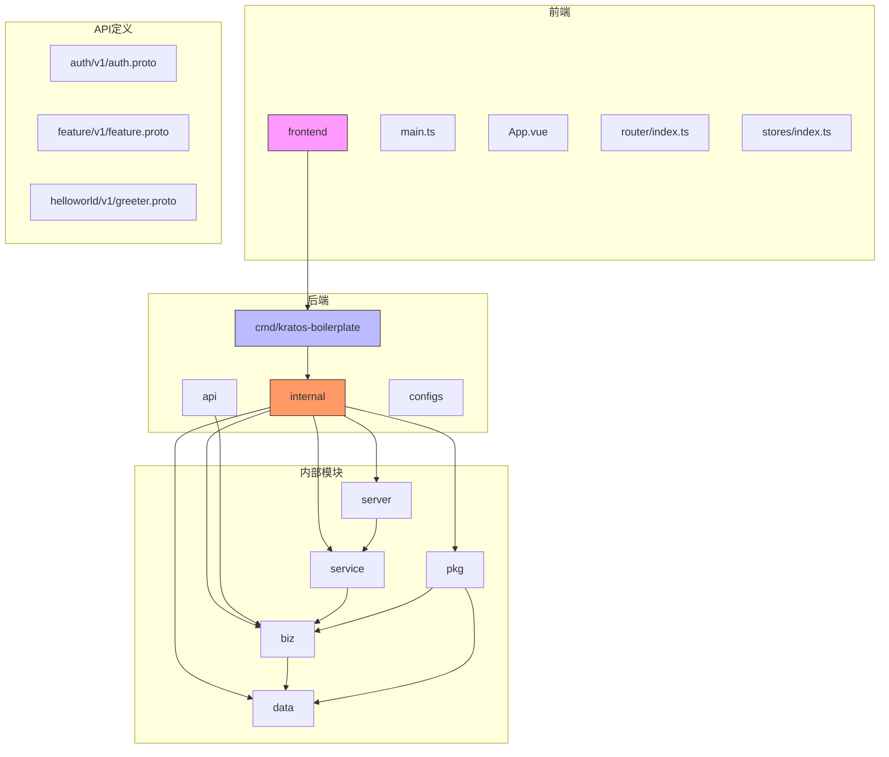
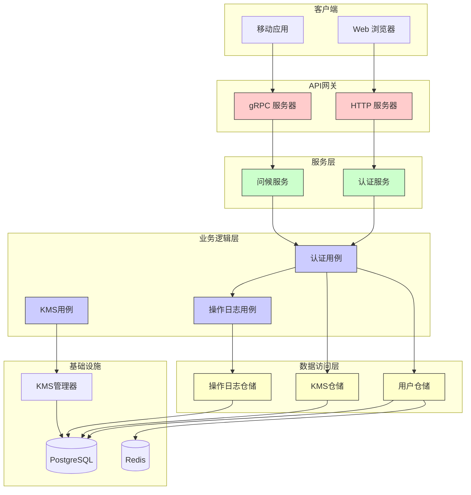

# 系统概述

<cite>
**本文档中引用的文件**
- [main.go](file://cmd/kratos-boilerplate/main.go)
- [wire.go](file://cmd/kratos-boilerplate/wire.go)
- [auth.go](file://internal/biz/auth.go)
- [kms.go](file://internal/biz/kms.go)
- [operation_log.go](file://internal/biz/operation_log.go)
- [auth.go](file://internal/data/auth.go)
- [kms.go](file://internal/data/kms.go)
- [operation_log.go](file://internal/data/operation_log.go)
- [anonymizer.go](file://internal/pkg/sensitive/anonymizer.go)
- [manager.go](file://internal/pkg/kms/manager.go)
- [server.go](file://internal/server/server.go)
- [grpc.go](file://internal/server/grpc.go)
- [http.go](file://internal/server/http.go)
- [config.yaml](file://configs/config.yaml)
- [main.ts](file://frontend/src/main.ts)
</cite>

## 目录
1. [简介](#简介)
2. [项目结构](#项目结构)
3. [核心组件](#核心组件)
4. [架构概览](#架构概览)
5. [详细组件分析](#详细组件分析)
6. [依赖关系分析](#依赖关系分析)
7. [性能考虑](#性能考虑)
8. [故障排除指南](#故障排除指南)
9. [结论](#结论)

## 简介
kratos-boilerplate 是一个企业级全栈微服务基础架构项目，旨在提供可扩展、安全且易于维护的后端服务与现代化前端集成解决方案。该项目采用 Go Kratos 框架构建后端服务，结合 Vue.js 3 + TypeScript 构建前端界面，并通过 Protobuf/gRPC 实现高效的服务间通信。系统设计遵循领域驱动设计（DDD）分层架构原则，包含 API → Service → Biz → Data 四个层次，确保代码的高内聚低耦合。

项目专注于关键功能模块的实现，包括用户认证、权限控制、敏感数据处理、功能开关管理、密钥管理系统（KMS）和操作日志记录。技术栈选型上，使用 PostgreSQL 作为主数据库存储结构化数据，Redis 用于缓存和会话管理，同时支持配置热更新、依赖注入（Wire）和插件系统等现代开发特性。整个系统通过 Docker 容器化部署，配合 docker-compose 实现本地开发环境的一键启动。

本项目还特别注重安全性，实现了基于 JWT 的身份验证机制，支持双因素认证（TOTP），并通过 KMS 系统对敏感数据进行加密保护。操作日志中间件自动记录关键业务操作，满足审计需求。测试方面采用 TDD（底层逻辑）+ BDD（业务逻辑）混合策略，确保代码质量和业务正确性。

## 项目结构



**图示来源**
- [main.go](file://cmd/kratos-boilerplate/main.go#L1-L92)
- [main.ts](file://frontend/src/main.ts#L1-L21)
- [server.go](file://internal/server/server.go#L1-L9)

**本节来源**
- [main.go](file://cmd/kratos-boilerplate/main.go#L1-L92)
- [main.ts](file://frontend/src/main.ts#L1-L21)
- [server.go](file://internal/server/server.go#L1-L9)

## 核心组件

kratos-boilerplate 项目的核心组件围绕 DDD 分层架构展开，主要包括用户认证、密钥管理、操作日志和敏感数据处理四大功能模块。在用户认证方面，系统实现了完整的注册、登录、令牌刷新和注销流程，支持验证码验证和账户锁定机制，有效防止暴力破解攻击。密钥管理系统（KMS）采用分层加密策略，通过根密钥保护数据密钥，实现敏感信息的安全存储和自动轮换。

操作日志组件通过中间件方式自动捕获关键业务操作，记录操作者、操作类型、目标对象和结果等六要素，满足安全审计要求。敏感数据处理模块提供了完善的脱敏机制，在日志输出和 API 响应中自动隐藏或模糊化敏感字段，如邮箱、手机号和个人姓名。这些核心组件通过依赖注入（Wire）框架进行组装，确保各层之间的松耦合和可测试性。

系统还集成了插件系统，允许在不修改核心代码的情况下扩展功能，如审计日志插件和认证增强插件。配置热更新机制使得系统参数可以在运行时动态调整，无需重启服务。所有这些设计决策共同构成了一个健壮、安全且易于维护的企业级微服务基础架构。

**本节来源**
- [auth.go](file://internal/biz/auth.go#L1-L695)
- [kms.go](file://internal/biz/kms.go#L1-L140)
- [operation_log.go](file://internal/biz/operation_log.go#L1-L24)
- [anonymizer.go](file://internal/pkg/sensitive/anonymizer.go#L1-L380)

## 架构概览



**图示来源**
- [http.go](file://internal/server/http.go#L1-L37)
- [grpc.go](file://internal/server/grpc.go#L1-L35)
- [server.go](file://internal/server/server.go#L1-L9)

**本节来源**
- [http.go](file://internal/server/http.go#L1-L37)
- [grpc.go](file://internal/server/grpc.go#L1-L35)
- [server.go](file://internal/server/server.go#L1-L9)

## 详细组件分析

### 认证组件分析

#### 对象导向组件：
```mermaid
classDiagram
    class User {
        +int64 ID
        +string Username
        +string Password
        +string Email
        +string Phone
        +string Name
        +string TotpSecret
        +time.Time CreatedAt
        +time.Time UpdatedAt
        +GetSensitiveFields() string[]
        +Anonymize() object
        +LogSafeString() string
    }
    
    class Captcha {
        +string ID
        +string Code
        +string Type
        +string Target
        +time.Time ExpireAt
        +bool Used
    }
    
    class TokenPair {
        +string AccessToken
        +string RefreshToken
        +int64 ExpiresIn
    }
    
    class AccountLock {
        +string Username
        +int32 FailedAttempts
        +time.Time LockUntil
        +time.Time LastAttempt
    }
    
    class AuthConfig {
        +string JWTSecretKey
        +time.Duration AccessTokenExpiration
        +time.Duration RefreshTokenExpiration
        +bool CaptchaEnabled
        +time.Duration CaptchaExpiration
        +int32 MaxLoginAttempts
        +time.Duration LockDuration
        +bool TOTPEnabled
    }
    
    class AuthUsecase {
        -UserRepo repo
        -CaptchaService captchaService
        -AuthConfig config
        -log.Helper log
        -sync.Map token