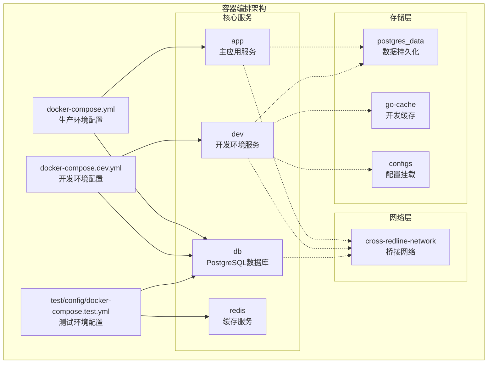
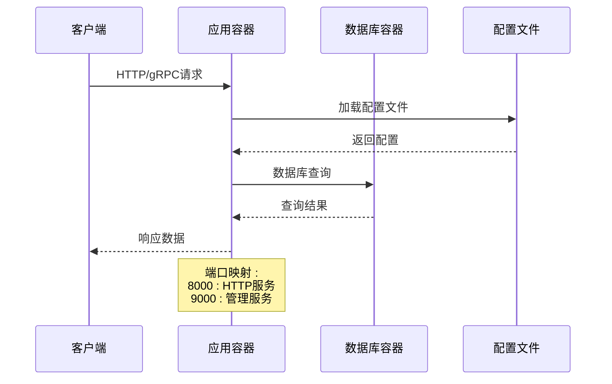
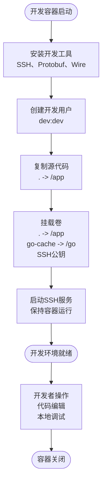
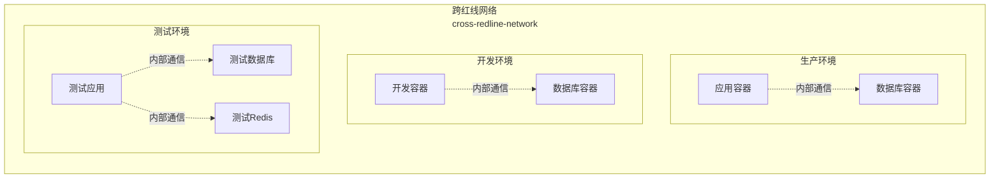
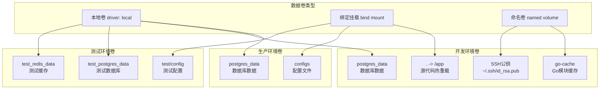
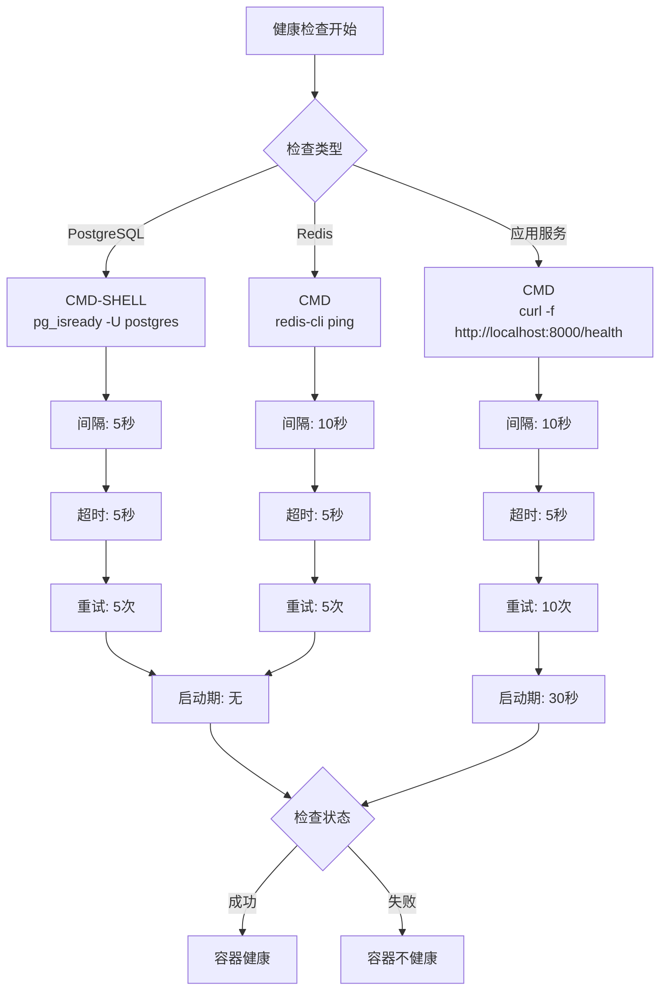
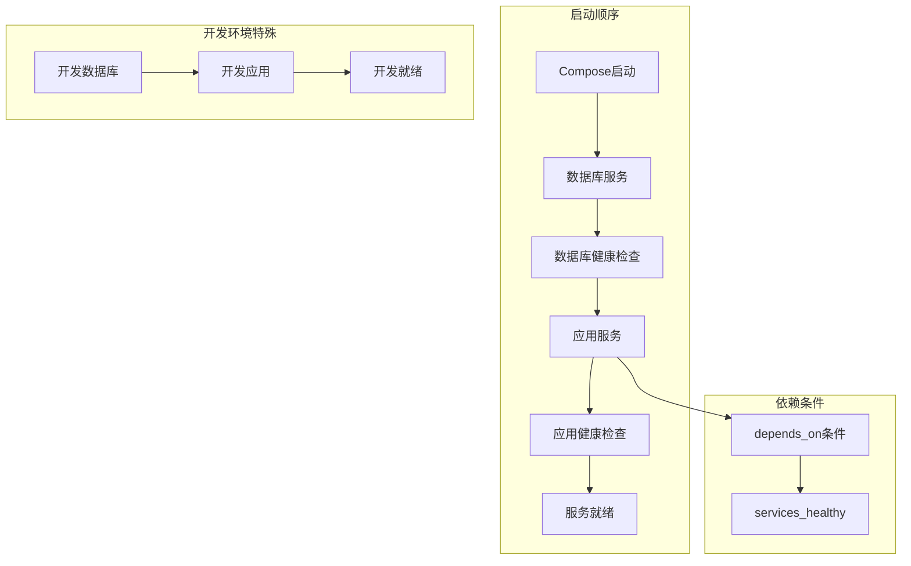
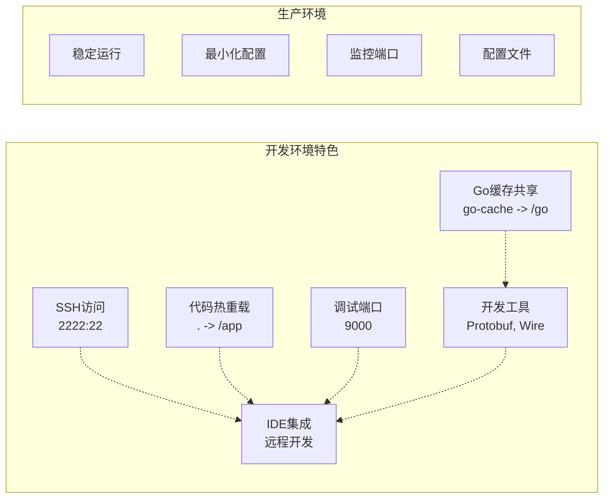
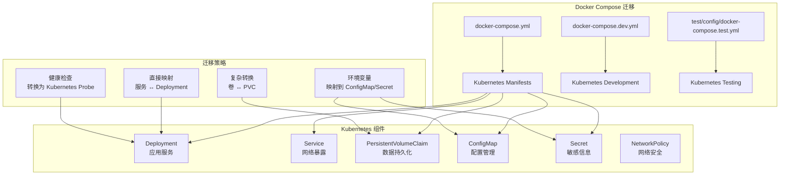
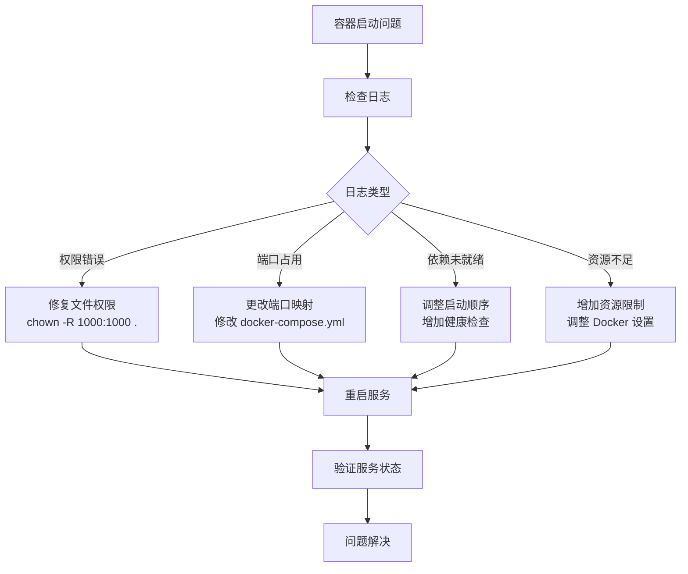

# 容器编排

<cite>
**本文档引用的文件**
- [docker-compose.yml](file://docker-compose.yml)
- [docker-compose.dev.yml](file://docker-compose.dev.yml)
- [Dockerfile](file://Dockerfile)
- [Dockerfile.dev](file://Dockerfile.dev)
- [test/config/docker-compose.test.yml](file://test/config/docker-compose.test.yml)
- [cmd/kratos-boilerplate/main.go](file://cmd/kratos-boilerplate/main.go)
- [internal/conf/conf.proto](file://internal/conf/conf.proto)
</cite>

## 目录
1. [简介](#简介)
2. [项目结构概览](#项目结构概览)
3. [核心容器服务](#核心容器服务)
4. [网络配置](#网络配置)
5. [数据卷管理](#数据卷管理)
6. [环境变量配置](#环境变量配置)
7. [健康检查机制](#健康检查机制)
8. [服务依赖关系](#服务依赖关系)
9. [开发环境 vs 生产环境](#开发环境-vs-生产环境)
10. [常用命令](#常用命令)
11. [Kubernetes 迁移指南](#kubernetes-迁移指南)
12. [故障排除](#故障排除)
13. [总结](#总结)

## 简介

kratos-boilerplate 项目采用了现代化的容器化架构，通过 Docker Compose 实现了完整的微服务编排。该项目包含三个主要容器服务：主应用服务、PostgreSQL 数据库和 Redis 缓存，支持开发环境和生产环境的不同配置需求。

该容器编排方案具有以下特点：
- 基于 OpenEuler 操作系统的基础镜像
- 支持前后端分离构建
- 提供开发环境的热重载和调试功能
- 包含完善的健康检查机制
- 支持多环境配置切换

## 项目结构概览



**图表来源**
- [docker-compose.yml](file://docker-compose.yml#L1-L50)
- [docker-compose.dev.yml](file://docker-compose.dev.yml#L1-L56)

## 核心容器服务

### 主应用服务 (app)

主应用服务是项目的核心业务逻辑容器，负责处理 HTTP 和 gRPC 请求。



**图表来源**
- [docker-compose.yml](file://docker-compose.yml#L3-L15)
- [cmd/kratos-boilerplate/main.go](file://cmd/kratos-boilerplate/main.go#L1-L51)

**服务配置特点：**
- 使用标准 Dockerfile 构建
- 容器名称：cross-redline-app
- 端口映射：8000(HTTP)、9000(管理)
- 配置文件挂载：./configs -> /data/conf
- 时区设置：Asia/Shanghai

### 开发环境服务 (dev)

开发环境服务专为开发者设计，提供了 SSH 访问和热重载功能。



**图表来源**
- [docker-compose.dev.yml](file://docker-compose.dev.yml#L3-L25)
- [Dockerfile.dev](file://Dockerfile.dev#L1-L71)

**开发特性：**
- SSH 端口：2222:22
- 代码热重载：. -> /app 卷挂载
- Go 缓存共享：go-cache -> /go
- SSH 公钥认证：~/.ssh/id_rsa.pub -> authorized_keys
- 终端交互：tty: true, stdin_open: true

### 数据库服务 (db)

PostgreSQL 数据库服务提供数据持久化能力。

**数据库配置：**
- 镜像版本：postgres:14
- 容器名称：cross-redline-db
- 端口映射：5432:5432
- 数据库名称：test
- 用户名密码：postgres/postgres
- 时区：Asia/Shanghai

**健康检查配置：**
```yaml
healthcheck:
  test: ["CMD-SHELL", "pg_isready -U postgres"]
  interval: 5s
  timeout: 5s
  retries: 5
```

**节来源**
- [docker-compose.yml](file://docker-compose.yml#L17-L35)
- [docker-compose.dev.yml](file://docker-compose.dev.yml#L27-L45)

## 网络配置

### 网络类型

项目使用 Docker 的 bridge 网络驱动，确保容器间的通信安全性和性能。



**图表来源**
- [docker-compose.yml](file://docker-compose.yml#L47-L49)
- [docker-compose.dev.yml](file://docker-compose.dev.yml#L51-L53)

### 网络隔离

每个环境都有独立的网络配置，避免服务冲突：

1. **生产环境网络**：cross-redline-network
2. **开发环境网络**：cross-redline-network  
3. **测试环境网络**：test-network

**节来源**
- [docker-compose.yml](file://docker-compose.yml#L47-L49)
- [docker-compose.dev.yml](file://docker-compose.dev.yml#L51-L53)
- [test/config/docker-compose.test.yml](file://test/config/docker-compose.test.yml#L63-L65)

## 数据卷管理

### 卷类型与用途



**图表来源**
- [docker-compose.yml](file://docker-compose.yml#L37-L46)
- [docker-compose.dev.yml](file://docker-compose.dev.yml#L17-L25)

### 卷挂载策略

**生产环境：**
- `./configs:/data/conf`：配置文件挂载
- `postgres_data:/var/lib/postgresql/data`：数据库数据持久化

**开发环境：**
- `.:/app`：源代码热重载
- `go-cache:/go`：Go模块缓存共享
- `~/.ssh/id_rsa.pub:/home/dev/.ssh/authorized_keys:ro`：SSH公钥认证

**测试环境：**
- `../../migrations:/migrations`：数据库迁移脚本
- `../../test/config:/app/test/config`：测试配置文件

**节来源**
- [docker-compose.yml](file://docker-compose.yml#L11-L15)
- [docker-compose.dev.yml](file://docker-compose.dev.yml#L11-L17)

## 环境变量配置

### 共同环境变量

所有服务都继承了以下基础环境变量：

```yaml
environment:
  - TZ=Asia/Shanghai
```

### 应用服务特定配置

**主应用服务：**
- 时区设置：Asia/Shanghai
- 配置路径：/data/conf

**开发环境服务：**
- 时区设置：Asia/Shanghai
- Go 环境变量：
  - GOPROXY=https://goproxy.cn
  - GO111MODULE=on
  - PATH 包含 Go bin 目录
  - GOPATH=/go

**数据库服务：**
- POSTGRES_USER: postgres
- POSTGRES_PASSWORD: postgres  
- POSTGRES_DB: test
- 时区设置：Asia/Shanghai

**节来源**
- [docker-compose.yml](file://docker-compose.yml#L16-L20)
- [docker-compose.dev.yml](file://docker-compose.dev.yml#L21-L25)
- [docker-compose.yml](file://docker-compose.yml#L22-L26)

## 健康检查机制

### 健康检查策略



**图表来源**
- [docker-compose.yml](file://docker-compose.yml#L31-L35)
- [test/config/docker-compose.test.yml](file://test/config/docker-compose.test.yml#L17-L21)
- [test/config/docker-compose.test.yml](file://test/config/docker-compose.test.yml#L55-L61)

### 健康检查配置详解

**PostgreSQL 健康检查：**
```yaml
healthcheck:
  test: ["CMD-SHELL", "pg_isready -U postgres"]
  interval: 5s
  timeout: 5s
  retries: 5
```

**Redis 健康检查：**
```yaml
healthcheck:
  test: ["CMD", "redis-cli", "ping"]
  interval: 10s
  timeout: 5s
  retries: 5
```

**应用服务健康检查：**
```yaml
healthcheck:
  test: ["CMD", "curl", "-f", "http://localhost:8000/health"]
  interval: 10s
  timeout: 5s
  retries: 10
  start_period: 30s
```

**节来源**
- [docker-compose.yml](file://docker-compose.yml#L31-L35)
- [test/config/docker-compose.test.yml](file://test/config/docker-compose.test.yml#L17-L21)
- [test/config/docker-compose.test.yml](file://test/config/docker-compose.test.yml#L55-L61)

## 服务依赖关系

### 依赖链分析



**图表来源**
- [docker-compose.yml](file://docker-compose.yml#L18-L20)
- [docker-compose.dev.yml](file://docker-compose.dev.yml#L19-L21)

### 依赖配置详解

**生产环境依赖：**
```yaml
depends_on:
  db:
    condition: service_healthy
```

**开发环境依赖：**
```yaml
depends_on:
  db:
    condition: service_healthy
```

**依赖条件说明：**
- `service_healthy`：等待目标服务达到健康状态后再启动当前服务
- 这种配置确保数据库完全启动并准备好连接后，应用服务才开始启动

**节来源**
- [docker-compose.yml](file://docker-compose.yml#L18-L20)
- [docker-compose.dev.yml](file://docker-compose.dev.yml#L19-L21)

## 开发环境 vs 生产环境

### 配置对比表

| 特性 | 生产环境 | 开发环境 |
|------|----------|----------|
| 容器名称 | cross-redline-app | cross-redline-dev |
| Dockerfile | Dockerfile | Dockerfile.dev |
| 端口映射 | 8000, 9000 | 2222, 8000, 9000 |
| SSH访问 | ❌ | ✅ |
| 热重载 | ❌ | ✅ |
| 调试端口 | ❌ | ✅ |
| Go缓存 | ❌ | ✅ |
| 配置挂载 | ./configs | . |

### 开发环境增强功能



**图表来源**
- [docker-compose.dev.yml](file://docker-compose.dev.yml#L3-L25)
- [Dockerfile.dev](file://Dockerfile.dev#L1-L71)

### 开发环境 Dockerfile 特性

**SSH 服务配置：**
```dockerfile
# 配置 SSH
RUN mkdir /var/run/sshd && \
    ssh-keygen -A && \
    sed -i 's/#PermitRootLogin prohibit-password/PermitRootLogin prohibit-password/' /etc/ssh/sshd_config && \
    sed -i 's/#PubkeyAuthentication yes/PubkeyAuthentication yes/' /etc/ssh/sshd_config && \
    sed -i 's/#PasswordAuthentication yes/PasswordAuthentication no/' /etc/ssh/sshd_config
```

**开发工具安装：**
- Protobuf 编译器
- Kratos CLI 工具
- Wire 依赖注入工具
- Go 插件：protoc-gen-go, protoc-gen-go-grpc, protoc-gen-go-http

**节来源**
- [docker-compose.dev.yml](file://docker-compose.dev.yml#L1-L56)
- [Dockerfile.dev](file://Dockerfile.dev#L1-L71)

## 常用命令

### 基础操作命令

```bash
# 启动生产环境服务
docker-compose up -d

# 启动开发环境服务
docker-compose -f docker-compose.dev.yml up -d

# 查看服务状态
docker-compose ps
docker-compose -f docker-compose.dev.yml ps

# 查看服务日志
docker-compose logs app
docker-compose logs db
docker-compose -f docker-compose.dev.yml logs dev

# 停止所有服务
docker-compose down
docker-compose -f docker-compose.dev.yml down

# 清理未使用的资源
docker-compose down --volumes
```

### 开发环境专用命令

```bash
# 进入开发容器
docker exec -it cross-redline-dev bash

# 查看开发容器内文件
docker exec cross-redline-dev ls -la /app

# 复制本地文件到容器
docker cp ./local-file.txt cross-redline-dev:/app/

# 查看容器网络连接
docker network inspect cross-redline-network
```

### 扩展与维护命令

```bash
# 扩展应用服务实例
docker-compose scale app=3

# 更新服务镜像
docker-compose pull
docker-compose up -d --no-deps app

# 查看容器资源使用
docker stats

# 导出容器配置
docker-compose config
```

## Kubernetes 迁移指南

### 从 Docker Compose 到 Kubernetes 的转换



### Kubernetes 部署清单模板

**应用服务 Deployment：**
```yaml
apiVersion: apps/v1
kind: Deployment
metadata:
  name: kratos-boilerplate
spec:
  replicas: 1
  selector:
    matchLabels:
      app: kratos-boilerplate
  template:
    metadata:
      labels:
        app: kratos-boilerplate
    spec:
      containers:
      - name: app
        image: your-registry/kratos-boilerplate:latest
        ports:
        - containerPort: 8000
          name: http
        - containerPort: 9000
          name: admin
        env:
        - name: TZ
          value: Asia/Shanghai
        volumeMounts:
        - name: config-volume
          mountPath: /data/conf
        livenessProbe:
          httpGet:
            path: /health
            port: 8000
          initialDelaySeconds: 30
          periodSeconds: 10
        readinessProbe:
          httpGet:
            path: /health
            port: 8000
          initialDelaySeconds: 5
          periodSeconds: 5
      volumes:
      - name: config-volume
        configMap:
          name: kratos-config
```

**数据库服务 Service：**
```yaml
apiVersion: v1
kind: Service
metadata:
  name: postgres-service
spec:
  selector:
    app: postgres
  ports:
  - port: 5432
    targetPort: 5432
  type: ClusterIP
---
apiVersion: apps/v1
kind: Deployment
metadata:
  name: postgres
spec:
  replicas: 1
  selector:
    matchLabels:
      app: postgres
  template:
    metadata:
      labels:
        app: postgres
    spec:
      containers:
      - name: postgres
        image: postgres:14
        ports:
        - containerPort: 5432
        env:
        - name: POSTGRES_USER
          value: postgres
        - name: POSTGRES_PASSWORD
          valueFrom:
            secretKeyRef:
              name: postgres-secret
              key: password
        - name: POSTGRES_DB
          value: test
        volumeMounts:
        - name: postgres-storage
          mountPath: /var/lib/postgresql/data
        livenessProbe:
          exec:
            command:
            - pg_isready
            - -U
            - postgres
          initialDelaySeconds: 30
          periodSeconds: 10
      volumes:
      - name: postgres-storage
        persistentVolumeClaim:
          claimName: postgres-pvc
```

### 迁移注意事项

1. **网络配置**：将 Docker bridge 网络转换为 Kubernetes Service
2. **存储管理**：将本地卷映射转换为 PersistentVolumeClaim
3. **环境变量**：将环境变量映射到 ConfigMap 或 Secret
4. **健康检查**：将 CMD-SHELL 健康检查转换为 Kubernetes Probe
5. **资源限制**：添加 CPU 和内存资源限制
6. **滚动更新**：配置适当的滚动更新策略

## 故障排除

### 常见问题与解决方案



### 排查步骤

**1. 检查容器状态**
```bash
# 查看所有容器状态
docker-compose ps

# 查看特定容器日志
docker-compose logs app
docker-compose logs db

# 进入容器内部
docker exec -it cross-redline-app bash
```

**2. 检查网络连接**
```bash
# 查看网络配置
docker network ls
docker network inspect cross-redline-network

# 测试容器间连通性
docker exec cross-redline-app ping cross-redline-db
```

**3. 检查数据卷**
```bash
# 查看卷列表
docker volume ls

# 查看卷详情
docker volume inspect postgres_data

# 检查卷内容
docker run --rm -v postgres_data:/data alpine ls -la /data
```

**4. 常见错误处理**

**权限问题：**
```bash
# 修复文件权限
sudo chown -R 1000:1000 .
```

**端口冲突：**
```bash
# 修改 docker-compose.yml 中的端口映射
ports:
  - "8080:8000"  # 将外部端口改为8080
```

**依赖问题：**
```bash
# 确保数据库先启动
docker-compose up -d db
sleep 10
docker-compose up -d app
```

### 性能优化建议

1. **资源分配**：根据应用负载调整容器资源限制
2. **网络优化**：使用 overlay 网络提高容器间通信效率
3. **存储优化**：使用 SSD 存储提升数据库性能
4. **缓存策略**：合理配置 Redis 缓存参数
5. **监控告警**：设置容器资源使用监控

## 总结

kratos-boilerplate 项目的容器编排方案展现了现代微服务架构的最佳实践。通过精心设计的 Docker Compose 配置，项目实现了：

### 核心优势

1. **环境一致性**：开发、测试、生产环境配置统一
2. **快速启动**：完善的健康检查确保服务可靠启动
3. **开发友好**：SSH 访问和热重载提升开发效率
4. **数据持久化**：可靠的存储卷管理保证数据安全
5. **网络隔离**：独立的网络配置避免服务冲突

### 技术亮点

- **多阶段构建**：Dockerfile 实现了高效的前后端分离构建
- **健康检查**：多层次的健康检查机制确保服务稳定性
- **卷管理**：灵活的数据卷配置支持不同场景需求
- **环境适配**：开发环境的特殊配置满足调试和热重载需求

### 迁移价值

该容器编排方案为 Kubernetes 迁移提供了清晰的路径，通过合理的组件映射和配置转换，可以平滑过渡到云原生环境。项目的设计充分考虑了可维护性和扩展性，为未来的架构演进奠定了坚实基础。

通过本文档的详细分析，开发者可以深入理解项目的容器化架构，掌握 Docker Compose 的最佳实践，并为实际项目部署提供有价值的参考。