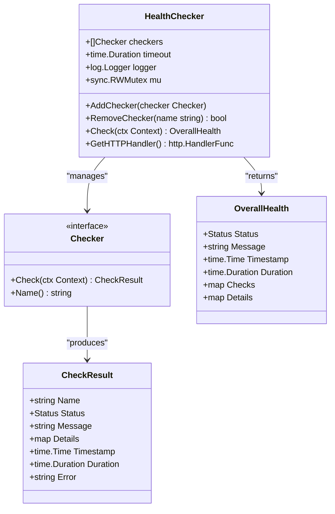
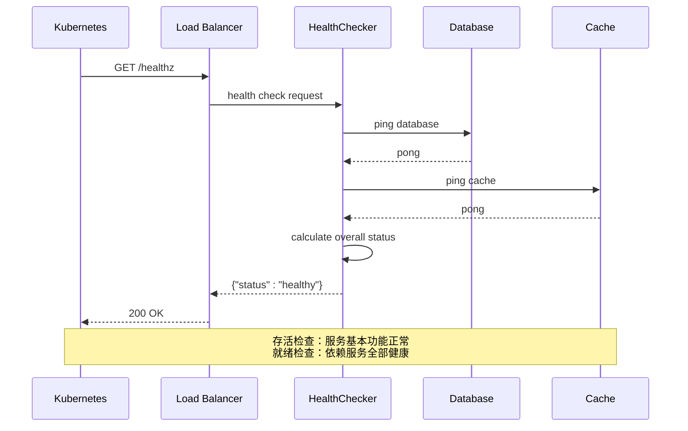
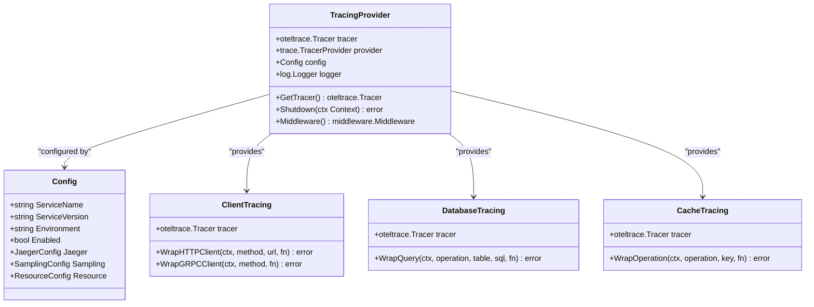
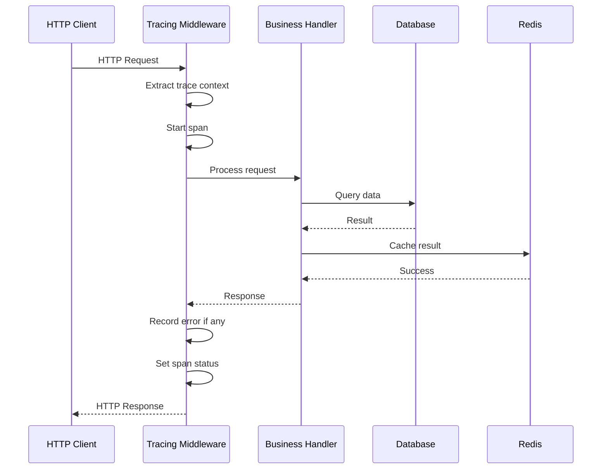

# 监控与可观测性

<cite>
**本文档引用的文件**
- [internal/pkg/health/health.go](file://internal/pkg/health/health.go)
- [internal/pkg/log/logger.go](file://internal/pkg/log/logger.go)
- [internal/pkg/tracing/tracing.go](file://internal/pkg/tracing/tracing.go)
- [internal/pkg/middleware/middleware.go](file://internal/pkg/middleware/middleware.go)
- [cmd/kratos-boilerplate/main.go](file://cmd/kratos-boilerplate/main.go)
- [internal/server/http.go](file://internal/server/http.go)
- [internal/server/grpc.go](file://internal/server/grpc.go)
</cite>

## 目录
1. [概述](#概述)
2. [健康检查系统](#健康检查系统)
3. [结构化日志系统](#结构化日志系统)
4. [链路追踪系统](#链路追踪系统)
5. [指标监控系统](#指标监控系统)
6. [容器编排集成](#容器编排集成)
7. [告警规则设计](#告警规则设计)
8. [最佳实践建议](#最佳实践建议)

## 概述

本项目提供了完整的监控与可观测性解决方案，包括健康检查、结构化日志、链路追踪和指标监控等功能。这些组件协同工作，为微服务架构提供了全面的可观测性支持，帮助开发者快速定位问题、监控系统性能并确保服务的高可用性。

## 健康检查系统

### 健康检查接口实现

项目在 `/internal/pkg/health/health.go` 中实现了完整的健康检查系统，提供 `/healthz` 接口用于容器编排平台的存活与就绪探测。



**图表来源**
- [internal/pkg/health/health.go](file://internal/pkg/health/health.go#L1-L551)

### 健康检查器类型

系统支持多种类型的健康检查器：

1. **数据库检查器**：验证数据库连接状态
2. **缓存检查器**：检查缓存服务可用性
3. **HTTP检查器**：验证外部服务可达性
4. **内存检查器**：监控内存使用情况
5. **预构建检查器**：提供常用服务的健康检查实现

### 存活与就绪检查器



**图表来源**
- [internal/pkg/health/health.go](file://internal/pkg/health/health.go#L480-L551)

**章节来源**
- [internal/pkg/health/health.go](file://internal/pkg/health/health.go#L1-L551)

## 结构化日志系统

### 日志输出格式

项目采用 JSON 格式的结构化日志输出，便于集成到 ELK/EFK 栈进行集中管理和分析。

```mermaid
classDiagram
class Logger {
<<interface>>
+Debug(msg string, fields ...Field)
+Info(msg string, fields ...Field)
+Warn(msg string, fields ...Field)
+Error(msg string, fields ...Field)
+Fatal(msg string, fields ...Field)
+WithContext(ctx Context) Logger
+WithFields(fields ...Field) Logger
+Sync() error
+Close() error
}
class Field {
<<interface>>
+Key() string
+Value() interface{}
+Type() FieldType
}
class zapLogger {
+zap.Logger zap
+zapcore.Level level
+Config config
+sync.RWMutex mu
+Log(level Level, keyvals ...interface{}) error
+fieldsToZapFields(fields ...Field) []zap.Field
}
class Config {
+string Level
+string Format
+string Output
+FileConfig File
+bool EnableCaller
+bool EnableTrace
+SampleConfig SampleConfig
}
Logger <|-- zapLogger
Logger --> Field : "accepts"
zapLogger --> Config : "configured by"
```

**图表来源**
- [internal/pkg/log/logger.go](file://internal/pkg/log/logger.go#L1-L593)

### 日志字段类型

系统支持多种日志字段类型，包括字符串、整数、浮点数、布尔值、时间戳、持续时间和错误等。

### 链路追踪集成

日志系统与链路追踪深度集成，自动在每条日志中添加追踪信息：

```go
// 示例：带追踪信息的日志
logger.WithContext(ctx).Info("用户登录成功", 
    log.String("user_id", "12345"),
    log.String("ip_address", "192.168.1.100"))
```

### ELK/EFK 栈集成方案

1. **日志收集**：使用 Filebeat 或 Fluent Bit 收集应用日志
2. **数据处理**：通过 Logstash 或直接使用 Elasticsearch 的 Ingest Node 处理日志
3. **存储索引**：将日志存储到 Elasticsearch 中
4. **可视化展示**：使用 Kibana 进行日志查询和可视化

**章节来源**
- [internal/pkg/log/logger.go](file://internal/pkg/log/logger.go#L1-L593)

## 链路追踪系统

### OpenTelemetry 集成

项目基于 OpenTelemetry 实现了完整的链路追踪系统，支持 Jaeger 作为后端存储。



**图表来源**
- [internal/pkg/tracing/tracing.go](file://internal/pkg/tracing/tracing.go#L1-L579)

### 追踪中间件

系统提供了自动化的追踪中间件，能够自动捕获请求的完整生命周期：



**图表来源**
- [internal/pkg/tracing/tracing.go](file://internal/pkg/tracing/tracing.go#L200-L250)

### 分布式追踪接入点

系统提供了多个级别的追踪接入点：

1. **HTTP 客户端追踪**：自动追踪 HTTP 请求
2. **gRPC 客户端追踪**：自动追踪 gRPC 调用
3. **数据库追踪**：自动追踪数据库查询
4. **缓存追踪**：自动追踪缓存操作
5. **异步操作追踪**：支持异步任务的追踪

**章节来源**
- [internal/pkg/tracing/tracing.go](file://internal/pkg/tracing/tracing.go#L1-L579)

## 指标监控系统

### Prometheus 指标暴露

虽然当前代码中没有直接实现 Prometheus 指标暴露，但系统已经预留了相应的接口和中间件支持。

```mermaid
flowchart TD
Request[HTTP/gRPC Request] --> MetricsMiddleware[Metrics Middleware]
MetricsMiddleware --> StartTimer[Start Timer]
MetricsMiddleware --> RecordStart[Record Request Started]
MetricsMiddleware --> BusinessLogic[Business Logic]
BusinessLogic --> RecordSuccess[Record Success/Failure]
BusinessLogic --> RecordDuration[Record Duration]
RecordSuccess --> ExportMetrics[Export to Prometheus]
RecordDuration --> ExportMetrics
ExportMetrics --> PrometheusEndpoint[/metrics Endpoint]
```

**图表来源**
- [internal/pkg/middleware/middleware.go](file://internal/pkg/middleware/middleware.go#L177-L217)

### 指标记录器接口

系统定义了指标记录器接口，支持以下指标类型：

- 请求开始计数
- 成功请求计数
- 失败请求计数
- 请求处理时间分布

### 未来扩展建议

1. **集成 Prometheus 客户端库**：使用官方的 Go 客户端库实现指标暴露
2. **定义关键业务指标**：如用户活跃度、功能开关使用率等
3. **设置指标标签**：添加服务版本、环境等维度信息
4. **实现指标持久化**：定期导出指标到时序数据库

**章节来源**
- [internal/pkg/middleware/middleware.go](file://internal/pkg/middleware/middleware.go#L177-L217)

## 容器编排集成

### Kubernetes 配置示例

基于健康检查系统的实现，以下是 Kubernetes Pod 的配置示例：

```yaml
apiVersion: v1
kind: Pod
metadata:
  name: kratos-app
spec:
  containers:
  - name: kratos
    image: kratos-boilerplate:latest
    ports:
    - containerPort: 8000
      name: http
    - containerPort: 9000
      name: grpc
    livenessProbe:
      httpGet:
        path: /healthz
        port: http
      initialDelaySeconds: 30
      periodSeconds: 10
    readinessProbe:
      httpGet:
        path: /ready
        port: http
      initialDelaySeconds: 5
      periodSeconds: 5
    resources:
      requests:
        memory: "64Mi"
        cpu: "250m"
      limits:
        memory: "128Mi"
        cpu: "500m"
```

### Docker Compose 配置

```yaml
version: '3.8'
services:
  kratos:
    build: .
    ports:
      - "8000:8000"
      - "9000:9000"
    healthcheck:
      test: ["CMD", "curl", "-f", "http://localhost:8000/healthz"]
      interval: 30s
      timeout: 10s
      retries: 3
      start_period: 40s
```

## 告警规则设计

### 响应延迟告警

```yaml
groups:
- name: kratos-alerts
  rules:
  - alert: HighResponseLatency
    expr: histogram_quantile(0.95, request_duration_seconds_bucket) > 1
    for: 5m
    labels:
      severity: warning
    annotations:
      summary: "High response latency detected"
      description: "95th percentile response time is {{ $value }}s for {{ $labels.service }}"
```

### 错误率突增告警

```yaml
- alert: HighErrorRate
  expr: rate(http_requests_total{status=~"5.."}[5m]) / rate(http_requests_total[5m]) > 0.05
  for: 2m
  labels:
    severity: critical
  annotations:
    summary: "High error rate detected"
    description: "Error rate is {{ $value | humanizePercentage }} for {{ $labels.service }}"
```

### 服务不可用告警

```yaml
- alert: ServiceDown
  expr: up{job="kratos-service"} == 0
  for: 1m
  labels:
    severity: critical
  annotations:
    summary: "Service is down"
    description: "{{ $labels.instance }} of job {{ $labels.job }} is down"
```

### 内存使用告警

```yaml
- alert: HighMemoryUsage
  expr: process_resident_memory_bytes > 100 * 1024 * 1024
  for: 5m
  labels:
    severity: warning
  annotations:
    summary: "High memory usage"
    description: "Memory usage is {{ $value | humanizeBytes }} for {{ $labels.instance }}"
```

## 最佳实践建议

### 监控策略

1. **分层监控**：
   - 基础设施层：CPU、内存、磁盘、网络
   - 应用层：响应时间、错误率、吞吐量
   - 业务层：用户行为、功能使用率

2. **告警分级**：
   - Critical：服务完全不可用
   - Warning：性能下降或异常
   - Info：正常但值得关注的信息

3. **监控覆盖范围**：
   - 所有关键服务必须有健康检查
   - 生产环境必须启用链路追踪
   - 所有服务必须有结构化日志输出

### 性能优化

1. **日志采样**：在高流量场景下启用日志采样，减少性能影响
2. **异步处理**：将非关键的监控数据异步发送到后端
3. **批量上报**：对指标数据进行批量处理和上报

### 安全考虑

1. **敏感信息过滤**：在日志中过滤敏感信息
2. **访问控制**：限制对监控接口的访问权限
3. **数据加密**：在传输和存储过程中加密监控数据

### 运维自动化

1. **自动扩缩容**：基于监控指标自动调整服务实例数量
2. **故障自愈**：检测到特定故障模式时自动执行修复操作
3. **容量规划**：基于历史监控数据预测资源需求

通过这套完整的监控与可观测性解决方案，开发团队可以建立一个健壮的微服务监控体系，确保系统的高可用性和可维护性。系统的设计充分考虑了容器化部署的需求，为现代化的云原生应用提供了坚实的基础支撑。