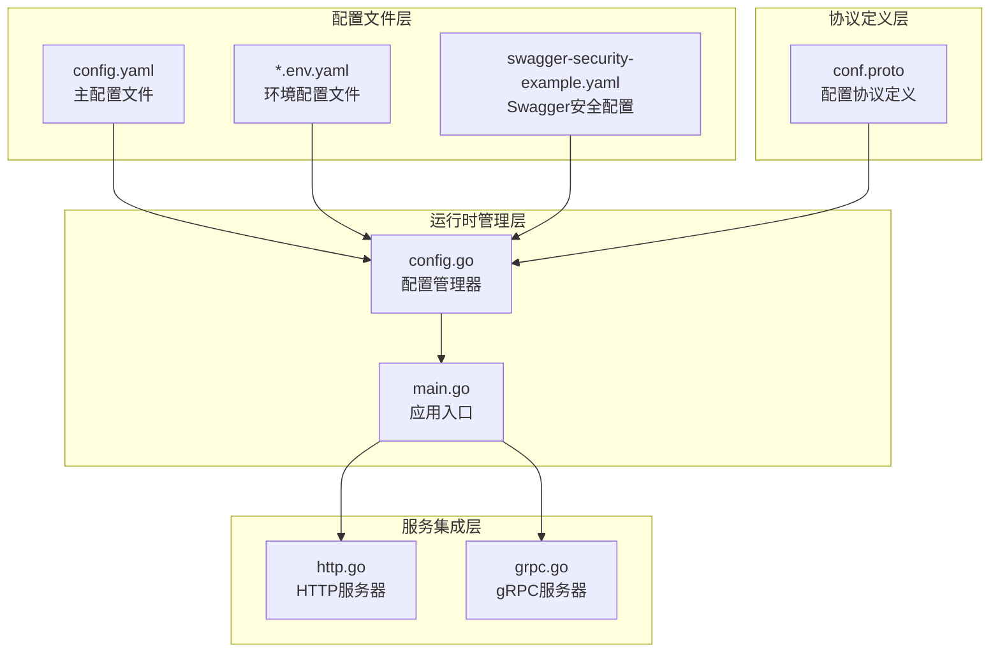
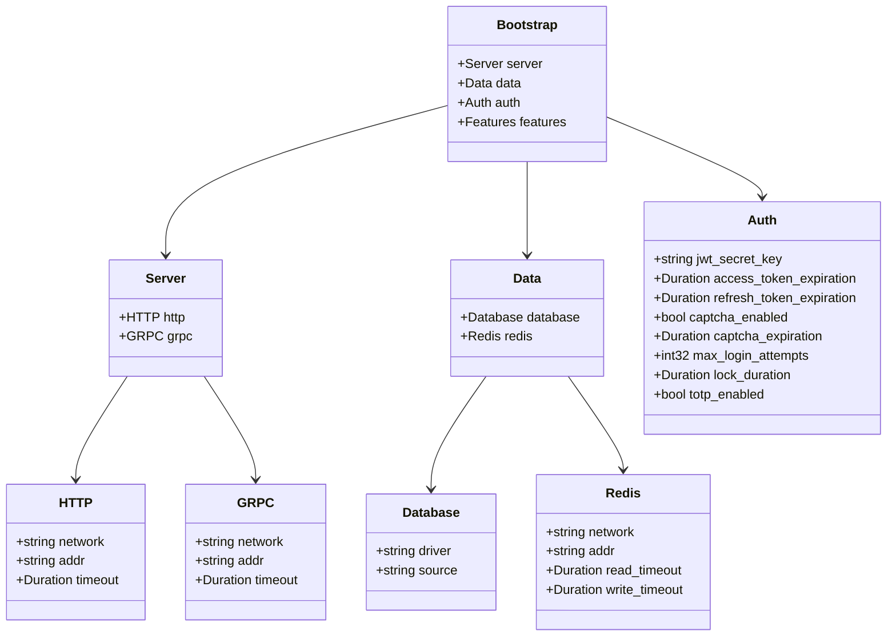
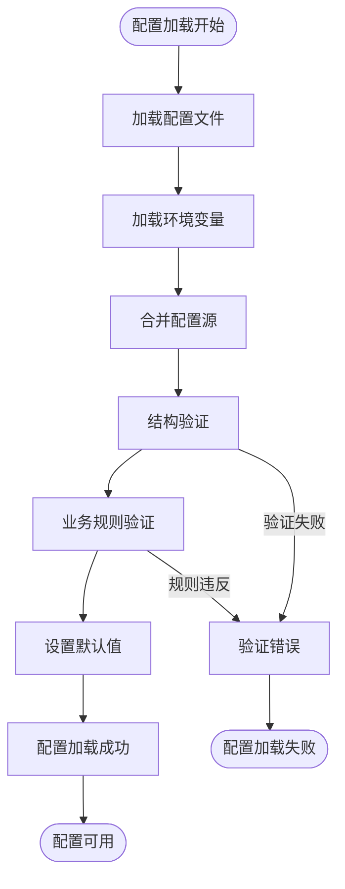
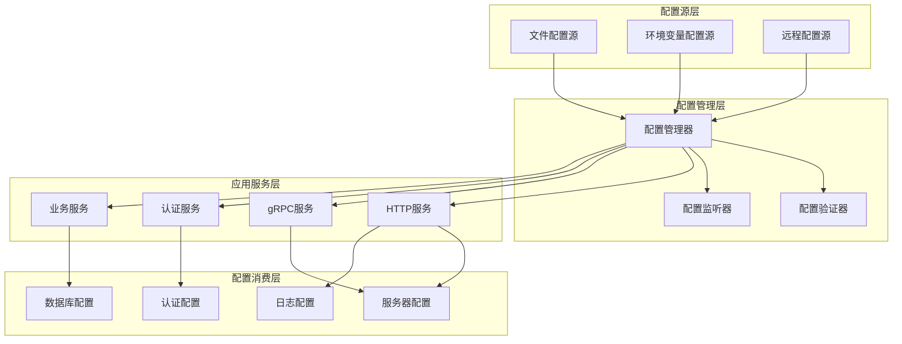
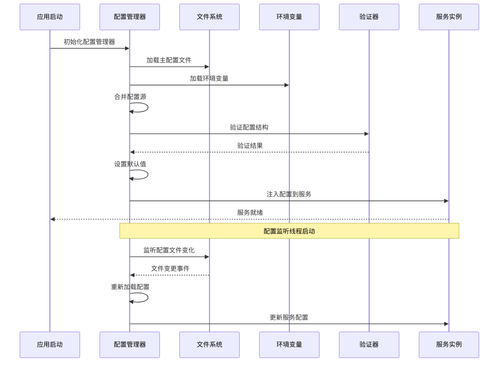
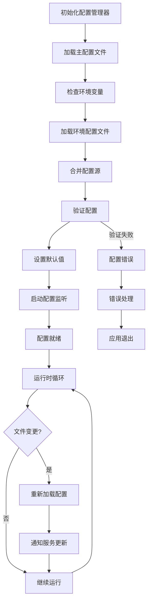
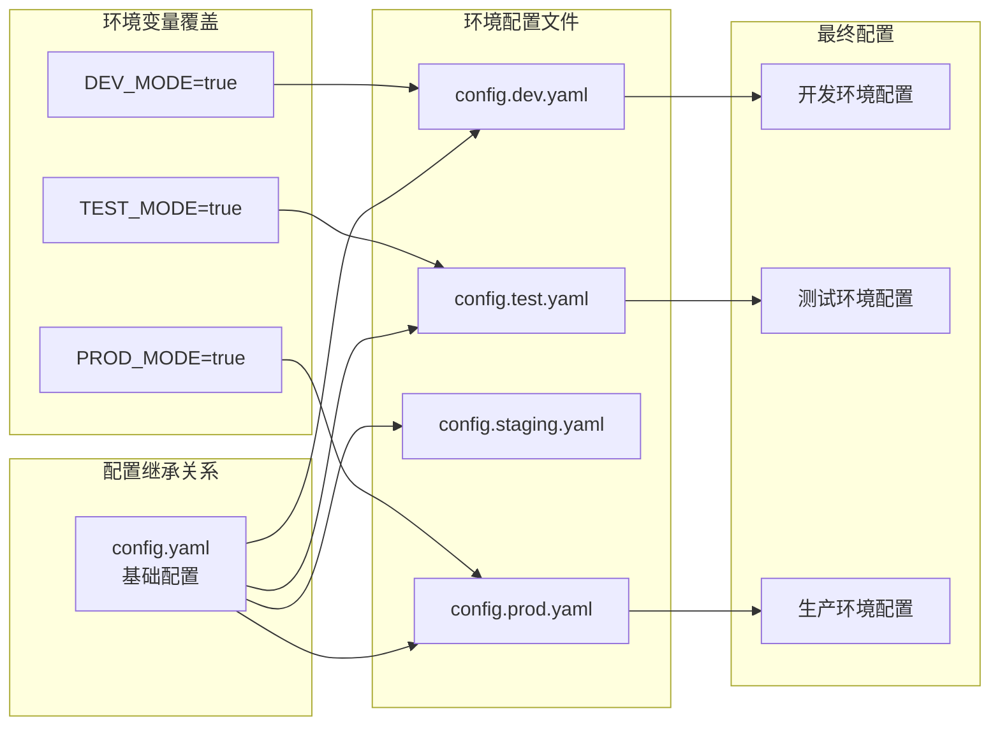
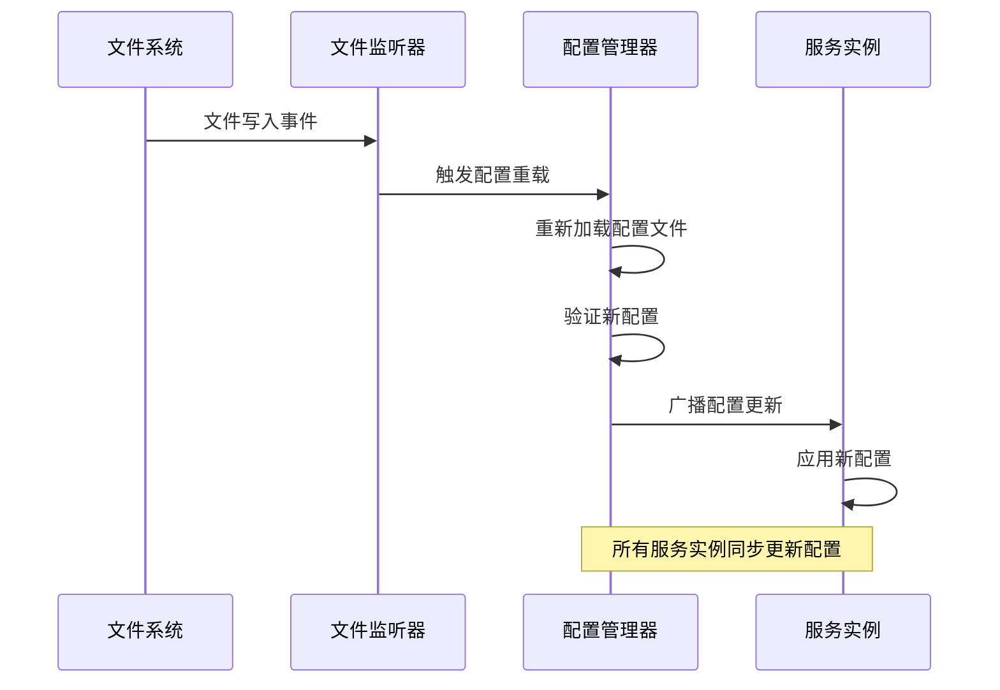
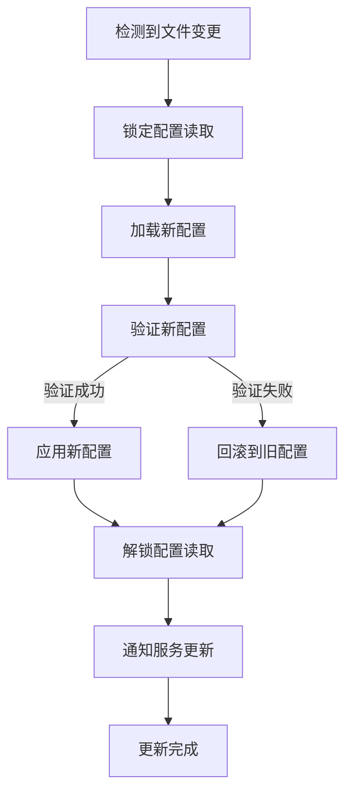
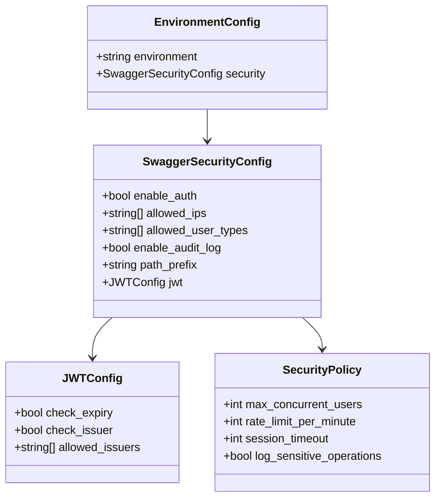

# 配置管理系统

<cite>
**本文档中引用的文件**
- [configs/config.yaml](file://configs/config.yaml)
- [configs/swagger-security-example.yaml](file://configs/swagger-security-example.yaml)
- [internal/conf/conf.proto](file://internal/conf/conf.proto)
- [internal/pkg/config/config.go](file://internal/pkg/config/config.go)
- [cmd/kratos-boilerplate/main.go](file://cmd/kratos-boilerplate/main.go)
- [internal/server/http.go](file://internal/server/http.go)
- [internal/server/grpc.go](file://internal/server/grpc.go)
</cite>

## 目录
1. [简介](#简介)
2. [项目结构概览](#项目结构概览)
3. [核心配置组件](#核心配置组件)
4. [架构概览](#架构概览)
5. [详细组件分析](#详细组件分析)
6. [环境配置管理](#环境配置管理)
7. [配置热更新机制](#配置热更新机制)
8. [API安全配置](#api安全配置)
9. [性能考虑](#性能考虑)
10. [故障排除指南](#故障排除指南)
11. [结论](#结论)

## 简介

本项目采用基于 Kratos 框架的现代化配置管理系统，通过 `config.yaml` 文件实现外部化配置，结合 Protocol Buffers 定义强类型配置结构，提供了完整的配置生命周期管理功能。该系统支持多环境配置切换、配置热更新、环境变量覆盖以及强大的配置验证机制。

## 项目结构概览

配置管理系统的核心文件组织如下：



**图表来源**
- [configs/config.yaml](file://configs/config.yaml#L1-L48)
- [internal/conf/conf.proto](file://internal/conf/conf.proto#L1-L70)
- [internal/pkg/config/config.go](file://internal/pkg/config/config.go#L1-L50)

**章节来源**
- [configs/config.yaml](file://configs/config.yaml#L1-L48)
- [internal/conf/conf.proto](file://internal/conf/conf.proto#L1-L70)

## 核心配置组件

### 配置数据结构

系统使用 Protocol Buffers 定义强类型配置结构，确保编译时类型安全：



**图表来源**
- [internal/conf/conf.proto](file://internal/conf/conf.proto#L7-L69)

### 配置验证机制

配置管理器实现了多层次的验证机制：



**图表来源**
- [internal/pkg/config/config.go](file://internal/pkg/config/config.go#L120-L150)

**章节来源**
- [internal/conf/conf.proto](file://internal/conf/conf.proto#L1-L70)
- [internal/pkg/config/config.go](file://internal/pkg/config/config.go#L1-L100)

## 架构概览

配置管理系统采用分层架构设计，实现了配置的集中管理、验证和分发：



**图表来源**
- [internal/pkg/config/config.go](file://internal/pkg/config/config.go#L80-L120)
- [cmd/kratos-boilerplate/main.go](file://cmd/kratos-boilerplate/main.go#L40-L60)

## 详细组件分析

### 配置管理器实现

配置管理器是整个配置系统的核心组件，负责配置的加载、验证、监听和分发：



**图表来源**
- [internal/pkg/config/config.go](file://internal/pkg/config/config.go#L80-L150)
- [internal/pkg/config/config.go](file://internal/pkg/config/config.go#L200-L250)

### 配置加载流程

配置加载过程支持多种配置源的优先级处理：



**图表来源**
- [internal/pkg/config/config.go](file://internal/pkg/config/config.go#L80-L120)

**章节来源**
- [internal/pkg/config/config.go](file://internal/pkg/config/config.go#L80-L200)

## 环境配置管理

### 多环境配置策略

系统支持开发、测试、预生产和生产等多种环境的配置管理：



**图表来源**
- [configs/config.yaml](file://configs/config.yaml#L1-L48)
- [internal/pkg/config/config.go](file://internal/pkg/config/config.go#L280-L300)

### 环境特定配置示例

以 Swagger 安全配置为例，展示不同环境下的配置差异：

```yaml
# 开发环境 - 最宽松的安全策略
development:
  swagger_ui:
    security:
      enable_auth: false
      allowed_ips: []
      allowed_user_types: []
      enable_audit_log: false

# 生产环境 - 最严格的安全策略  
production:
  swagger_ui:
    security:
      enable_auth: true
      allowed_ips:
        - "172.16.0.100"     # 运维跳板机
        - "172.16.0.101"     # 备用跳板机
      allowed_user_types:
        - "admin"            # 仅管理员
      enable_audit_log: true
      jwt:
        check_expiry: true
        check_issuer: true
        allowed_issuers:
          - "production-auth-service"
```

**章节来源**
- [configs/swagger-security-example.yaml](file://configs/swagger-security-example.yaml#L40-L120)

## 配置热更新机制

### 文件监听实现

配置管理器内置了基于 `fsnotify` 的文件监听机制，支持配置文件的实时更新：



**图表来源**
- [internal/pkg/config/config.go](file://internal/pkg/config/config.go#L200-L250)

### 配置更新流程

配置热更新遵循严格的验证和回滚机制：



**图表来源**
- [internal/pkg/config/config.go](file://internal/pkg/config/config.go#L250-L280)

**章节来源**
- [internal/pkg/config/config.go](file://internal/pkg/config/config.go#L200-L280)

## API安全配置

### Swagger UI安全配置

系统提供了完整的 Swagger UI 安全配置机制，支持细粒度的访问控制：



**图表来源**
- [configs/swagger-security-example.yaml](file://configs/swagger-security-example.yaml#L1-L50)

### 功能开关配置

系统支持动态的功能开关配置，可以在不重启服务的情况下控制功能的启用/禁用：

```yaml
features:
  enabled: true
  config_file: "./configs/features.yaml"
  config_format: "yaml"
  watch_config: true
  default_environment: "production"
  repository:
    type: "file"
    config_path: "./configs/features.yaml"
    format: "yaml"
```

**章节来源**
- [configs/swagger-security-example.yaml](file://configs/swagger-security-example.yaml#L1-L189)
- [configs/config.yaml](file://configs/config.yaml#L40-L48)

## 性能考虑

### 配置缓存机制

配置管理器实现了智能的配置缓存机制，避免重复解析和验证：

- **延迟加载**：配置项按需加载，减少内存占用
- **缓存失效**：配置变更时自动失效相关缓存
- **批量更新**：配置更新采用事务性方式，保证一致性

### 监听器优化

文件监听器采用了高效的事件处理机制：

- **异步处理**：配置变更事件异步处理，不影响主线程
- **去重机制**：合并连续的文件变更事件
- **资源管理**：及时释放不再使用的监听器资源

## 故障排除指南

### 常见配置问题

1. **配置文件格式错误**
   - 症状：应用启动时抛出 YAML 解析错误
   - 解决方案：检查 YAML 语法，确保缩进正确

2. **配置验证失败**
   - 症状：配置加载后验证失败
   - 解决方案：检查配置值是否符合验证规则

3. **环境变量覆盖无效**
   - 症状：环境变量未生效
   - 解决方案：确认环境变量命名规范和优先级

### 调试配置加载

```go
// 启用配置调试日志
logger := log.With(log.NewStdLogger(os.Stdout),
    "ts", log.DefaultTimestamp,
    "caller", log.DefaultCaller,
    "config_debug", "true",
)
```

**章节来源**
- [internal/pkg/config/config.go](file://internal/pkg/config/config.go#L120-L180)

## 结论

本配置管理系统通过 Kratos 框架的强大功能，实现了现代化的配置管理解决方案。系统具有以下优势：

1. **强类型安全**：基于 Protocol Buffers 的配置定义，确保编译时类型检查
2. **多环境支持**：灵活的环境配置管理和覆盖机制
3. **热更新能力**：实时配置更新，无需重启服务
4. **验证保障**：多层次的配置验证机制
5. **扩展性强**：支持自定义配置源和验证规则

该系统为 Kratos 应用提供了稳定可靠的配置管理基础设施，支持从开发到生产的全生命周期配置需求。