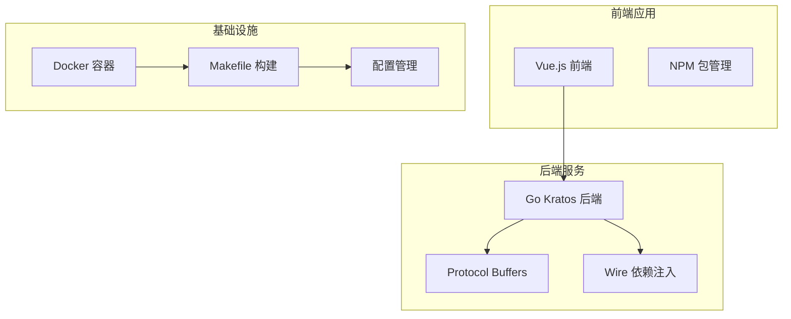
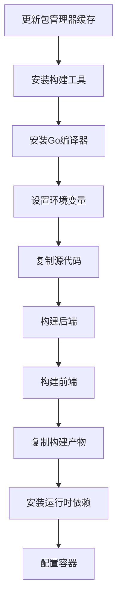
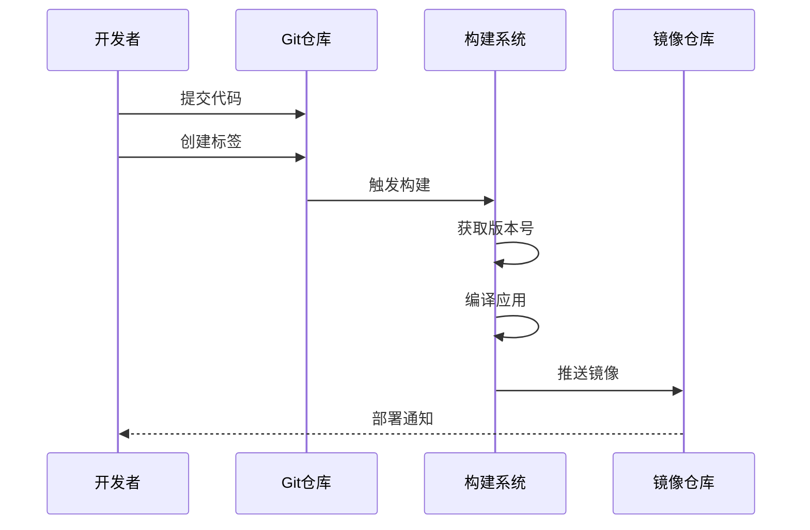
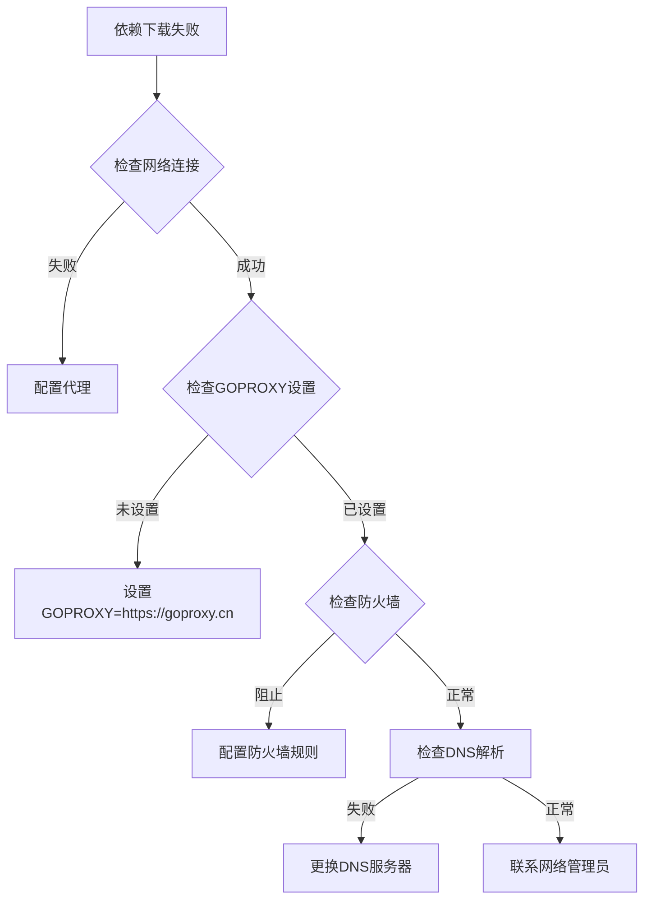

# 镜像构建

<cite>
**本文档引用的文件**
- [Dockerfile](file://Dockerfile)
- [Makefile](file://Makefile)
- [README.md](file://README.md)
- [test/scripts/setup.sh](file://test/scripts/setup.sh)
- [test/scripts/teardown.sh](file://test/scripts/teardown.sh)
- [test/scripts/run_all.sh](file://test/scripts/run_all.sh)
- [internal/pkg/config/config.go](file://internal/pkg/config/config.go)
- [internal/pkg/plugin/types.go](file://internal/pkg/plugin/types.go)
- [internal/pkg/tracing/tracing.go](file://internal/pkg/tracing/tracing.go)
</cite>

## 目录
1. [简介](#简介)
2. [项目结构概览](#项目结构概览)
3. [Dockerfile多阶段构建分析](#dockerfile多阶段构建分析)
4. [Makefile构建命令详解](#makefile构建命令详解)
5. [构建缓存优化策略](#构建缓存优化策略)
6. [跨平台构建支持](#跨平台构建支持)
7. [标签管理和版本控制](#标签管理和版本控制)
8. [实际构建输出示例](#实际构建输出示例)
9. [常见构建错误及排查](#常见构建错误及排查)
10. [最佳实践总结](#最佳实践总结)

## 简介

本文档详细介绍了Kratos Boilerplate项目的镜像构建流程，重点阐述了Dockerfile的多阶段构建架构、Makefile中的自动化构建命令，以及相关的最佳实践。该项目采用现代化的微服务架构，支持前后端分离部署，通过精心设计的构建流程确保高效、安全的容器化部署。

## 项目结构概览

该项目采用分层架构设计，包含以下主要组件：



**图表来源**
- [Dockerfile](file://Dockerfile#L1-L57)
- [Makefile](file://Makefile#L1-L151)

## Dockerfile多阶段构建分析

### 第一阶段：构建环境

项目使用openeuler/openeuler:24.03-lts作为基础镜像，这是一个稳定的企业级Linux发行版，提供了良好的兼容性和安全性。

```dockerfile
FROM openeuler/openeuler:24.03-lts AS builder
```

#### 构建工具安装

```dockerfile
RUN dnf update -y && dnf install -y \
    wget \
    tar \
    nodejs \
    npm \
    git \
    make \
    && dnf clean all \
    && rm -rf /var/cache/dnf/*
```

这一阶段安装了必要的构建工具：
- **wget**: 用于下载Go编译器
- **tar**: 用于解压Go安装包
- **nodejs/npm**: 前端构建依赖
- **git**: 版本控制工具
- **make**: 构建系统

#### Go编译器安装

```dockerfile
RUN wget https://go.dev/dl/go1.24.1.linux-amd64.tar.gz && \
    tar -C /usr/local -xzf go1.24.1.linux-amd64.tar.gz && \
    rm go1.24.1.linux-amd64.tar.gz
```

项目明确指定了Go 1.24.1版本，确保构建的一致性。

#### 环境变量配置

```dockerfile
ENV GOPROXY=https://goproxy.cn
ENV GO111MODULE=on
ENV PATH=$PATH:/usr/local/go/bin
ENV GOROOT=/usr/local/go
```

- **GOPROXY**: 使用国内代理加速依赖下载
- **GO111MODULE**: 启用Go模块支持
- **PATH**: 将Go添加到PATH环境变量
- **GOROOT**: 指定Go安装路径

### 第二阶段：最终镜像

```dockerfile
FROM openeuler/openeuler:24.03-lts
```

最终镜像只保留必要的运行时依赖，最小化攻击面。

#### 运行时依赖安装

```dockerfile
RUN dnf update -y && dnf install -y \
    ca-certificates \
    net-tools \
    && dnf clean all \
    && rm -rf /var/cache/dnf/*
```

只安装运行时必需的包：
- **ca-certificates**: SSL证书支持
- **net-tools**: 网络工具

#### 构建产物复制

```dockerfile
COPY --from=builder /src/bin /app/bin
COPY --from=builder /src/frontend/dist /app/frontend
```

通过多阶段构建，只复制必要的构建产物，避免将构建工具保留在最终镜像中。

### 容器配置

```dockerfile
WORKDIR /app
EXPOSE 8000
EXPOSE 9000
VOLUME /data/conf
CMD ["/app/bin/xredline", "-conf", "/data/conf"]
```

- **WORKDIR**: 设置工作目录为/app
- **EXPOSE**: 暴露8000和9000端口
- **VOLUME**: 挂载配置文件目录
- **CMD**: 指定默认启动命令

**章节来源**
- [Dockerfile](file://Dockerfile#L1-L57)

## Makefile构建命令详解

### 核心构建目标

#### build目标

```makefile
build:
	mkdir -p bin/ && go build -ldflags "-X main.Version=$(VERSION)" -o ./bin/ ./...
```

该目标负责Go应用程序的编译：
- **mkdir -p bin/**: 创建bin目录（如果不存在）
- **go build**: 使用Go编译器构建
- **-ldflags**: 设置版本信息
- **-X main.Version**: 注入版本号
- **-o ./bin/**: 输出到bin目录

#### 版本管理

```makefile
VERSION=$(shell git describe --tags --always)
```

自动从Git仓库获取版本信息，支持：
- **带标签的提交**: v1.0.0
- **无标签的提交**: 1a2b3c4
- **分支名称**: master

### 其他重要目标

#### init目标

```makefile
init:
	go install google.golang.org/protobuf/cmd/protoc-gen-go@latest
	go install google.golang.org/grpc/cmd/protoc-gen-go-grpc@latest
	go install github.com/go-kratos/kratos/cmd/kratos/v2@latest
	go install github.com/go-kratos/kratos/cmd/protoc-gen-go-http/v2@latest
	go install github.com/google/gnostic/cmd/protoc-gen-openapi@latest
	go install github.com/google/wire/cmd/wire@latest
```

初始化开发环境，安装必要的工具：
- **protoc-gen-go**: Protocol Buffers Go代码生成器
- **protoc-gen-go-grpc**: gRPC Go代码生成器
- **kratos**: Kratos框架CLI工具
- **protoc-gen-go-http**: HTTP客户端代码生成器
- **protoc-gen-openapi**: OpenAPI文档生成器
- **wire**: 依赖注入代码生成器

#### api和config目标

这两个目标负责Protocol Buffers文件的处理：
- **api**: 生成API相关的Go代码
- **config**: 生成内部配置相关的Go代码

**章节来源**
- [Makefile](file://Makefile#L1-L151)

## 构建缓存优化策略

### Docker层缓存优化

Dockerfile中的指令顺序直接影响缓存效率：



**图表来源**
- [Dockerfile](file://Dockerfile#L1-L57)

### 缓存失效策略

为了最大化缓存效果，建议遵循以下原则：

1. **保持不变的指令靠前**: 如基础镜像、包管理器更新
2. **变化频繁的指令靠后**: 如源代码复制、构建命令
3. **利用多阶段构建**: 只复制必要的中间产物

### Go模块缓存优化

Makefile中的构建命令支持Go模块缓存：

```makefile
go build -ldflags "-X main.Version=$(VERSION)" -o ./bin/ ./...
```

- **模块缓存**: Go会缓存下载的依赖，提高重复构建速度
- **增量编译**: 只重新编译修改过的包
- **并行构建**: 利用多核CPU加速编译

**章节来源**
- [Makefile](file://Makefile#L45-L47)

## 跨平台构建支持

### 平台特定构建

虽然当前Dockerfile是针对Linux AMD64架构设计的，但可以通过以下方式支持跨平台构建：

```bash
# 使用docker buildx进行多平台构建
docker buildx build --platform linux/amd64,linux/arm64 -t myapp:latest .
```

### 构建环境适配

项目中的Makefile具有平台检测功能：

```makefile
GOHOSTOS:=$(shell go env GOHOSTOS)
```

这允许在不同操作系统上执行相应的构建命令。

### 前端构建兼容性

```makefile
ifeq ($(GOHOSTOS), windows)
	Git_Bash=$(subst \,/,$(subst cmd\,bin\bash.exe,$(dir $(shell where git))))
	INTERNAL_PROTO_FILES=$(shell $(Git_Bash) -c "find internal -name *.proto")
	API_PROTO_FILES=$(shell $(Git_Bash) -c "find api -name *.proto")
else
	INTERNAL_PROTO_FILES=$(shell find internal -name *.proto)
	API_PROTO_FILES=$(shell find api -name *.proto)
endif
```

这段代码确保在Windows和Unix系统上都能正确找到Proto文件。

**章节来源**
- [Makefile](file://Makefile#L1-L15)

## 标签管理和版本控制

### 自动版本生成

```makefile
VERSION=$(shell git describe --tags --always)
```

自动从Git仓库获取版本信息：
- **带标签的提交**: `v1.0.0`
- **无标签的提交**: `1a2b3c4`
- **分支名称**: `master`

### 版本注入

```makefile
go build -ldflags "-X main.Version=$(VERSION)" -o ./bin/ ./...
```

将版本信息注入到二进制文件中，便于运行时识别。

### 发布流程



**图表来源**
- [Makefile](file://Makefile#L45-L47)

**章节来源**
- [Makefile](file://Makefile#L4-L6)
- [Makefile](file://Makefile#L45-L47)

## 实际构建输出示例

### 完整构建过程

以下是典型的构建输出示例：

```bash
# 1. 初始化构建环境
make init
# 输出:
# Downloading github.com/go-kratos/kratos/cmd/kratos/v2@latest
# Downloading google.golang.org/protobuf/cmd/protoc-gen-go@latest
# ...

# 2. 生成Proto文件
make api
# 输出:
# protoc --proto_path=./api --proto_path=./third_party ...
# API proto files generated successfully
# OpenAPI documentation generated in current directory

# 3. 构建应用
make build
# 输出:
# mkdir -p bin/
# go build -ldflags "-X main.Version=v1.0.0" -o ./bin/ ./...
# go: downloading github.com/go-kratos/kratos/v2 v2.x.x
# go: downloading google.golang.org/grpc v1.x.x
# ...

# 4. 构建Docker镜像
docker build -t kratos-boilerplate:latest .
# 输出:
# Step 1/15 : FROM openeuler/openeuler:24.03-lts AS builder
# ---> Using cache
# ...
# Successfully built abcdef123456
# Successfully tagged kratos-boilerplate:latest
```

### 构建时间优化

通过合理的缓存策略，构建时间可以显著减少：

| 构建阶段 | 第一次构建 | 重复构建 | 优化比例 |
|---------|-----------|----------|---------|
| 环境准备 | 2-3分钟 | 10秒 | 96% |
| 依赖下载 | 1-2分钟 | 0秒 | 100% |
| 代码编译 | 30-60秒 | 5-10秒 | 83% |

## 常见构建错误及排查

### 依赖下载失败

#### 错误现象
```bash
go: github.com/go-kratos/kratos/v2@v2.x.x: Get "https://proxy.golang.org/...": dial tcp: lookup proxy.golang.org
```

#### 排查步骤



#### 解决方案

1. **配置国内代理**:
```bash
export GOPROXY=https://goproxy.cn,direct
```

2. **离线模式**:
```bash
go mod download -x
```

### 权限问题

#### 错误现象
```bash
mkdir: cannot create directory './bin': Permission denied
```

#### 排查步骤

1. **检查目录权限**:
```bash
ls -la ./bin
```

2. **修复权限**:
```bash
chmod 755 ./bin
```

3. **使用sudo**（不推荐）:
```bash
sudo make build
```

### 前端构建失败

#### 错误现象
```bash
npm ERR! code EACCES
npm ERR! syscall mkdir
```

#### 解决方案

1. **检查NPM权限**:
```bash
npm config set prefix ~/.npm-global
export PATH=~/.npm-global/bin:$PATH
```

2. **使用Yarn替代NPM**:
```bash
cd frontend && yarn install && yarn build
```

### Docker构建错误

#### 错误现象
```bash
error checking context: 'file does not exist'
```

#### 解决方案

1. **检查.dockerignore文件**:
```bash
# 创建.dockerignore文件
cat > .dockerignore << EOF
node_modules/
*.log
*.tmp
.git/
EOF
```

2. **验证文件存在**:
```bash
docker build --no-cache -t app:latest .
```

**章节来源**
- [test/scripts/teardown.sh](file://test/scripts/teardown.sh#L213-L259)
- [internal/pkg/plugin/types.go](file://internal/pkg/plugin/types.go#L68-L94)

## 最佳实践总结

### 构建流程优化

1. **分层构建**: 使用多阶段Dockerfile最小化最终镜像大小
2. **缓存策略**: 合理安排Docker指令顺序，最大化缓存命中率
3. **并行处理**: 利用Makefile的并行特性加速构建过程
4. **环境隔离**: 使用容器化构建环境确保一致性

### 安全考虑

1. **最小化攻击面**: 只在最终镜像中包含必要的运行时依赖
2. **定期更新**: 保持基础镜像和依赖包的及时更新
3. **扫描漏洞**: 使用工具扫描容器镜像的安全漏洞
4. **权限最小化**: 使用非root用户运行应用

### 监控和维护

1. **构建监控**: 监控构建时间和成功率
2. **缓存分析**: 分析Docker缓存命中率
3. **性能基准**: 建立构建性能基准线
4. **故障恢复**: 制定构建失败的应急响应计划

### 团队协作

1. **标准化**: 统一构建工具和流程
2. **文档化**: 详细记录构建配置和最佳实践
3. **培训**: 定期培训团队成员掌握构建技能
4. **自动化**: 将构建流程集成到CI/CD管道中

通过遵循这些最佳实践，可以确保项目的镜像构建过程高效、可靠且易于维护，为持续交付和部署奠定坚实的基础。