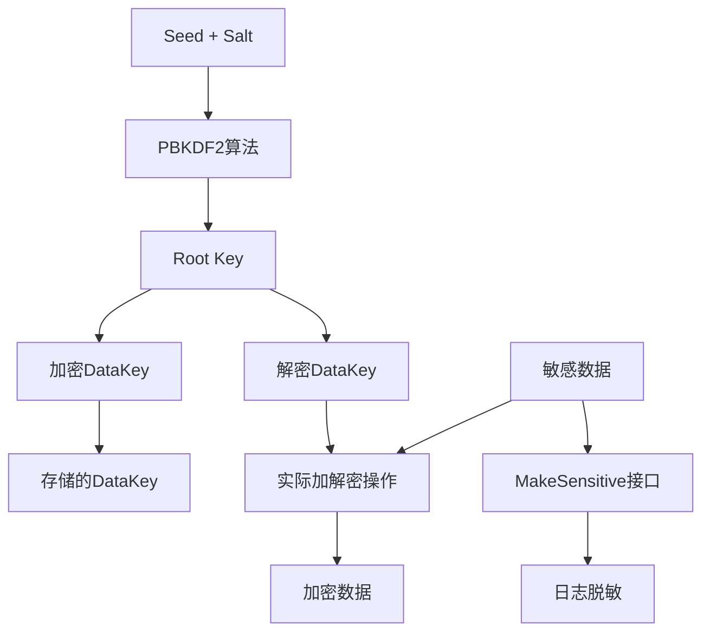

# KMS密钥管理系统架构设计

## 1. 系统概述

本文档设计了一个分层密钥管理系统（KMS），用于替代当前硬编码的密钥管理方式，提供安全的密钥生成、存储和管理机制，同时实现统一的日志脱敏功能。

### 1.1 设计目标

* **安全性**：采用分层密钥架构，rootkey和datakey分离

* **可扩展性**：支持多种加密算法和密钥轮换

* **易用性**：提供统一的加解密接口

* **合规性**：支持国密和国际标准算法

* **脱敏能力**：内置日志敏感信息脱敏机制

### 1.2 核心特性

* 基于PBKDF2的rootkey生成

* datakey使用rootkey加密存储

* 统一的密钥管理接口

* 自动密钥轮换机制

* 对象级别的敏感信息脱敏

## 2. 架构设计

### 2.1 分层密钥架构



### 2.2 密钥层级说明

#### Root Key（根密钥）

* **生成方式**：PBKDF2(seed, salt, iterations, keyLength)

* **存储方式**：内存中临时存储，不持久化

* **用途**：仅用于加密/解密Data Key

* **生命周期**：应用启动时生成，重启时重新生成

#### Data Key（数据密钥）

* **生成方式**：随机生成的AES-256密钥

* **存储方式**：使用Root Key加密后存储到数据库

* **用途**：实际的数据加解密操作

* **轮换机制**：支持定期轮换，保持多版本

### 2.3 系统组件

#### KMS Manager

* 密钥生成和管理

* 密钥轮换调度

* 密钥版本控制

#### Crypto Service

* 统一的加解密接口

* 算法适配器

* 性能优化

#### Sensitive Data Handler

* 敏感信息脱敏

* 日志安全处理

* 对象级别脱敏

## 3. 接口设计

### 3.1 KMS核心接口

```go
// KMSManager 密钥管理系统接口
type KMSManager interface {
    // 初始化KMS系统
    Initialize(config *KMSConfig) error
    
    // 获取当前活跃的数据密钥
    GetActiveDataKey() (*DataKey, error)
    
    // 根据版本获取数据密钥
    GetDataKeyByVersion(version string) (*DataKey, error)
    
    // 轮换数据密钥
    RotateDataKey() (*DataKey, error)
    
    // 加密数据
    Encrypt(plaintext []byte) (*EncryptedData, error)
    
    // 解密数据
    Decrypt(encryptedData *EncryptedData) ([]byte, error)
    
    // 关闭KMS系统
    Close() error
}

// CryptoService 统一加解密服务
type CryptoService interface {
    // 加密敏感字段
    EncryptField(fieldName string, value []byte) (*EncryptedField, error)
    
    // 解密敏感字段
    DecryptField(encryptedField *EncryptedField) ([]byte, error)
    
    // 计算哈希值（用于检索）
    HashField(value []byte) string
    
    // 批量加密
    EncryptBatch(fields map[string][]byte) (map[string]*EncryptedField, error)
    
    // 批量解密
    DecryptBatch(fields map[string]*EncryptedField) (map[string][]byte, error)
}
```

### 3.2 敏感信息脱敏接口

```go
// MakeSensitive 敏感信息脱敏接口
type MakeSensitive interface {
    // 获取敏感字段列表
    GetSensitiveFields() []string
    
    // 脱敏处理
    Anonymize() interface{}
    
    // 获取脱敏规则
    GetAnonymizeRules() map[string]AnonymizeRule
}

// AnonymizeRule 脱敏规则
type AnonymizeRule struct {
    FieldName   string `json:"field_name"`   // 字段名
    KeepStart   int    `json:"keep_start"`   // 保留开头字符数
    KeepEnd     int    `json:"keep_end"`     // 保留结尾字符数
    MaskChar    string `json:"mask_char"`    // 掩码字符，默认为*
    CustomFunc  func(string) string `json:"-"` // 自定义脱敏函数
}

// LogSafeStringer 日志安全字符串接口
type LogSafeStringer interface {
    // 返回日志安全的字符串表示
    LogSafeString() string
}
```

## 4. 数据结构设计

### 4.1 密钥相关结构

```go
// KMSConfig KMS配置
type KMSConfig struct {
    Seed           string        `yaml:"seed"`            // 种子值
    Salt           string        `yaml:"salt"`            // 盐值
    Iterations     int           `yaml:"iterations"`      // PBKDF2迭代次数
    KeyLength      int           `yaml:"key_length"`      // 密钥长度
    RotateInterval time.Duration `yaml:"rotate_interval"` // 轮换间隔
    Algorithm      string        `yaml:"algorithm"`       // 默认算法
}

// DataKey 数据密钥
type DataKey struct {
    ID          string    `json:"id"`          // 密钥ID
    Version     string    `json:"version"`     // 版本号
    Algorithm   string    `json:"algorithm"`   // 算法类型
    Key         []byte    `json:"-"`           // 实际密钥（不序列化）
    EncryptedKey []byte   `json:"encrypted_key"` // 加密后的密钥
    CreatedAt   time.Time `json:"created_at"`  // 创建时间
    ExpiresAt   time.Time `json:"expires_at"`  // 过期时间
    IsActive    bool      `json:"is_active"`   // 是否活跃
}

// EncryptedData 加密数据
type EncryptedData struct {
    KeyVersion string `json:"key_version"` // 密钥版本
    Algorithm  string `json:"algorithm"`   // 算法标识
    Nonce      []byte `json:"nonce"`       // 随机数
    Ciphertext []byte `json:"ciphertext"`  // 密文
    AuthTag    []byte `json:"auth_tag"`    // 认证标签（GCM模式）
}

// EncryptedField 加密字段
type EncryptedField struct {
    FieldName     string         `json:"field_name"`
    EncryptedData *EncryptedData `json:"encrypted_data"`
    Hash          string         `json:"hash"` // 用于检索的哈希值
}
```

### 4.2 用户敏感信息结构

```go
// User 用户结构（实现MakeSensitive接口）
type User struct {
    ID       int64  `json:"id"`
    Username string `json:"username"`
    Email    string `json:"email"`
    Phone    string `json:"phone"`
    Name     string `json:"name"`
    // ... 其他字段
}

// 实现MakeSensitive接口
func (u *User) GetSensitiveFields() []string {
    return []string{"email", "phone", "name"}
}

func (u *User) GetAnonymizeRules() map[string]AnonymizeRule {
    return map[string]AnonymizeRule{
        "email": {FieldName: "email", KeepStart: 2, KeepEnd: 4, MaskChar: "*"},
        "phone": {FieldName: "phone", KeepStart: 3, KeepEnd: 4, MaskChar: "*"},
        "name":  {FieldName: "name", KeepStart: 1, KeepEnd: 1, MaskChar: "*"},
    }
}

func (u *User) Anonymize() interface{} {
    rules := u.GetAnonymizeRules()
    anonymized := &User{
        ID:       u.ID,
        Username: u.Username,
        Email:    anonymizeField(u.Email, rules["email"]),
        Phone:    anonymizeField(u.Phone, rules["phone"]),
        Name:     anonymizeField(u.Name, rules["name"]),
    }
    return anonymized
}

// 实现LogSafeStringer接口
func (u *User) LogSafeString() string {
    anonymized := u.Anonymize().(*User)
    return fmt.Sprintf("User{ID:%d, Username:%s, Email:%s, Phone:%s, Name:%s}",
        anonymized.ID, anonymized.Username, anonymized.Email, anonymized.Phone, anonymized.Name)
}
```

## 5. 实现方案

### 5.1 目录结构

```
internal/pkg/
├── kms/
│   ├── manager.go          # KMS管理器实现
│   ├── datakey.go          # 数据密钥管理
│   ├── rootkey.go          # 根密钥生成
│   ├── crypto_service.go   # 加解密服务
│   ├── storage.go          # 密钥存储
│   └── config.go           # 配置管理
├── sensitive/
│   ├── anonymizer.go       # 脱敏处理器
│   ├── interfaces.go       # 脱敏接口定义
│   ├── rules.go           # 脱敏规则
│   └── logger.go          # 日志安全处理
└── crypto/
    ├── aes.go             # AES加密实现（保持兼容）
    ├── sm3.go             # SM3实现（保持兼容）
    └── adapter.go         # 适配器（连接KMS）
```

### 5.2 核心实现逻辑

#### Root Key生成

```go
func generateRootKey(seed, salt string, iterations, keyLength int) ([]byte, error) {
    return pbkdf2.Key([]byte(seed), []byte(salt), iterations, keyLength, sha256.New), nil
}
```

#### Data Key管理

```go
func (m *KMSManager) generateDataKey() (*DataKey, error) {
    // 1. 生成随机密钥
    key := make([]byte, 32)
    if _, err := rand.Read(key); err != nil {
        return nil, err
    }
    
    // 2. 使用Root Key加密
    encryptedKey, err := m.encryptWithRootKey(key)
    if err != nil {
        return nil, err
    }
    
    // 3. 创建DataKey对象
    dataKey := &DataKey{
        ID:           generateKeyID(),
        Version:      generateVersion(),
        Algorithm:    "AES-GCM-256",
        Key:          key,
        EncryptedKey: encryptedKey,
        CreatedAt:    time.Now(),
        ExpiresAt:    time.Now().Add(m.config.RotateInterval),
        IsActive:     true,
    }
    
    return dataKey, nil
}
```

#### 敏感信息脱敏

```go
func anonymizeField(value string, rule AnonymizeRule) string {
    if rule.CustomFunc != nil {
        return rule.CustomFunc(value)
    }
    
    runes := []rune(value)
    length := len(runes)
    
    if length <= rule.KeepStart+rule.KeepEnd {
        return value
    }
    
    start := string(runes[:rule.KeepStart])
    end := string(runes[length-rule.KeepEnd:])
    
    maskLength := length - rule.KeepStart - rule.KeepEnd
    mask := strings.Repeat(rule.MaskChar, maskLength)
    
    return start + mask + end
}
```

## 6. 集成方案

### 6.1 与现有系统集成

#### 数据层改造

```go
// 新的UserRepo实现
type userRepo struct {
    data   *Data
    log    *log.Helper
    crypto CryptoService  // 替换原来的enc字段
}

func NewUserRepo(data *Data, logger log.Logger, kms KMSManager) (biz.UserRepo, error) {
    cryptoService := NewCryptoService(kms)
    
    return &userRepo{
        data:   data,
        log:    log.NewHelper(logger),
        crypto: cryptoService,
    }, nil
}

func (r *userRepo) CreateUser(ctx context.Context, u *biz.User) error {
    // 使用新的加密服务
    fields := map[string][]byte{
        "email": []byte(u.Email),
        "phone": []byte(u.Phone),
        "name":  []byte(u.Name),
    }
    
    encryptedFields, err := r.crypto.EncryptBatch(fields)
    if err != nil {
        return err
    }
    
    // 数据库操作...
}
```

#### 日志中间件集成

```go
// 日志脱敏中间件
func LogSanitizeMiddleware() middleware.Middleware {
    return func(handler middleware.Handler) middleware.Handler {
        return func(ctx context.Context, req interface{}) (reply interface{}, err error) {
            // 请求日志脱敏
            if sensitive, ok := req.(MakeSensitive); ok {
                r.log.Infof("Request: %+v", sensitive.Anonymize())
            } else {
                r.log.Infof("Request: %+v", req)
            }
            
            reply, err = handler(ctx, req)
            
            // 响应日志脱敏
            if sensitive, ok := reply.(MakeSensitive); ok {
                r.log.Infof("Response: %+v", sensitive.Anonymize())
            } else {
                r.log.Infof("Response: %+v", reply)
            }
            
            return reply, err
        }
    }
}
```

### 6.2 配置管理

```yaml
# config.yaml
kms:
  seed: "${KMS_SEED}"  # 从环境变量获取
  salt: "${KMS_SALT}"  # 从环境变量获取
  iterations: 100000
  key_length: 32
  rotate_interval: "24h"
  algorithm: "AES-GCM-256"

sensitive:
  log_level: "info"
  default_mask_char: "*"
  enable_anonymize: true
```

## 7. 安全考虑

### 7.1 密钥安全

* **Root Key**：仅在内存中存在，不持久化

* **Seed和Salt**：通过环境变量注入，不在代码中硬编码

* **Data Key轮换**：定期自动轮换，支持多版本共存

* **密钥传输**：内存中传递，避免序列化

### 7.2 访问控制

* **接口权限**：KMS接口仅限内部调用

* **审计日志**：记录所有密钥操作

* **故障恢复**：支持密钥恢复机制

### 7.3 合规性

* **算法支持**：兼容国密SM3/SM4和国际AES标准

* **密钥长度**：支持256位密钥

* **随机性**：使用加密安全的随机数生成器

## 8. 性能优化

### 8.1 缓存策略

* **密钥缓存**：活跃密钥内存缓存

* **脱敏缓存**：常用脱敏结果缓存

* **批量操作**：支持批量加解密

### 8.2 并发安全

* **读写锁**：密钥轮换时的并发控制

* **原子操作**：密钥状态更新

* **连接池**：数据库连接复用

## 9. 监控和运维

### 9.1 监控指标

* 密钥轮换频率

* 加解密操作QPS

* 错误率统计

* 性能延迟监控

### 9.2 告警机制

* 密钥轮换失败告警

* 加解密错误率告警

* 性能异常告警

## 10. 迁移方案

### 10.1 渐进式迁移

1. **阶段1**：部署KMS系统，与现有系统并行
2. **阶段2**：新数据使用KMS加密
3. **阶段3**：历史数据批量迁移
4. **阶段4**：移除旧的加密方式

### 10.2 兼容性保证

* 支持旧格式数据解密

* 渐进式数据格式升级

* 回滚机制支持

## 11. 测试策略

### 11.1 单元测试

* 密钥生成和轮换测试

* 加解密功能测试

* 脱敏规则测试

### 11.2 集成测试

* 端到端加密流程测试

* 并发安全测试

* 故障恢复测试

### 11.3 安全测试

* 密钥泄露检测

* 侧信道攻击防护

* 合规性验证

## 12. 总结

本KMS系统设计提供了：

✅ **分层密钥管理**：Root Key + Data Key架构确保密钥安全
✅ **统一加解密接口**：简化业务层调用
✅ **自动密钥轮换**：提高长期安全性
✅ **敏感信息脱敏**：保护日志中的隐私数据
✅ **算法兼容性**：支持国密和国际标准
✅ **渐进式迁移**：平滑替换现有系统

该设计在保证安全性的同时，提供了良好的可用性和可维护性，为系统的长期发展奠定了坚实基础。
