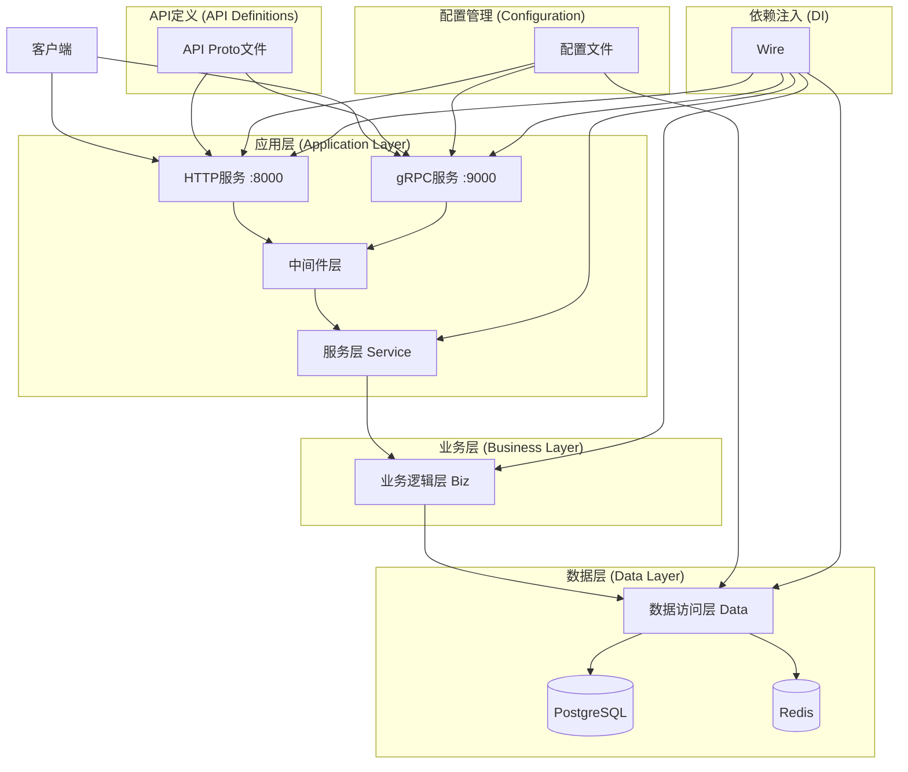
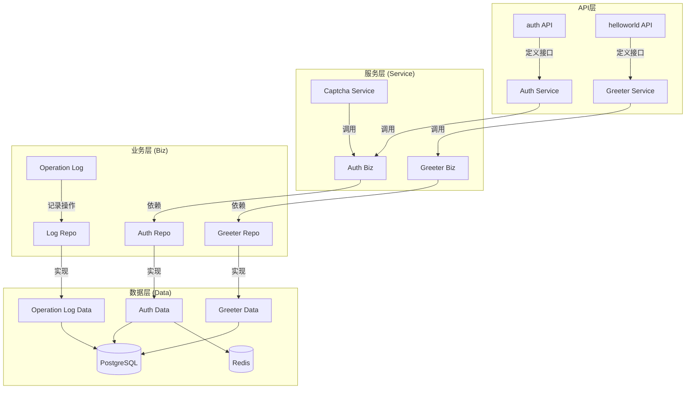
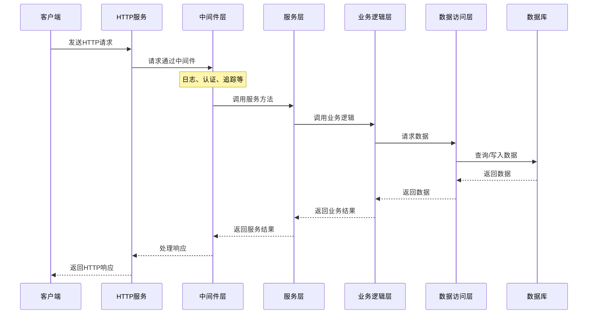
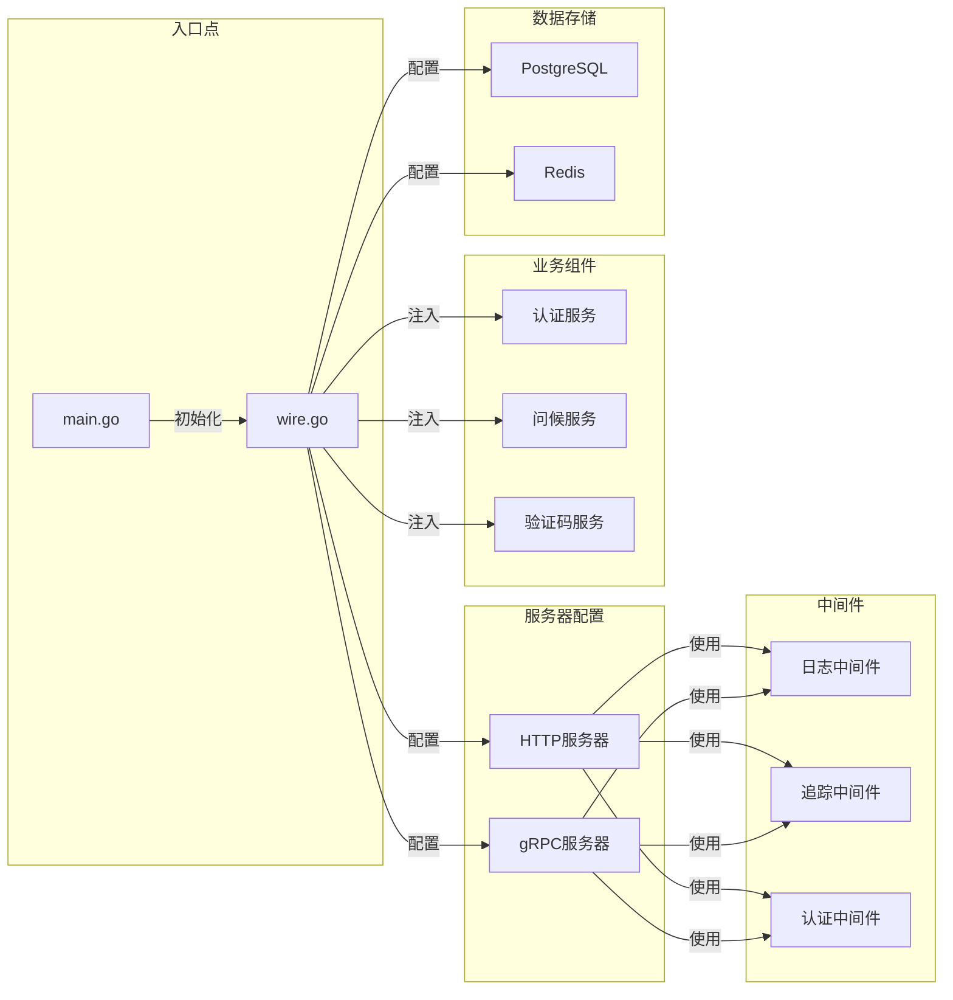
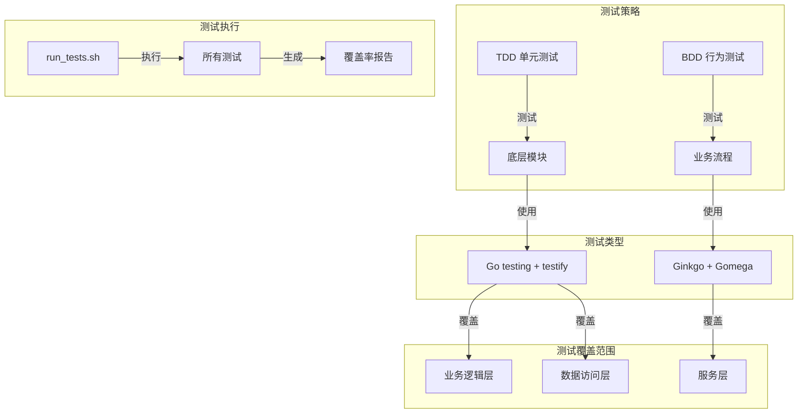

# Kratos Boilerplate 项目架构图

## 整体架构

```mermaid
graph TD
    Client[客户端] --> HTTP[HTTP服务 :8000]
    Client --> GRPC[gRPC服务 :9000]
    
    subgraph "应用层 (Application Layer)"
        HTTP --> Middleware[中间件层]
        GRPC --> Middleware
        Middleware --> Service[服务层 Service]
    end
    
    subgraph "业务层 (Business Layer)"
        Service --> Biz[业务逻辑层 Biz]
    end
    
    subgraph "数据层 (Data Layer)"
        Biz --> Data[数据访问层 Data]
        Data --> DB[(PostgreSQL)]
        Data --> Redis[(Redis)]
    end
    
    subgraph "API定义 (API Definitions)"
        API[API Proto文件] --> HTTP
        API --> GRPC
    end
    
    subgraph "配置管理 (Configuration)"
        Config[配置文件] --> HTTP
        Config --> GRPC
        Config --> Data
    end
    
    subgraph "依赖注入 (DI)"
        Wire[Wire] --> Service
        Wire --> Biz
        Wire --> Data
        Wire --> HTTP
        Wire --> GRPC
    end
```

## 分层架构详解

```mermaid
graph TD
    subgraph "API层"
        API1[auth API] --> |定义接口| Service1[Auth Service]
        API2[helloworld API] --> |定义接口| Service2[Greeter Service]
    end
    
    subgraph "服务层 (Service)"
        Service1 --> |调用| Biz1[Auth Biz]
        Service2 --> |调用| Biz2[Greeter Biz]
        Service3[Captcha Service] --> |调用| Biz1
    end
    
    subgraph "业务层 (Biz)"
        Biz1 --> |依赖| Repo1[Auth Repo]
        Biz2 --> |依赖| Repo2[Greeter Repo]
        Biz3[Operation Log] --> |记录操作| Repo3[Log Repo]
    end
    
    subgraph "数据层 (Data)"
        Repo1 --> |实现| Data1[Auth Data]
        Repo2 --> |实现| Data2[Greeter Data]
        Repo3 --> |实现| Data3[Operation Log Data]
        Data1 --> DB[(PostgreSQL)]
        Data2 --> DB
        Data3 --> DB
        Data1 --> Redis[(Redis)]
    end
```

## 请求流程

```mermaid
sequenceDiagram
    participant Client as 客户端
    participant HTTP as HTTP服务
    participant Middleware as 中间件层
    participant Service as 服务层
    participant Biz as 业务逻辑层
    participant Data as 数据访问层
    participant DB as 数据库
    
    Client->>HTTP: 发送HTTP请求
    HTTP->>Middleware: 请求通过中间件
    Note over Middleware: 日志、认证、追踪等
    Middleware->>Service: 调用服务方法
    Service->>Biz: 调用业务逻辑
    Biz->>Data: 请求数据
    Data->>DB: 查询/写入数据
    DB-->>Data: 返回数据
    Data-->>Biz: 返回数据
    Biz-->>Service: 返回业务结果
    Service-->>Middleware: 返回服务结果
    Middleware-->>HTTP: 处理响应
    HTTP-->>Client: 返回HTTP响应
```

## 项目组件关系

```mermaid
graph LR
    subgraph "入口点"
        Main[main.go] --> |初始化| Wire[wire.go]
    end
    
    subgraph "服务器配置"
        Wire --> |配置| HTTPServer[HTTP服务器]
        Wire --> |配置| GRPCServer[gRPC服务器]
    end
    
    subgraph "业务组件"
        Wire --> |注入| AuthService[认证服务]
        Wire --> |注入| GreeterService[问候服务]
        Wire --> |注入| CaptchaService[验证码服务]
    end
    
    subgraph "数据存储"
        Wire --> |配置| Database[PostgreSQL]
        Wire --> |配置| RedisCache[Redis]
    end
    
    subgraph "中间件"
        HTTPServer --> |使用| Logging[日志中间件]
        HTTPServer --> |使用| Tracing[追踪中间件]
        HTTPServer --> |使用| Auth[认证中间件]
        GRPCServer --> |使用| Logging
        GRPCServer --> |使用| Tracing
        GRPCServer --> |使用| Auth
    end
```

## 测试策略

```mermaid
graph TD
    subgraph "测试策略"
        TDD[TDD 单元测试] --> |测试| Unit[底层模块]
        BDD[BDD 行为测试] --> |测试| Integration[业务流程]
    end
    
    subgraph "测试类型"
        Unit --> |使用| GoTest[Go testing + testify]
        Integration --> |使用| Ginkgo[Ginkgo + Gomega]
    end
    
    subgraph "测试覆盖范围"
        GoTest --> |覆盖| Biz[业务逻辑层]
        GoTest --> |覆盖| Data[数据访问层]
        Ginkgo --> |覆盖| Service[服务层]
    end
    
    subgraph "测试执行"
        Script[run_tests.sh] --> |执行| AllTests[所有测试]
        AllTests --> |生成| Coverage[覆盖率报告]
    end
```